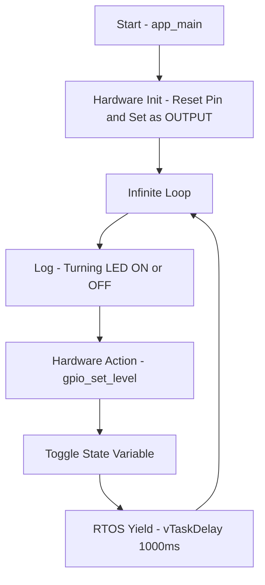

# Topic: System Boot and Basic Output (Blink)

## 1. Theory & Protocol Overview
Before diving into complex protocols, it's crucial to understand how an ESP32 boots up and how basic digital output (GPIO) works. 
*   **System Boot:** When powered on, the ESP32 runs a primary bootloader from ROM, which then loads the secondary bootloader from Flash. The secondary bootloader is responsible for loading the actual application (`app_main()`) and FreeRTOS into memory.
*   **GPIO (General Purpose Input/Output):** Digital pins that can be controlled via software. In output mode, they can output a HIGH (3.3V) or LOW (0V) signal. This is the foundation of driving LEDs, Relays, or sending basic digital signals to other ICs.

## 2. Configuration Steps
To set up a basic ESP-IDF project, you need standard configurations:
*   **CMakeLists.txt (Project level):** Standard project configuration.
*   **CMakeLists.txt (Component level - `main/`):** Register the source files.
*   **Menuconfig / Kconfig:** You can use `Kconfig.projbuild` to create a menu entry to dynamically define `CONFIG_BLINK_GPIO`.

## 3. Logic Flowchart & Implementation
Here is the logical flow of a simple Blink application.

### Logic Explanation:
1.  **`app_main` Entry:** Unlike standard C programs that start at `main()`, ESP-IDF starts the user application in a FreeRTOS task called `app_main`.
2.  **Hardware Init (`gpio_set_direction`):** Prepares the physical pin.
3.  **Hardware Action (`gpio_set_level`):** Directly writes to the hardware register to pull the pin High or Low.
4.  **RTOS Yield (`vTaskDelay`):** This is the most critical concept. In an RTOS, an infinite loop without yielding will starve other tasks. `vTaskDelay` temporarily suspends this task, allowing the CPU to breathe. Without it, the Task Watchdog Timer will reset the chip.

*(For exact C syntax, see `examples/get-started/blink` in the ESP-IDF directory).*
