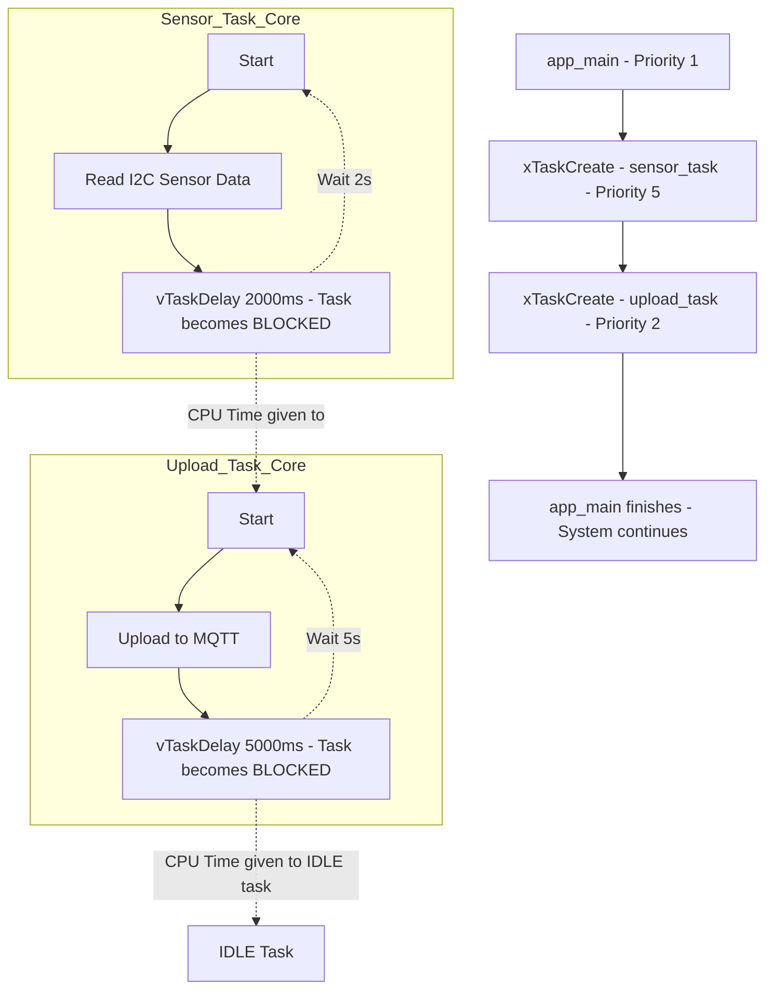

# Topic: FreeRTOS Task Management

## 1. Theory & Protocol Overview
The ESP32 is a dual-core processor running a Real-Time Operating System called **FreeRTOS**. 
*   **What is a Task?** In FreeRTOS, a "Task" is an independent thread of execution. Multiple tasks can run "concurrently".
*   **Task States:** A task can be in one of four states: *Running* (currently executing), *Ready* (waiting for CPU time), *Blocked* (waiting for an event or delay), or *Suspended* (explicitly paused).
*   **Priority:** FreeRTOS uses a preemptive priority-based scheduler. Higher priority tasks preempt (interrupt) lower priority tasks immediately when they become Ready.

## 2. Configuration Steps
FreeRTOS is built into ESP-IDF natively.
*   **`menuconfig`:** `Component config -> FreeRTOS`.
    *   **Tick rate (Hz):** Default is 100Hz (1 tick = 10ms). Changing this to 1000Hz (1 tick = 1ms) provides finer delay resolution.
    *   **Run FreeRTOS only on first core:** Useful for debugging unicore behavior.

## 3. Logic Flowchart & Implementation
Here is how the RTOS schedules multiple tasks running independently.

### Logic Explanation:
1.  **Creation:** `xTaskCreate` allocates RAM for the task's stack and adds it to the Ready queue.
2.  **Priorities in Action:** `sensor_task` (Priority 5) will ALWAYS interrupt `upload_task` (Priority 2) if it needs to run. 
3.  **Blocking is Key:** If `sensor_task` never calls a blocking function (like `vTaskDelay`, `xQueueReceive`, or `ulTaskNotifyTake`), it will hog the CPU forever, and `upload_task` will starve. By blocking, it hands control back to the scheduler to run lower priority tasks.
4.  **`app_main` Exit:** The entry function `app_main` is just a normal FreeRTOS task. It can return and terminate safely; the OS scheduler will keep background tasks alive forever.
