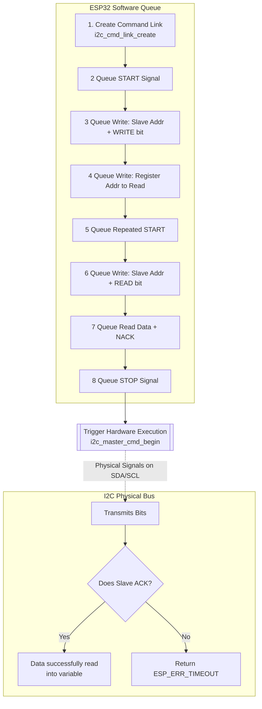

# Topic: I2C (Inter-Integrated Circuit) Protocol

## 1. Theory & Protocol Overview
I2C is a synchronous, multi-master, multi-slave, serial communication bus widely used for attaching lower-speed peripheral ICs (sensors, displays) to the ESP32.

*   **Hardware Interface:** Requires two wires (SDA - Data, SCL - Clock) and external Pull-up resistors to 3.3V.
*   **Master/Slave Paradigm:** The Master (ESP32) generates the clock and initiates communication. Slaves listen for their specific 7-bit address.

## 2. Configuration Steps
*   **Pin Selection:** ESP32 allows routing I2C to almost any GPIO pin using the GPIO Matrix. Commonly used pins: GPIO 21 (SDA), GPIO 22 (SCL).
*   **Port:** ESP32 has two I2C hardware controllers (`I2C_NUM_0` and `I2C_NUM_1`).
*   **Initialization:** You must define `i2c_config_t` and apply it via `i2c_param_config()`, then install the driver using `i2c_driver_install()`.

## 3. Logic Flowchart (I2C Read Sequence)
ESP-IDF uses a "Command Link" approach. You don't execute I2C bit-by-bit; instead, you build a queue of commands and tell the hardware to execute the entire queue at once.

Here is the logical flow of reading a specific register from a sensor (e.g., reading a Temperature register):

### Logic Explanation:
1.  **Queueing vs Executing:** Functions like `i2c_master_start` or `i2c_master_write_byte` **DO NOT** talk to the sensor immediately. They only add instructions to a local memory queue (`cmd`).
2.  **Addressing:** The 7-bit slave address must be shifted left by 1 bit `(addr << 1)`. The lowest bit is then set to 0 for a WRITE operation, or 1 for a READ operation.
3.  **Repeated Start:** To read a specific register, you must first WRITE the register ID to the sensor. Then, instead of stopping, you issue a "Repeated Start" and switch to READ mode to grab the actual data.
4.  **Hardware Execution:** `i2c_master_cmd_begin` takes the entire queue and commands the I2C peripheral hardware to blast it out onto the physical wires. It blocks until the transaction is complete or times out.

*(For exact C code mapping to these steps, see `examples/peripherals/i2c/i2c_simple`)*
