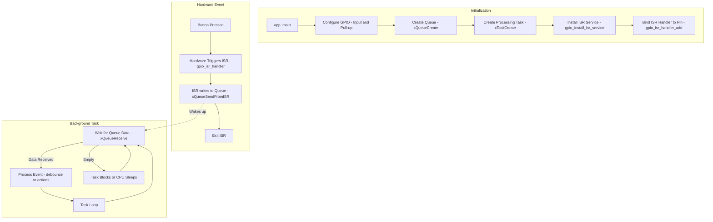

# Topic: Generic GPIO & Interrupt Handling

## 1. Theory & Protocol Overview
GPIO (General Purpose Input/Output) can trigger **Interrupts** so the CPU doesn't waste clock cycles polling (checking) the state of a pin in a loop.
*   **Interrupt Service Routine (ISR):** A special function that runs immediately when a hardware event occurs (e.g., button pressed).
*   **IRAM_ATTR:** ISR code must reside in internal RAM (IRAM) rather than external Flash. This ensures execution speed and prevents issues if flash cache is currently disabled.
*   **FreeRTOS Queue:** ISRs must be extremely fast. Instead of processing button actions in the ISR, we send the event to a Queue, which a background Task listens to.

## 2. Configuration Steps
*   **CMakeLists.txt:** Standard configurations.
*   **Configuration Struct (`gpio_config_t`):** Enables setting up multiple pins, pull-ups, pull-downs, and interrupt types in a single call:
    ```c
    gpio_config_t io_conf = {
        .intr_type = GPIO_INTR_NEGEDGE,      // Trigger interrupt on falling edge
        .mode = GPIO_MODE_INPUT,             // Input mode
        .pin_bit_mask = (1ULL << BUTTON_PIN), // Bitmask of the pin
        .pull_up_en = GPIO_PULLUP_ENABLE,    // Enable internal pull-up
    };
    gpio_config(&io_conf);
    ```

## 3. Logic Flowchart
Here is how an interrupt-driven input handles events via FreeRTOS queues:



### Logic Explanation:
1.  **Event Queue:** The queue acts as a buffer. If the user presses the button multiple times rapidly, the events are queued up safely.
2.  **`gpio_install_isr_service`:** Installs the driver's generic ISR handler, allowing you to easily attach individual handlers for different pins using `gpio_isr_handler_add`.
3.  **Context Switching:** When `xQueueSendFromISR` sends data, it immediately wakes the blocked processing task, enabling real-time response.

*(Reference path: `examples/peripherals/gpio/generic_gpio`)*
