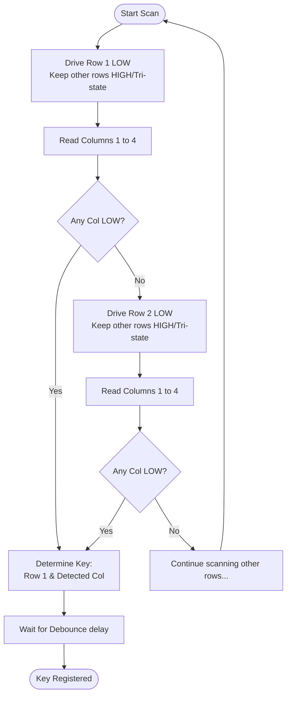

# Topic: Matrix Keyboard (Keypad)

## 1. Theory & Protocol Overview
A matrix keypad connects multiple keys in a grid (rows and columns). Instead of using one GPIO pin per button (which would require 16 pins for a 4x4 keypad), a matrix layout only requires $Rows + Columns$ pins (8 pins for 4x4).
*   **Scanning Mechanism:** The CPU sequentially drives one row LOW (or HIGH) while reading the columns. By detecting which column goes LOW when a specific row is active, the exact coordinates of the pressed key can be calculated.

## 2. Configuration Steps
*   **Driver:** Can be implemented using raw GPIOs or specialized keypad drivers.
*   **Pin Setup:** 
    *   Row Pins: Configured as Outputs.
    *   Column Pins: Configured as Inputs with internal Pull-up resistors.

## 3. Logic Flowchart

*(Reference path: `examples/peripherals/gpio/matrix_keyboard`)*
