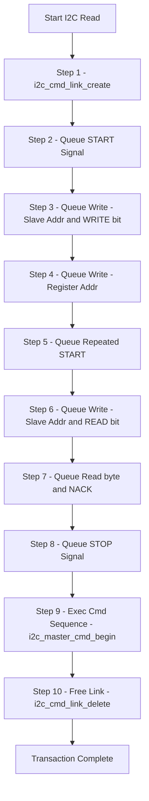

# Topic: I2C Master and Slave Operations (i2c_simple)

## 1. Theory & Protocol Overview
I2C (Inter-Integrated Circuit) is a 2-wire serial protocol (SDA, SCL) designed for short-distance communications between ICs.
*   **Command Link (ESP-IDF Specific):** ESP-IDF uses a command link structure to execute multiple operations. First, you build a transaction list in memory, then you command the hardware to transmit it.
*   **Standard & Fast Modes:** ESP32 supports standard mode (100 kbps) and fast mode (400 kbps).

## 2. Configuration Steps
1.  Configure `sda_io_num`, `scl_io_num`, and pull-up configuration using `i2c_config_t`.
2.  Enable settings via `i2c_param_config()`.
3.  Register driver via `i2c_driver_install()`.

## 3. Logic Flowchart (Command Link Execution)

### Logic Explanation:
1.  **Command Link:** Command link structure saves system overhead. The I2C engine does not generate traffic on the bus until `i2c_master_cmd_begin()` is invoked.
2.  **Repeated Start:** Re-issues start without releasing the bus, preventing other masters from hijacking control mid-transaction.

*(Reference path: `examples/peripherals/i2c/i2c_simple`)*
