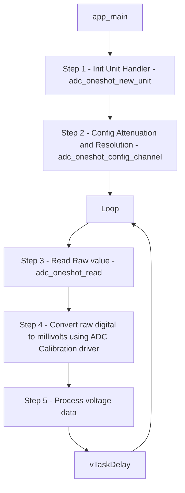

# Topic: Analog-to-Digital Converter (ADC) Oneshot Mode

## 1. Theory & Protocol Overview
An ADC (Analog to Digital Converter) converts a continuous physical voltage level into a digital number that the processor can read.
*   **Resolution (e.g., 12-bit):** Maps the voltage range to numbers between $0$ and $4095$ ($2^{12} - 1$).
*   **Attenuation (e.g., 11dB):** ESP32 pins natively measure only up to ~1.1V. To measure higher voltages (e.g., up to 3.3V), we must configure internal input attenuation.
*   **Oneshot Mode:** Takes a single reading snapshot when requested. (Alternative: Continuous/DMA mode for high-speed sampling).

## 2. Configuration Steps
ESP-IDF uses the new `esp_adc` driver:
1.  **Unit Handle:** Create a unit handle using `adc_oneshot_new_unit()`.
2.  **Channel Configuration:** Configure resolution and attenuation for a specific pin channel using `adc_oneshot_config_channel()`.
3.  **Read Action:** Get the raw digital value using `adc_oneshot_read()`.

## 3. Logic Flowchart

### Logic Explanation:
1.  **Calibration:** ESP32 ADCs are notoriously non-linear and vary from chip to chip due to reference voltage tolerances. ESP-IDF provides calibration APIs to read hardware fuses and adjust the raw measurement to output a highly accurate millivolt value.
2.  **Units:** ESP32 has two separate ADC modules: ADC1 (8 channels, safe to use with WiFi) and ADC2 (10 channels, shared with WiFi - cannot be used easily when WiFi is active).

*(Reference path: `examples/peripherals/adc/oneshot_read`)*
