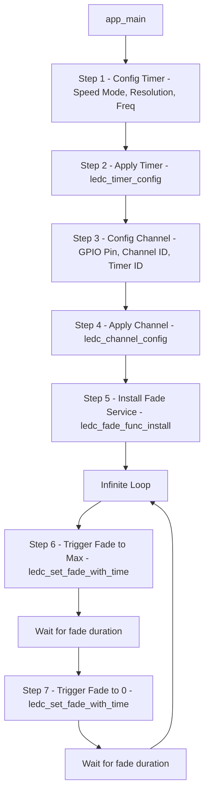

# Topic: LEDC PWM Control

## 1. Theory & Protocol Overview
PWM (Pulse Width Modulation) controls the average voltage sent to a device by switching a digital pin between HIGH and LOW rapidly.
*   **Duty Cycle:** The ratio of time the signal is HIGH relative to the total period (e.g., 50% duty cycle means active half the time).
*   **LEDC Peripheral:** ESP32 has a dedicated LED Control (LEDC) peripheral designed primarily to control LEDs (dimming, color mixing), but it can also be used to generate general PWM signals for motors or buzzers. It features automatic fade transitions without CPU intervention.

## 2. Configuration Steps
1.  **Timer Configuration:** Set up the PWM frequency and resolution using `ledc_timer_config()`.
2.  **Channel Configuration:** Bind a GPIO pin to an LEDC channel, assign it a timer, and set the default duty cycle using `ledc_channel_config()`.

## 3. Logic Flowchart (Fade Effect)

### Logic Explanation:
1.  **Resolution (e.g., 13-bit):** Defines the precision of the duty cycle. 13-bit gives you $2^{13} = 8192$ discrete brightness levels.
2.  **Fade Service:** Once `ledc_fade_func_install` is called, the hardware handles smooth gradient fading autonomously in the background. The CPU is completely free during the transition.

*(Reference path: `examples/peripherals/ledc/ledc_basic`)*
