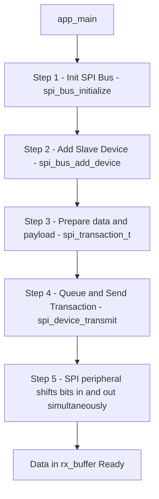

# Topic: SPI Master Driver

## 1. Theory & Protocol Overview
SPI (Serial Peripheral Interface) is a high-speed, synchronous, full-duplex serial bus interface. It is much faster than I2C (reaching tens of MHz).
*   **Four Wires:**
    *   **MOSI (Master Out Slave In):** Data sent from Master to Slave.
    *   **MISO (Master In Slave Out):** Data sent from Slave to Master.
    *   **SCLK (Serial Clock):** Generated by Master.
    *   **CS/SS (Chip Select):** Low level enables slave.
*   **ESP-IDF Driver Architecture:**
    1.  **Bus Configuration:** Setup global SPI pins (MOSI, MISO, SCLK).
    2.  **Device Addition:** Add individual slave devices to the bus (each gets its own CS pin and clock settings).
    3.  **Transactions:** Send data blocks (either blocking or non-blocking queues).

## 2. Configuration Steps
*   **Bus Init:** Initialize the bus using `spi_bus_initialize()`.
*   **Device Init:** Add a device to the bus using `spi_bus_add_device()`.
*   **Transaction Struct:** Define transaction data (length, payload, command, address) using `spi_transaction_t`.

## 3. Logic Flowchart (SPI Transaction)

### Logic Explanation:
1.  **Full Duplex:** For every bit shifted out on MOSI, a bit is shifted in on MISO at the exact same clock tick.
2.  **`spi_device_transmit`:** This is a blocking helper. It queues the transaction, waits for the SPI controller to finish shifting all the bits, and then returns.

*(Reference path: `examples/peripherals/spi_master/lcd`)*
