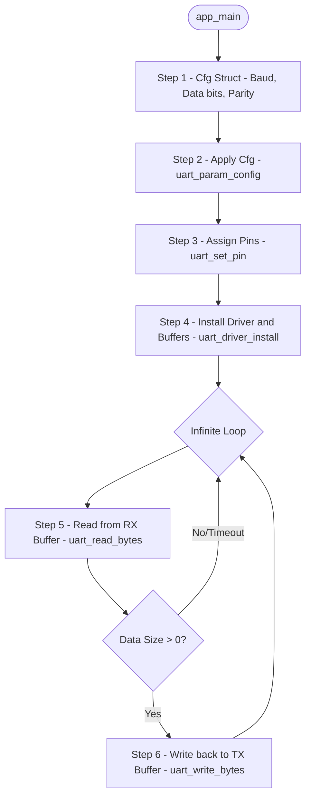

# Topic: UART Echo (Basic Serial Read/Write)

## 1. Theory & Protocol Overview
UART (Universal Asynchronous Receiver-Transmitter) is a simple, asynchronous serial communication protocol using only two wires:
*   **TX (Transmit):** Sends data.
*   **RX (Receive):** Receives data.
*   *Note:* The Baud rate (communication speed, e.g., 115200bps) must match exactly on both devices since there is no shared clock signal.

## 2. Configuration Steps
To configure UART in ESP-IDF:
1.  Define configuration parameters using `uart_config_t`.
2.  Apply settings using `uart_param_config()`.
3.  Bind TX/RX pins to the hardware controller using `uart_set_pin()`.
4.  Allocate internal memory buffer and install the driver using `uart_driver_install()`.

## 3. Logic Flowchart
The following diagram demonstrates the simple "Echo" loop (any data received on RX is immediately re-sent on TX):

### Logic Explanation:
1.  **Buffer Allocation:** During `uart_driver_install`, we allocate an RX Ring Buffer. Incoming bytes are handled by the hardware UART peripheral and placed into this RAM buffer automatically in the background.
2.  **`uart_read_bytes`:** This function checks the RX Ring Buffer. If it's empty, the calling task blocks (goes to sleep) until new data arrives or the timeout expires, preventing 100% CPU usage.

*(Reference path: `examples/peripherals/uart/uart_echo`)*
