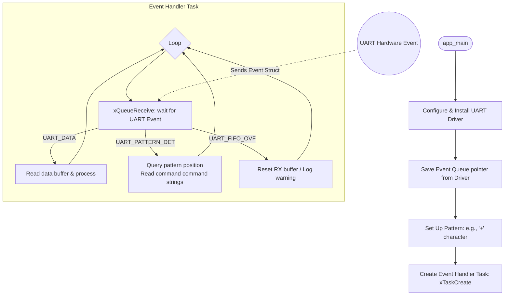

# Topic: UART Events & Pattern Detection

## 1. Theory & Protocol Overview
Instead of actively polling for bytes using `uart_read_bytes`, a more advanced and robust way is to use **UART Events**. The driver uses an OS queue to notify the application of different hardware-level events:
*   **`UART_DATA`:** Normal data bytes received.
*   **`UART_FIFO_OVF` / `UART_BUFFER_FULL`:** Buffer overflow warnings.
*   **`UART_PATTERN_DET`:** Pattern matching (e.g., detecting `\r\n` or `+++` in command lines).

## 2. Configuration Steps
1.  Configure UART parameters as usual.
2.  During `uart_driver_install`, provide a pointer to a `QueueHandle_t` to receive driver events.
3.  Configure pattern detection using `uart_enable_pattern_det_baud_intr()`.

## 3. Logic Flowchart

### Logic Explanation:
1.  **Event Queue:** When the hardware UART peripheral detects an event (like receiving bytes or matching a pattern), it writes a `uart_event_t` struct directly to the queue.
2.  **`UART_PATTERN_DET`:** Extremely useful for AT command parsing. The hardware automatically identifies the target sequence and gives you the exact buffer index, eliminating the need to write complex string parser logic.

*(Reference path: `examples/peripherals/uart/uart_events`)*
