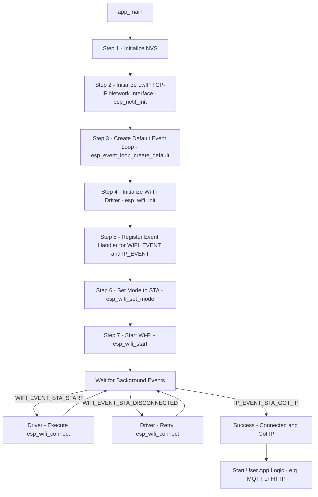

# Topic: Wi-Fi Station (Client) Mode

## 1. Theory & Protocol Overview
The ESP32 has a built-in 2.4GHz Wi-Fi transceiver. Wi-Fi can operate in different modes:
*   **Station (STA):** The ESP32 connects to an existing Wi-Fi router (Access Point) just like your smartphone does.
*   **Access Point (AP):** The ESP32 acts as a router, broadcasting its own network for others to connect to.
*   **AP-STA:** Both modes running simultaneously.

In ESP-IDF, Wi-Fi operates asynchronously. The hardware does its job in the background, and it uses the **Event Loop** to notify the application when things happen (e.g., `WIFI_EVENT_STA_START`, `WIFI_EVENT_STA_DISCONNECTED`, `IP_EVENT_STA_GOT_IP`). You don't "wait" in a loop for Wi-Fi to connect; instead, you register an Event Handler function that reacts to these signals.

## 2. Configuration Steps
*   **CMakeLists.txt:** You must include the `esp_wifi`, `esp_netif`, and `esp_event` components.
    ```cmake
    # Usually available by default in the main CMakeLists, but ensure requires if building a component
    REQUIRES esp_wifi esp_netif esp_event nvs_flash
    ```
*   **NVS Requirement:** The Wi-Fi driver requires NVS (Non-Volatile Storage) to be initialized first because it saves calibration data and configuration in Flash.

## 3. Logic Flowchart (Event-Driven Wi-Fi Connection)
Instead of a heavy code block, here is the logical flow of how ESP-IDF initializes Wi-Fi and handles connection events.



### Flowchart Logic Explanation:
1.  **NVS & Netif:** Before Wi-Fi can start, the underlying TCP/IP stack (`LwIP`) and Flash storage (`NVS`) must be ready.
2.  **Event Loop:** Because Wi-Fi takes time to negotiate, we create an Event Loop. We tell the system: *"Hey, if Wi-Fi connects or disconnects, call my EventHandler function."*
3.  **Start & Connect:** `esp_wifi_start()` boots the hardware. This triggers the `WIFI_EVENT_STA_START` event. The Event Handler catches this and calls `esp_wifi_connect()` to actually attempt connection to the router.
4.  **Got IP:** If the password is correct, the router assigns an IP address. This triggers `IP_EVENT_STA_GOT_IP`. At this point, the connection is complete, and your main application (like sending HTTP requests) can safely begin.

*(Note: Because this task involves heavy event registration and struct configuration, please refer to the `examples/wifi/getting_started/station` directory in your ESP-IDF path for the exact boilerplate code).*
