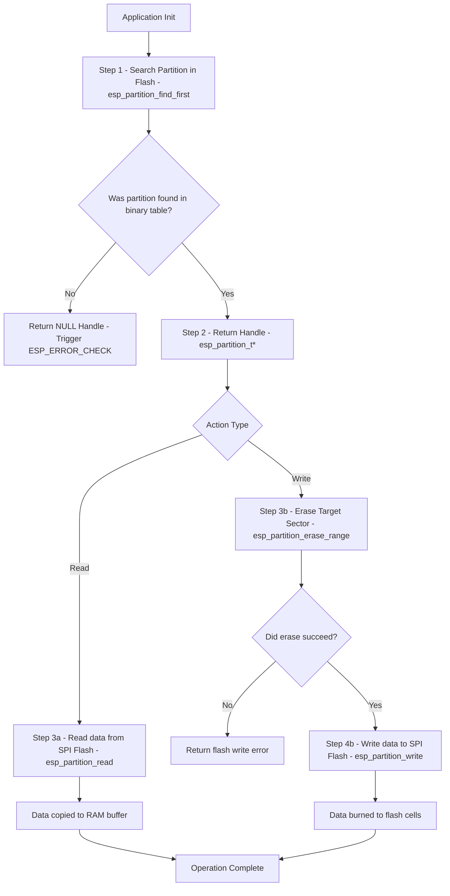

# Deep Dive: Flash Memory Partitioning (Partition Table)

## 1. Deep-Dive Mechanics & Architecture
The ESP32 uses external SPI flash memory (connected via the SPI0/1 peripheral) to store the secondary bootloader, partition table, executable application binary, and user data.

```text
Physical SPI Flash Layout:
+-------------------+----------------------+--------------------+--------------------+
| 2nd Bootloader    | Partition Table      | NVS Partition      | Application (App)  |
| (Offset 0x1000)   | (Offset 0x8000)      | (Offset 0x9000)    | (Offset 0x10000)   |
+-------------------+----------------------+--------------------+--------------------+
```

### Memory Management Unit (MMU) & Virtual Address Space
*   **MMU Mapping:** The ESP32 CPU cannot execute code directly from external SPI flash because the serial bus is too slow. Instead, the MMU maps blocks of external flash (in 64KB pages) into the CPU's internal virtual address space:
    *   **Instruction Bus (IROM):** Virtual address range `0x40000000` to `0x403FFFFF`.
    *   **Data Bus (DROM):** Virtual address range `0x3F400000` to `0x3F7FFFFF`.
*   **Partition Table:** A binary map located at offset `0x8000` (length 3KB). It defines the boundaries (offset, size) of flash partitions. During initialization, the ESP-IDF Virtual File System (VFS) and Partition Manager read this map to mount storage partitions and locate executable partitions.

---

## 2. Configuration & Toolchain Setup

### Step 1: Write the `partitions.csv`
A partition table is structured as a comma-separated values file. Let's analyze a production-ready custom partition layout:

```csv
# Name,     Type,  SubType,  Offset,   Size,     Flags
nvs,        data,  nvs,      0x9000,   0x6000,
otadata,    data,  ota,      0xf000,   0x2000,
phy_init,   data,  phy,      0x11000,  0x1000,
factory,    app,   factory,  0x12000,  1.5M,
storage,    data,  spiffs,   ,         1M,       encrypted
```

*   **Type:** 
    *   `app` (0x00): Partition contains executable code.
    *   `data` (0x01): Partition contains configuration files, calibration details, or file systems.
*   **SubType:** Refers to the module using the partition (e.g., `nvs`, `ota`, `phy`, `spiffs`, `fat`).
*   **Offset:** The starting byte address in SPI Flash. If left blank, the build system calculates it based on the previous partition's offset + size.
*   **Flags:** 
    *   `encrypted`: If set, this partition will be encrypted on boot when **Flash Encryption** is enabled.

### Step 2: Configure SDK via `menuconfig`
To compile your project with this custom layout:
1.  Go to `Partition Table`.
2.  Set `Partition Table` config to `Custom partition table CSV`.
3.  Set `Custom partition table CSV` to `partitions.csv`.
4.  Optionally set `Offset of partition table` (default is `0x8000`).

### Step 3: Toolchain flashing commands
The build system converts `partitions.csv` into a binary `partition-table.bin`. To flash only the partition table manually without rebuilding the entire app:
```bash
esptool.py --chip esp32 --port /dev/ttyUSB0 --baud 921600 write_flash 0x8000 build/partition_table/partition-table.bin
```

---

## 3. Flowchart & Critical Paths Analysis



### Critical Decisions & Branching:
*   **Finding Partition (`SearchCheck`):** If your application code attempts to access a partition name (e.g., `"storage"`) that is not listed in `partitions.csv`, `esp_partition_find_first` returns `NULL`. Wrapping this call with `ESP_ERROR_CHECK()` causes the system to reboot, preventing access to invalid memory.
*   **Flash Sector Erase (`EraseSector`):** You **cannot** write to a flash address without erasing it first. Flash memory writes work by changing bits from `1` to `0`. The erase operation resets all bits in a **4KB sector** to `1`. If you attempt to write without erasing, the write will succeed but the resulting data will be corrupted.

---

## 4. System Impacts & Warnings

### Flash Wear-Out (Lifespan)
*   External SPI Flash chips have a write/erase cycle limit (typically **100,000 cycles**).
*   **Warning:** Running raw writes (`esp_partition_write`) inside a fast loop will destroy the flash memory within hours. For continuous logging, use a filesystem component with **Wear Leveling** (like SPIFFS or FATFS) which distributes writes evenly across different physical flash sectors.

### Read/Write Performance
*   **Read Speed:** Fast (uses hardware cache).
*   **Write/Erase Speed:** Very slow. Erasing a 4KB sector blocks CPU execution on the flash controller for up to 10-100ms.
*   **Cache Disabling:** During erase/write operations, the CPU flash cache is temporarily disabled. If any task tries to run an instruction residing in SPI flash during this time, a **Cache Disabled Exception** occurs, crashing the system.
    *   *Solution:* Tasks handling critical hardware interrupts during flash writes must have their code marked with `IRAM_ATTR`.

### Security Constraints
*   If **Flash Encryption** is active, you must use `esp_partition_write` with encryption flags, or write to partitions flagged as `encrypted` in the CSV. Writing plaintext data to an encrypted partition will result in garbage data when read.
