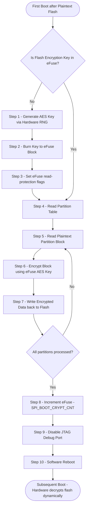

# Deep Dive: Flash Encryption (Hardware Protection)

## 1. Deep-Dive Mechanics & Architecture
Flash Encryption prevents direct physical access to the contents of external SPI flash.

```text
SPI Flash (Encrypted Data) ---> [Hardware AES Decryption Engine] ---> CPU Core (Plaintext Code)
                                           ^
                                           |
                                  [eFuse Key Block] (Hardware Locked)
```

### The Hardware Decryption Engine
*   **On-the-fly Decryption:** The ESP32 features a hardware cryptographic engine situated between the external SPI bus controller and the internal MMU cache.
*   **Transparent Access:** When the CPU requests an instruction from flash (virtual memory address), the MMU fetches the encrypted sector. The AES engine decrypts it in real-time using the key stored in the eFuses before it hits the CPU cache. The CPU sees normal plaintext code.
*   **eFuses:** eFuses are microscopic, one-time programmable (OTP) fuses inside the ESP32 silicon. Once a fuse is blown (programmed to `1`), it cannot be reversed.
*   **Key Storage:** The bootloader stores a 256-bit AES key in one of the eFuse blocks (e.g., `BLOCK_KEY0` to `BLOCK_KEY5` on ESP32-S3/C3). Hardware security locks are then burned so that this key is **never** readable by CPU software, JTAG debuggers, or the bootloader itself. Only the hardware AES decrypter can access it.

---

## 2. Configuration & Toolchain Setup

### Step 1: Menuconfig Configuration
Run `idf.py menuconfig` and navigate to `Security features`:
1.  Enable **Enable flash encryption on boot**.
2.  Choose the **Usage Mode**:
    *   **Development Mode (Testing):** Key parameters are left open. You can still flash plaintext binaries via serial port. The ESP32 re-encrypts the flash on next boot.
    *   **Release Mode (Production):** All security doors are locked. JTAG is disabled. Bootloader is read-protected. The chip only accepts pre-encrypted OTA binaries.

### Step 2: eFuse Programming via CLI
In Development Mode, the chip generates its own key. In a manufacturing line, it is safer to generate the key on a PC and flash it to the eFuse block:
```bash
# 1. Generate key file on PC
espsecure.py generate_key --keytype flash_encryption my_flash_key.bin

# 2. Burn key to ESP32 eFuse block (e.g., BLOCK_KEY0)
espefuse.py --port /dev/ttyUSB0 burn_key BLOCK_KEY0 my_flash_key.bin FLASH_ENCRYPTION
```
*(Warning: The burn command is permanent! Double-check the target block before executing).*

---

## 3. Flowchart & Critical Paths Analysis



### Critical Decisions & Branching:
*   **Key Check (`CheckFuseKey`):** On first boot, if the eFuse key block is empty, the ESP32 activates its internal Hardware Random Number Generator (RNG) to create a key.
*   **SPI Boot Crypt Counter (`BurnCryptCnt`):** The ESP32 tracks the status of encryption using the `SPI_BOOT_CRYPT_CNT` eFuse register (3-bit/8-bit field).
    *   If the counter has an **odd number of bits set** (e.g., `0x01`), Flash Encryption is **enabled**.
    *   If you flash new plaintext firmware, you must increment this counter (e.g., `0x03` - even bits set), which temporarily disables decryption. The chip then re-encrypts the flash on boot and sets the counter to odd (e.g., `0x07`).
    *   **Development limit:** The counter can only be written to a maximum of 3 or 4 times. Once all bits are burned, the chip is permanently locked in encryption mode.

---

## 4. System Impacts & Warnings

### Permanent JTAG Lock
*   Enabling Flash Encryption in **Release Mode** permanently disables the JTAG debug port. You can no longer use hardware debuggers (like ESP-Prog) to step through code.

### Read/Write Latency
*   **Latency:** The hardware AES engine decrypts blocks in parallel with flash reads. The performance penalty is minimal (~5-10% slower read times), which is hidden by the MMU cache.
*   **Write Speed:** Writing data to an encrypted partition takes longer because the CPU must encrypt the data buffer in software before writing it to SPI Flash.

### OTA (Over-the-Air) Configuration
*   Since plaintext flashing over UART is blocked in Release Mode, future updates must be performed via OTA. The OTA server transmits encrypted binaries, or the ESP32 receives plaintext OTA and encrypts it locally before writing to the target OTA partition.

### Brick Risk
*   If you lose the key file (if keys were generated externally) or if the first boot encryption process is interrupted due to a power loss, the SPI flash contents will be corrupted, and the chip will be permanently bricked. Always ensure stable power supply during first boot.
