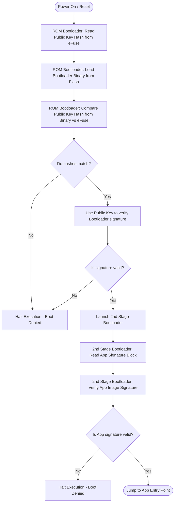

# Deep Dive: Secure Boot V2 (Trust Chain Integrity)

## 1. Deep-Dive Mechanics & Architecture
Secure Boot V2 ensures that only signed, authorized firmware runs on the ESP32. It prevents execution of modified or hijacked binaries.

```text
Boot Chain of Trust:
[ROM Bootloader] ---> [Signed 2nd Stage Bootloader] ---> [Signed App Image]
        |                            |                           |
  Verifies signature           Verifies signature          Verifies OTA data
  using eFuse Key Hash         using Bootloader Key        before update
```

### Cryptographic Signatures & Verification
*   **Asymmetric Cryptography:** Secure Boot V2 uses public-key cryptography (typically **RSA-3072** or **ECDSA-P256**). 
*   **eFuse Key Hash:** Generating RSA/ECDSA verification keys inside the ESP32 silicon would require too much space. Instead, a SHA-256 hash of the Public Verification Key is burned into the ESP32's internal OTP **eFuse** registers.
*   **Verification Process:**
    1.  The firmware binary has a signature block appended to its end containing: the Public Key and the digital signature (hash of firmware encrypted with the private key).
    2.  The ROM/Bootloader reads the Public Key from the binary's signature block, calculates its SHA-256 hash, and compares it against the hash burned into the eFuse.
    3.  If they match, it uses this Public Key to decrypt the signature and verify the cryptographic integrity of the code.

---

## 2. Configuration & Toolchain Setup

### Step 1: Generate the Keys
Generate a secure private signing key on your host PC using `espsecure.py` (part of the ESP-IDF toolchain):
```bash
# Generate a private RSA-3072 key
espsecure.py generate_signing_key --version 2 --scheme rsa3072 my_secure_boot_key.pem
```
*   **Critical:** Keep `my_secure_boot_key.pem` extremely safe and back it up. If lost, you can never update your devices again.

### Step 2: Configure SDK via `menuconfig`
Open `idf.py menuconfig` and go to `Security features`:
1.  Enable **Enable secure boot v2**.
2.  Choose the **Secure Boot v2 signing key** path (pointing to `my_secure_boot_key.pem`).
3.  Ensure **Sign binaries during build** (`CONFIG_SECURE_BOOT_BUILD_SIGNED_BINARIES`) is enabled.
4.  Specify the **App/Bootloader signature scheme** (e.g., `RSA-3072`).

### Step 3: Build & Flash
When you compile the project (`idf.py build`), the toolchain automatically signs the bootloader and the application binary.
On the first boot, the ESP32 will:
1.  Read the signature block of the bootloader.
2.  Calculate the public key hash.
3.  Burn the hash permanently into the eFuse controller.
4.  Lock the secure boot eFuse controller against write modifications.

---

## 3. Flowchart & Critical Paths Analysis



### Critical Decisions & Branching:
*   **Public Key Verification (`HashCheck`):** If a hacker replaces the public key in the binary with their own key, they can sign their firmware successfully. However, the SHA-256 hash of their public key will not match the hash burned in the eFuses, and the ROM bootloader immediately stops the boot.
*   **Signature Integrity (`SigCheck` / `AppCheck`):** Even a 1-bit modification in the compiled code (due to memory degradation or tampering) alters the calculated hash. The decrypted signature will fail to verify against the calculated hash, causing a boot denial.

---

## 4. System Impacts & Warnings

### OTA Lifecycle (Crucial)
*   **All updates must be signed:** Any OTA update binary sent to the device must be signed on your build machine using the exact same private key (`my_secure_boot_key.pem`). If you compile and send an unsigned or incorrectly signed binary, the device will write it to flash, reboot, fail verification, and halt.

### Boot Delay (Overhead)
*   Cryptographic calculations take clock cycles. Decrypting and verifying an RSA-3072 signature on boot delays start-up:
    *   Boot time delay can take up to **100ms - 500ms** depending on clock speed and CPU target.

### Production eFuse Locking
*   Once Secure Boot is active in Release mode, the JTAG debugging interface is disabled, UART bootloader flashing is disabled (or restricted to signed code on newer chips), and eFuse registers are write-protected.

### Irrecoverable Key Loss (Brick Warning)
*   **WARNING:** The private key `my_secure_boot_key.pem` is the ONLY key that can sign software for your chips. If you lose this private key:
    *   You cannot compile and update firmware over OTA.
    *   You cannot flash new code over UART.
    *   **The chip is permanently frozen in its current software state forever.** Keep the private key in a secure offline vault.
