# 🗺️ English Grammar & Cohesion Dashboard

Chào mừng bạn đến với góc học tập **Ngữ pháp & Kỹ năng Liên kết câu (Grammar & Cohesion)**. Đây là nơi tổng hợp các quy tắc ngữ pháp cốt lõi, cách sử dụng giới từ, danh động từ và các phương pháp viết câu, đoạn văn mạch lạc trong tiếng Anh.

---

## 📌 Sơ đồ lộ trình học tập (Learning Path)

```mermaid
graph TD
    Index["Grammar & Cohesion<br>(Mục lục chính)"] --> Sub1["🟢 1. Tenses & Core Grammar<br>(Các thì cơ bản)"]
    Index --> Sub2["🧩 2. Sentence Structures & Writing<br>(Cấu trúc câu & Viết câu)"]
    Index --> Sub3["📍 3. Prepositions & Gerunds<br>(Giới từ & Danh động từ)"]
    Index --> Sub4["⚡ 4. Advanced Grammar Topics<br>(Ngữ pháp nâng cao)"]

    Sub1 --> P1["1.1. Present Tenses"]
    Sub1 --> P2["1.2. Past Tenses"]
    Sub1 --> P3["1.3. Future Tenses"]

    Sub2 --> S1["2.1. Sentence Elements & Types"]
    Sub2 --> S2["2.2. Connecting Clauses with Prepositions"]
    Sub2 --> S3["2.3. Sentence Linkers & Cohesion"]

    Sub3 --> G1["3.1. Basic Prepositions"]
    Sub3 --> G2["3.2. Gerunds & Infinitives"]
    Sub3 --> G3["3.3. Advanced Prepositions"]

    Sub4 --> A1["4.1. Passive Voice"]
    Sub4 --> A2["4.2. Reported Speech"]
    Sub4 --> A3["4.3. Exclamatory"]
    Sub4 --> A4["4.4. Inversion"]
    Sub4 --> A5["4.5. Conditionals & Wish"]
    Sub4 --> A6["4.6. Subjunctive"]
    Sub4 --> A7["4.7. Cleft Sentences"]
```

---

## 📚 Danh mục các chuyên đề học tập

Dưới đây là các chủ đề chi tiết giúp bạn tra cứu và học tập một cách hệ thống theo từng thư mục con:

### 📁 1. Tenses & Core Grammar (Các thì & Ngữ pháp cốt lõi)
*   🟢 **[[1. Tenses & Core Grammar/1.1. Present Tenses|1.1. Present Tenses (Các thì Hiện tại)]]**: Công thức, cách dùng, dấu hiệu và lưu ý về động từ trạng thái (State verbs).
*   🟡 **[[1. Tenses & Core Grammar/1.2. Past Tenses|1.2. Past Tenses (Các thì Quá khứ)]]**: Phối hợp các thì quá khứ trong câu chuyện, quy tắc phát âm đuôi "-ed".
*   🔵 **[[1. Tenses & Core Grammar/1.3. Future Tenses|1.3. Future Tenses (Các thì Tương lai)]]**: Công thức tương lai và phân biệt bẫy *Will* vs. *Be going to* vs. *Present Continuous*.

### 📁 2. Sentence Structures & Writing (Cấu trúc câu & Kỹ thuật viết)
*   🧩 **[[2. Sentence Structures & Writing/2.1. Sentence Elements & Types|2.1. Sentence Elements & Types (Thành phần & Cấu trúc câu)]]**: Phân tích S-V-O-C-A, 4 kiểu câu (Simple, Compound, Complex, Compound-Complex) và các lỗi viết câu kinh điển.
*   🔗 **[[2. Sentence Structures & Writing/2.2. Connecting Clauses with Prepositions|2.2. Connecting Clauses with Prepositions (Nối câu bằng giới từ)]]**: Nối câu dùng *despite, due to* hoặc mệnh đề quan hệ với giới từ (*in which, to whom*).
*   🌉 **[[2. Sentence Structures & Writing/2.3. Sentence Linkers & Paragraph Cohesion|2.3. Sentence Linkers & Paragraph Cohesion (Từ nối & Liên kết câu)]]**: Cách dùng từ nối transition words và các công cụ giúp liên kết đoạn văn mạch lạc.

### 📁 3. Prepositions, Gerunds & Infinitives (Giới từ, Danh động từ & Nguyên mẫu)
*   📍 **[[3. Prepositions, Gerunds & Infinitives/3.1. Basic Prepositions (Giới từ cơ bản)|3.1. Basic Prepositions (Giới từ cơ bản)]]**: Quy tắc tam giác giới từ *In - On - At* và collocations giới từ cơ bản, kèm bài tập thực hành.
*   🔄 **[[3. Prepositions, Gerunds & Infinitives/3.2. Gerunds & Infinitives|3.2. Gerunds & Infinitives (Danh động từ & Động từ nguyên mẫu)]]**: Phân biệt *V-ing* vs. *to V*, các động từ đi với cả hai dạng nhưng nghĩa thay đổi.
*   ⚡ **[[3. Prepositions, Gerunds & Infinitives/3.3. Advanced Prepositions (Giới từ nâng cao)|3.3. Advanced Prepositions (Giới từ nâng cao)]]**: Giới từ chỉ tác nhân, công cụ, nguyên nhân, cụm giới từ phức tạp, các collocations C1-C2 và bài tập nâng cao.

### 📁 4. Advanced Grammar Topics (Chuyên đề ngữ pháp nâng cao)
*   🔄 **[[4. Advanced Grammar Topics/4.1. Passive Voice (Câu bị động)|4.1. Passive Voice (Câu bị động)]]**: Bị động cho 12 thì, bị động truyền khiến (*have/get sth done*), bị động kép với động từ tường thuật, và đảo ngữ bị động.
*   🗣️ **[[4. Advanced Grammar Topics/4.2. Reported Speech (Câu gián tiếp)|4.2. Reported Speech (Câu gián tiếp)]]**: Quy tắc lùi thì, đổi trạng từ và các động từ tường thuật đặc biệt (*suggest, deny, offer...*).
*   😮 **[[4. Advanced Grammar Topics/4.3. Exclamatory Sentences (Câu cảm thán)|4.3. Exclamatory Sentences (Câu cảm thán)]]**: Cấu trúc cảm thán nâng cao với *What, How, So, Such* và giao tiếp thực tế.
*   🔄 **[[4. Advanced Grammar Topics/4.4. Inversion (Đảo ngữ)|4.4. Inversion (Đảo ngữ)]]**: Đảo ngữ phủ định, đảo ngữ với *Only, No sooner, So/Such* và đảo ngữ câu điều kiện.
*   🌀 **[[4. Advanced Grammar Topics/4.5. Conditionals & Wish (Câu điều kiện & Ước)|4.5. Conditionals & Wish (Câu điều kiện & Câu ước)]]**: Điều kiện loại 0-3, điều kiện hỗn hợp (Mixed), các từ thay thế *If*, và cấu trúc câu ước *Wish / If only*.
*   🧠 **[[4. Advanced Grammar Topics/4.6. Subjunctive Mood (Thức giả định)|4.6. Subjunctive Mood (Thức giả định)]]**: Giả định hiện tại (động từ nguyên mẫu không chia sau *suggest, essential*) và giả định quá khứ (*It's time, Would rather, As if*).
*   🧩 **[[4. Advanced Grammar Topics/4.7. Cleft Sentences (Câu chẻ nhấn mạnh)|4.7. Cleft Sentences (Câu chẻ nhấn mạnh)]]**: Câu chẻ nhấn mạnh chủ ngữ, tân ngữ, trạng ngữ với *It is/was... that* và câu chẻ với *What*.

---

## 💡 Mẹo sử dụng Obsidian hiệu quả
- **Phím tắt nhanh:** Nhấn `Ctrl + Click` (hoặc `Cmd + Click`) vào các link màu xanh để nhảy nhanh đến note học tập.
- **Tập viết thực tế:** Sử dụng Skill Agent `grammar-cohesion-helper` để phân tích các câu/đoạn văn bạn viết và kiểm tra mức độ sử dụng giới từ, gerund, đảo ngữ hoặc câu chẻ trực tiếp.

---
*Cập nhật lần cuối: 2026-07-24 bởi Antigravity Assistant.*
