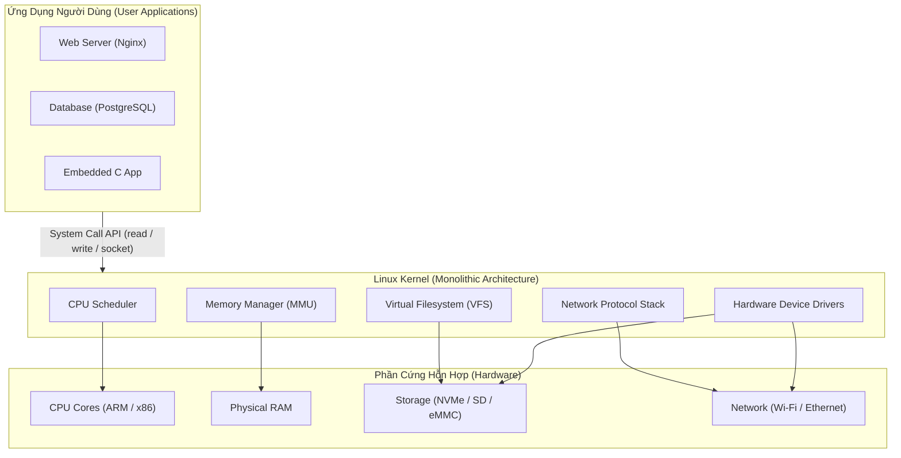
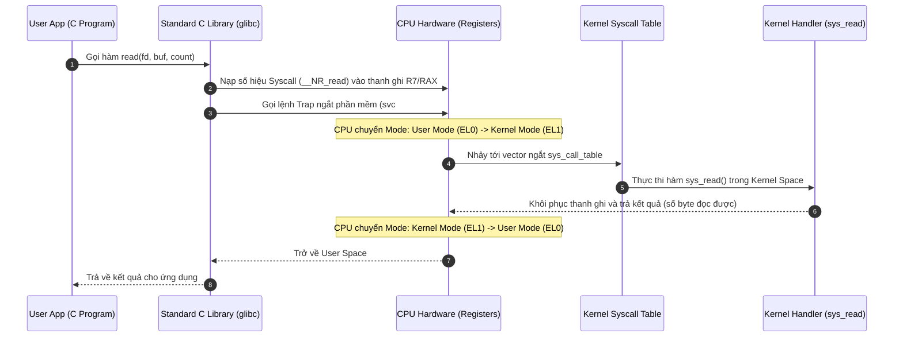
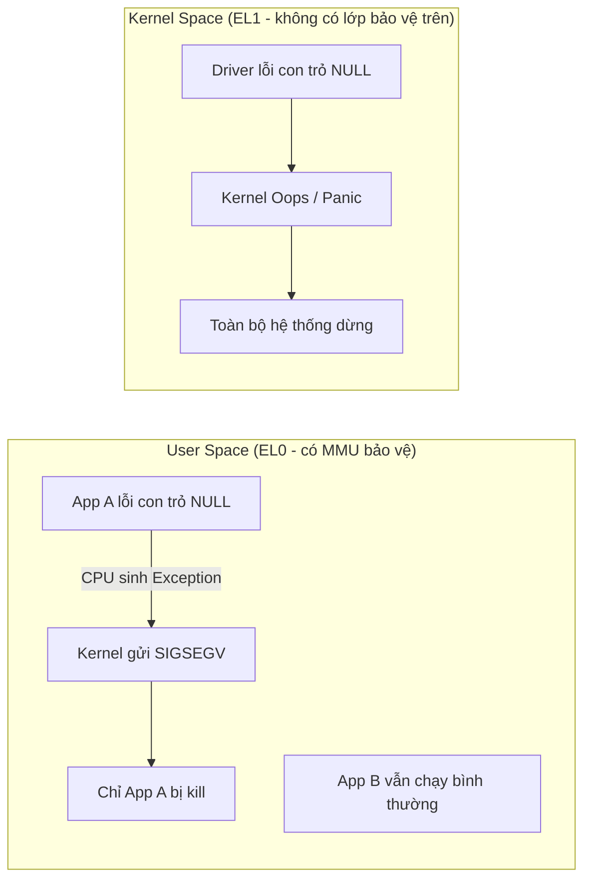

# 🐧 Chương 1: Linux Kernel Introduction (Giới Thiệu Chuyên Sâu Linux Kernel)

Tài liệu này hệ thống hóa toàn bộ kiến thức từ **Slide 17 đến Slide 22** của khóa học Bootlin Linux Kernel, bổ sung các phân tích kiến trúc chiều sâu, hướng dẫn bài thực hành Practical Lab, các tình huống lỗi thực tế và câu hỏi ôn tập củng cố.

---

## 📌 1. Nguồn Gốc và Triết Lý Thiết Kế Linux Kernel

### 1.1 Khái quát Lịch sử & Giấy phép GPLv2 (Slide 17-18)
* **Khởi đầu (1991)**: Linus Torvalds viết phiên bản Linux đầu tiên cho bộ vi xử lý Intel 80386 nhằm tạo ra một hệ điều hành kiểu UNIX tự do chạy trên máy tính cá nhân.
* **Chuẩn POSIX (Portable Operating System Interface)**: Linux tuân thủ các tiêu chuẩn POSIX.1. Điều này đảm bảo rằng các mã nguồn viết bằng ngôn ngữ C sử dụng các hàm chuẩn (như `open()`, `read()`, `fork()`, `pthread_create()`) có thể biên dịch và chạy tương thích trên cả Linux, BSD, macOS và UNIX.
* **Giấy phép GPLv2 (GNU General Public License v2)**:
  * Quy định mọi mã nguồn sửa đổi hoặc tích hợp trực tiếp với Linux Kernel khi phân phối ra công chúng **bắt buộc phải được phát hành công khai mã nguồn** dưới cùng giấy phép GPLv2.
  * Đây là yếu tố cốt lõi giúp Linux thu hút sự đóng góp khổng lồ từ các tập đoàn công nghệ hàng đầu thế giới (Google, Red Hat, Intel, ARM, Texas Instruments, Bootlin).

### 1.2 Hai Nhiệm Vụ Cốt Lõi Của Kernel (Slide 19)



1. **Quản lý Tài nguyên Phần cứng (Resource Manager)**:
   * **CPU Scheduling**: Phân chia thời gian thực thi của các nhân CPU cho hàng nghìn tiến trình (threads/processes) bằng thuật toán CFS (Completely Fair Scheduler) hoặc Real-time Schedulers (FIFO/RR).
   * **Memory Management**: Quản lý bộ nhớ RAM thông qua MMU, cấp phát và thu hồi bộ nhớ ảo (Virtual Memory), trang nhớ (Pages), ngăn ngừa các tiến trình truy cập trái phép vùng nhớ của nhau.
   * **I/O Management**: Điều phối băng thông đọc/ghi đĩa và giao tiếp mạng, tránh hiện tượng tắc nghẽn (bottleneck).

2. **Trừu tượng hóa Phần cứng (Hardware Abstraction Layer)**:
   * Cung cấp giao diện lập trình ứng dụng (API) đồng nhất. Nhờ có Kernel, lập trình viên ứng dụng chỉ cần mở file `/dev/video0` để đọc dữ liệu webcam mà không cần viết lại code điều khiển vi mạch điện tử cho từng loại chip cảm biến hình ảnh khác nhau.

---

## 🏗️ 2. Phân Cấp Kiến Trúc: User Space vs Kernel Space

### 2.1 Cấp Độ Quyền Hạn Phần Cứng (Hardware Privilege Levels) (Slide 20)
Để bảo vệ hệ thống không bị sụp đổ khi một ứng dụng gặp lỗi (Crash), các bộ vi xử lý cứng được thiết kế các chế độ hoạt động có quyền hạn khác nhau:

* **User Space (User Mode / Ring 3 trên x86 / EL0 trên ARM64)**:
  * Nơi thực thi các ứng dụng người dùng, giao diện GUI, thư viện C (`glibc`, `musl`).
  * **Hạn chế**: Không được phép thực thi các lệnh điều khiển CPU nguy hiểm (ví dụ: tắt ngắt `cli`, thay đổi bảng trang nhớ `CR3`/`TTBR0`), không được đọc/ghi trực tiếp vào địa chỉ I/O của thiết bị.
  * Nếu cố tình vi phạm, phần cứng CPU sẽ phát sinh ngoại lệ (Exception) $\rightarrow$ Kernel can thiệp và phát tín hiệu **`SIGSEGV` (Segmentation Fault)** để ngắt tiến trình đó ngay lập tức.

* **Kernel Space (Kernel Mode / Ring 0 trên x86 / EL1 trên ARM64)**:
  * Nơi Linux Kernel và toàn bộ các Device Drivers hoạt động.
  * **Quyền hạn**: Truy cập không giới hạn vào toàn bộ RAM vật lý, thanh ghi CPU và thiết bị phần cứng.
  * **Rủi ro**: Nếu mã nguồn trong Kernel Space bị lỗi con trỏ NULL hoặc đọc sai bộ nhớ, **toàn bộ hệ điều hành sẽ sụp đổ (Kernel Panic / Oops)**.

---

## 🔄 3. Cơ Chế Chuyển Ngữ System Call (Hệ Thống Lệnh Kênh)

### 3.1 Luồng thực thi chi tiết của một System Call (Slide 21)

Khi ứng dụng người dùng muốn đọc dữ liệu từ file (`read(fd, buf, count)`):



---

## 📁 4. Hệ Thống File Giả Lập (Pseudo Filesystems)

### 4.1 Chi tiết các Pseudo Filesystems chính (Slide 22)

Pseudo Filesystem là giao diện đặc biệt của Linux Kernel giúp người dùng tương tác với thông tin nội bộ của Kernel bằng các lệnh thao tác file chuẩn (`cat`, `echo`, `grep`).

| Hệ thống File | Điểm Gắn (Mount) | Mục Đích & Các Tệp Tin Quan Trọng |
| :--- | :--- | :--- |
| **`procfs`** | `/proc` | **Thông tin Tiến trình & Trạng thái Hệ thống**: <br>• `/proc/cpuinfo`: Thông số nhân CPU. <br>• `/proc/meminfo`: Dung lượng RAM trống/đã dùng. <br>• `/proc/cmdline`: Tham số khởi động Kernel (`bootargs`). <br>• `/proc/<PID>/`: Thông tin chi tiết của tiến trình có mã PID. |
| **`sysfs`** | `/sys` | **Mô hình Cấu trúc Thiết bị & Driver (Device Model)**: <br>• `/sys/bus/`: Danh sách các loại bus (i2c, usb, pci, platform). <br>• `/sys/class/`: Phân loại thiết bị (gpio, net, leds, input). <br>• `/sys/devices/`: Cây liên kết phần cứng vật lý toàn hệ thống. |
| **`devtmpfs`** | `/dev` | **File Đại diện Thiết bị (Device Nodes)**: <br>• `/dev/sda`, `/dev/nvme0n1`: Ổ cứng vật lý. <br>• `/dev/ttyUSB0`: Cổng nối tiếp Serial. <br>• `/dev/null`, `/dev/zero`, `/dev/urandom`: Thiết bị ảo. |

---

## 🛠️ PRACTICAL LAB 1: Thực Hành Đo Hiệu Năng Syscall & Khám Phá `/proc` / `/sys`

### Mục tiêu bài lab:
1. Viết chương trình C so sánh thời gian thực thi giữa hàm tính toán thông thường (User space) và System Call (`syscall`).
2. Khám phá các thông số phần cứng và kernel trực tiếp trên terminal qua `/proc` và `/sys`.

### Bước 1: Khám phá hệ thống qua `/proc` và `/sys`
Mở Terminal trên hệ thống Linux và chạy các câu lệnh sau:

```bash
# 1. Xem thông tin CPU và bộ nhớ
cat /proc/cpuinfo | grep "model name"
cat /proc/meminfo | head -n 5

# 2. Xem các tham số bootargs mà Bootloader đã truyền cho Kernel
cat /proc/cmdline

# 3. Thay đổi tham số Kernel ngay khi hệ thống đang chạy (Sysctl)
# Đọc trạng thái cho phép IP Forwarding
cat /proc/sys/net/ipv4/ip_forward

# 4. Duyệt các thiết bị trên Bus I2C hoặc USB trong /sys
ls -l /sys/bus/i2c/devices/
ls -l /sys/class/net/
```

### Bước 2: Viết chương trình C đo độ trễ System Call Trap
Tạo tệp `lab1_syscall_bench.c`:

```c
#include <stdio.h>
#include <stdlib.h>
#include <time.h>
#include <unistd.h>
#include <sys/syscall.h>
#include <sys/types.h>

#define ITERATIONS 10000000 // 10 triệu lần gọi

int main()
{
    struct timespec start, end;
    double elapsed;
    long i;

    printf("=== PRACTICAL LAB 1: MEASURING SYSCALL OVERHEAD ===\n");

    // 1. Đo thời gian thực thi hàm User Space thuần túy (getpid từ cache glibc)
    clock_gettime(CLOCK_MONOTONIC, &start);
    for (i = 0; i < ITERATIONS; i++) {
        // Hàm tính toán đơn giản trên User Space
        volatile int temp = i + 1;
    }
    clock_gettime(CLOCK_MONOTONIC, &end);
    elapsed = (end.tv_sec - start.tv_sec) + (end.tv_nsec - start.tv_nsec) / 1e9;
    printf("[User Space Computation] Time for 10M ops: %.4f seconds\n", elapsed);

    // 2. Đo thời gian thực thi System Call trực tiếp (Chuyển chế độ CPU Kernel Trap)
    clock_gettime(CLOCK_MONOTONIC, &start);
    for (i = 0; i < ITERATIONS; i++) {
        // Gọi lệnh getpid trực tiếp tới Kernel qua ngắt ngầm
        syscall(SYS_getpid);
    }
    clock_gettime(CLOCK_MONOTONIC, &end);
    elapsed = (end.tv_sec - start.tv_sec) + (end.tv_nsec - start.tv_nsec) / 1e9;
    printf("[Kernel System Call Trap ] Time for 10M sys_getpid: %.4f seconds\n", elapsed);

    return 0;
}
```

### Biên dịch và chạy thử:
```bash
gcc -O2 lab1_syscall_bench.c -o lab1_syscall_bench
./lab1_syscall_bench
```
*Kết quả:* Bạn sẽ thấy thời gian gọi System Call lâu hơn hàng chục lần so với tính toán User Space do chi phí **CPU Context Switch** và chuyển quyền hạn Ring 3 $\rightarrow$ Ring 0.

---

## 💡 Tình Huống Lỗi Thực Tế & Debug (Real-World Edge Cases)

### Tình huống 1: Lỗi Segmentation Fault (SIGSEGV)
* **Hiện tượng**: Ứng dụng User space bị văng ra kèm thông báo `Segmentation fault (core dumped)`.
* **Nguyên nhân**: Ứng dụng truy cập vào một con trỏ bộ nhớ không hợp lệ (ví dụ: con trỏ NULL hoặc địa chỉ thuộc Kernel Space `0xFFFF00000000`). CPU phần cứng phát hiện vi phạm quyền Ring 3 và gửi tín hiệu SIGSEGV ngắt ứng dụng.
* **Cách Debug**: Dùng `gdb ./app core` hoặc `dmesg | tail -n 10` để xem địa chỉ gây lỗi.

### Tình huống 2: Lỗi Kernel Panic / Oops
* **Hiện tượng**: Màn hình bị đứng, bàn phím chớp đèn vô tận, log dmesg xuất hiện `BUG: unable to handle kernel NULL pointer dereference`.
* **Nguyên nhân**: Một Driver trong Kernel Space truy cập con trỏ NULL. Do Kernel Space không có lớp bảo vệ nào bên trên, Kernel buộc phải dừng toàn bộ hệ thống để bảo vệ dữ liệu trên đĩa cứng.

---

## 📝 BÀI TẬP THỰC HÀNH HANDS-ON & CÂU HỎI ÔN TẬP

### Bài tập thực hành tự giải:
**Đề bài**: Viết một script bash kiểm tra xem thiết bị của bạn có hỗ trợ giao diện `/proc/config.gz` hay không. Nếu có, hãy giải nén và tìm xem tùy chọn `CONFIG_IKCONFIG` đang bật ở trạng thái nào (`y`, `m` hay không bật).

<details>
<summary>🔍 <b>Xem đáp án gợi ý</b></summary>

```bash
#!/bin/bash
if [ -f /proc/config.gz ]; then
    echo "Phát hiện /proc/config.gz! Đang giải nén kiểm tra..."
    zcat /proc/config.gz | grep "CONFIG_IKCONFIG"
else
    echo "Kernel này không bật CONFIG_IKCONFIG_PROC để lưu tệp cấu hình trong /proc."
fi
```
</details>

### Câu hỏi trắc nghiệm ôn tập:
1. **Tại sao driver chạy trong Kernel Space bị crash lại làm sụp đổ toàn bộ hệ điều hành, trong khi ứng dụng User Space bị crash thì hệ thống vẫn chạy bình thường?**
   * *Trả lời*: Vì Kernel Space chạy ở chế độ quyền hạn cao nhất (Ring 0 / EL1) không có lớp bảo vệ bộ nhớ bên trên. Nếu Kernel gặp lỗi, tính toàn vẹn của RAM và tài nguyên hệ thống không thể đảm bảo. Trong khi đó, ứng dụng User Space chạy ở Ring 3 (EL0) được bảo vệ cách ly bởi MMU.

---

## 🎯 VÍ DỤ MINH HỌA BỔ SUNG

### 💻 Ví dụ 1 (Code C): Đọc thông tin Kernel qua `/proc` không cần Syscall thủ công
Minh họa việc User Space chỉ cần dùng API file chuẩn để lấy dữ liệu nội bộ Kernel — đúng tinh thần "Hardware Abstraction Layer".

```c
#include <stdio.h>

int main(void)
{
    FILE *f = fopen("/proc/uptime", "r");   // Pseudo file do Kernel sinh ra
    double up, idle;

    if (!f) { perror("open /proc/uptime"); return 1; }
    fscanf(f, "%lf %lf", &up, &idle);
    fclose(f);

    printf("Hệ thống đã chạy: %.0f giây (%.1f giờ)\n", up, up / 3600.0);
    printf("Tổng thời gian CPU rảnh: %.0f giây\n", idle);
    return 0;
}
```
```bash
gcc uptime_reader.c -o uptime_reader && ./uptime_reader
```

### 🖥️ Ví dụ 2 (Terminal/Debug): Quan sát System Call thật sự bằng `strace`
`strace` chặn và in ra mọi lần chương trình chuyển từ User Space (EL0) xuống Kernel (EL1):

```bash
# Xem ls thực hiện những syscall nào để liệt kê thư mục
strace -c ls /            # -c: tổng hợp thống kê số lần & thời gian mỗi syscall

# Theo dõi riêng các syscall thao tác file của lệnh cat
strace -e trace=openat,read,write cat /proc/cpuinfo > /dev/null
```
*Bạn sẽ thấy các dòng như `openat(...) = 3`, `read(3, ...) = 4096` — mỗi dòng là một lần "trap" vào Kernel.*

### 📊 Ví dụ 3 (Mermaid): Ứng dụng crash chỉ ảnh hưởng chính nó, Driver crash làm sập cả hệ thống



---
*Tiếp theo: [Chương 2: Linux Kernel Sources](./02_Linux_Kernel_Sources.md)*
