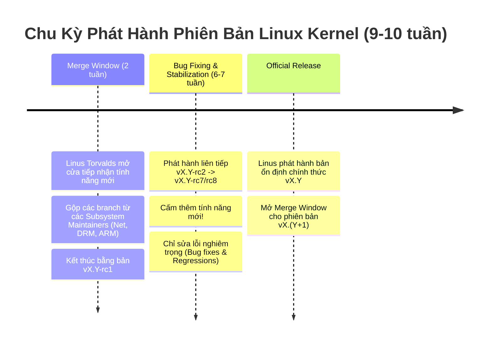
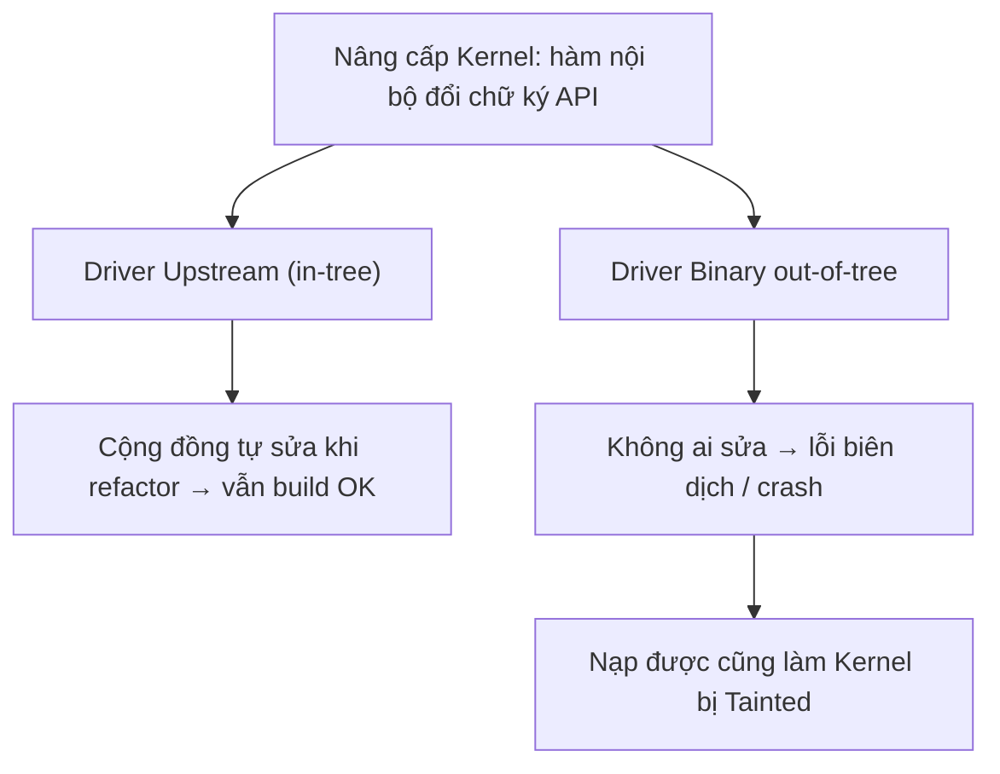

# 📁 Chương 2: Linux Kernel Sources & Source Code (Mã Nguồn Linux Kernel Chuyên Sâu)

Tài liệu này hệ thống hóa toàn bộ kiến thức từ **Slide 23 đến Slide 48** của khóa học Bootlin Linux Kernel, bao gồm quy trình phát triển kernel, phân tích cấu trúc cây thư mục mã nguồn, nguyên tắc GPLv2/ABI, bài thực hành Practical Lab 2 và bộ bài tập ôn tập.

---

## 🔄 1. Mô Hình Phát Triển & Chu Kỳ Phát Hành Kernel

### 1.1 Quy Trình Merge Window & Release Candidates (Slide 23-28)
Mã nguồn chính thức của Linux Kernel (Mainline Kernel) được Linus Torvalds duy trì tại [git.kernel.org](https://git.kernel.org). Mỗi phiên bản chính (ví dụ: `v6.10`, `v6.11`) được phát hành sau chu kỳ khoảng **9-10 tuần**:



### 1.2 Nhánh Stable & LTS (Long Term Support) (Slide 29-32)
* **Mainline**: Tệp mã nguồn mới nhất trên máy chủ của Linus Torvalds.
* **Stable Releases**: Sau khi phiên bản vX.Y ra đời, Greg Kroah-Hartman và đội ngũ tiếp tục bảo trì các bản vá lỗi khẩn cấp (Security Patches) dưới dạng `vX.Y.1`, `vX.Y.2`.
* **LTS (Long Term Support)**: Mỗi năm có một phiên bản Kernel được chọn làm LTS (ví dụ: 5.10, 5.15, 6.1, 6.6). Bản LTS được bảo trì cập nhật bản vá bảo trì từ **2 đến 6 năm**, là nền tảng bắt buộc cho Android, thiết bị nhúng IoT, ô tô và hạ tầng Cloud.

---

## 📂 2. Phân Tích Cấu Trúc Cây Thư Mục Mã Nguồn Kernel (Slide 34-38)

Tệp mã nguồn Linux Kernel chứa hàng chục triệu dòng lệnh C và Assembly. Thư mục gốc được chia thành các phần chuyên biệt:

```text
linux/
├── arch/                  # Mã nguồn phụ thuộc kiến trúc phần cứng CPU
│   ├── arm/               # ARM 32-bit (v7, BeagleBone, Raspberry Pi 1/2)
│   ├── arm64/             # ARM 64-bit (v8/v9, Raspberry Pi 3/4/5, Apple Silicon)
│   │   └── boot/dts/      # Các tệp mô tả phần cứng Device Tree (.dts, .dtsi)
│   └── x86/               # Intel/AMD 32-bit và 64-bit
├── block/                 # Tầng điều khiển thiết bị khối (Block I/O Schedulers, NVMe/SATA core)
├── crypto/                # Thư viện mã hóa phần cứng & phần mềm (AES, SHA, RSA)
├── drivers/               # Thư mục LỚN NHẤT chứa mã nguồn Driver của thiết bị
│   ├── char/              # Driver ký tự (Character devices)
│   ├── gpio/              # Subsystem điều khiển chân GPIO
│   ├── i2c/               # Controller và thiết bị bus I2C
│   ├── net/               # Card mạng (Ethernet, Wi-Fi, CAN bus)
│   └── usb/               # USB Host, Gadget và Controller drivers
├── fs/                    # Mã nguồn các hệ thống tệp (ext4, btrfs, vfat, sysfs, proc, nfs)
├── include/               # Tệp Header (.h) của toàn bộ Kernel
│   ├── linux/             # Header nội bộ Kernel (#include <linux/module.h>)
│   └── uapi/              # Header giao tiếp với User Space (#include <uapi/linux/i2c.h>)
├── init/                  # Mã nguồn khởi tạo Kernel (main.c -> hàm start_kernel())
├── kernel/                # Bộ não trung tâm: Scheduler, Signals, Locking, Modules, Timekeeping
├── mm/                    # Trình quản lý bộ nhớ (Memory Management): Paging, Buddy, SLUB Allocator
├── net/                   # Chồng giao thức mạng (TCP/IP stack, IPv6, Netfilter, Bluetooth)
├── scripts/               # Tiện ích biên dịch, checkpatch.pl, kconfig parser
└── tools/                 # Tiện ích dòng lệnh đi kèm (perf, bpf, iio)
```

---

## ⚖️ 3. Quy Tắc Giao Diện API/ABI & Giấy Phép GPLv2

### 3.1 Kernel API vs User Space API/ABI (Slide 39-42)

> [!IMPORTANT]
> **Quy tắc vàng của Linus Torvalds**: *"WE DO NOT BREAK USERSPACE!"*

* **Kernel-to-Userspace API/ABI**: **TUYỆT ĐỐI ỔN ĐỊNH BẤT BIẾN**. Các cuộc gọi System Call hoặc giao diện file `/sys`, `/proc` đã phát hành sẽ không bao giờ bị đổi tên hoặc xóa bỏ. Một phần mềm biên dịch từ năm 2005 vẫn phải chạy tốt trên Kernel 2026.
* **In-Kernel Internal API/ABI**: **KHÔNG CÓ CAM KẾT ỔN ĐỊNH**. Các hàm C nội bộ kernel (như `alloc_chrdev_region()`, `kmalloc()`) có thể bị refactor hoặc thay đổi số lượng tham số giữa các bản Kernel mới mà không cần báo trước.
  * **Hệ quả**: Driver đóng gói dạng nhị phân độc quyền (Binary Blobs out-of-tree) của các hãng linh kiện sẽ bị lỗi biên dịch ngay khi bạn nâng cấp phiên bản Kernel mới.

### 3.2 Tầm quan trọng của việc Upstream Driver (Slide 43-48)
Khi bạn viết driver và đóng góp trực tiếp vào mã nguồn chính thức của Linux Kernel (Upstreaming):
1. **Tự động bảo trì**: Mỗi khi cộng đồng đổi tên một hàm API nội bộ, họ bắt buộc phải tự tay sửa lại mã nguồn driver của bạn cho tương thích.
2. **Kiểm thử tự động**: Driver của bạn được kiểm thử liên tục trên hàng nghìn cấu hình phần cứng thông qua các hệ thống CI như ZeroDay (LKP) và Syzkaller.

---

## 🛠️ PRACTICAL LAB 2: Tải Mã Nguồn, Khám Phá Thư Mục & Kiểm Tra Mã Nguồn Với `checkpatch.pl`

### Mục tiêu bài lab:
1. Biết cách clone/tải mã nguồn Linux Kernel chính thức từ Git repository.
2. Sử dụng công cụ `cscope` và `ctags` để duyệt cấu trúc code C.
3. Sử dụng script `checkpatch.pl` để kiểm tra chuẩn định dạng mã nguồn theo tiêu chuẩn Linux Kernel Coding Style.

### Bước 1: Tải mã nguồn Linux Kernel (Git Clone)
Mở Terminal và thực hiện clone mã nguồn Linux Kernel (Sử dụng tham số `--depth 1` để tải nhanh bản mới nhất):

```bash
# Tạo thư mục làm việc
mkdir -p ~/kernel_labs && cd ~/kernel_labs

# Clone nhánh stable mới nhất của Linux Kernel (Dung lượng khoảng 1.2GB)
git clone --depth 1 https://git.kernel.org/pub/scm/linux/kernel/git/stable/linux.git
cd linux
```

### Bước 2: Tạo cơ sở dữ liệu tra cứu code với Cscope / Ctags
Tạo chỉ mục tra cứu code cho kiến trúc ARM64:

```bash
# Cài đặt cscope và ctags nếu chưa có
sudo apt update && sudo apt install -y cscope ctags

# Tạo bảng tra cứu code C cho kiến trúc ARM64
make ARCH=arm64 cscope tags
```

*Sau bước này, bạn có thể mở Vim hoặc VS Code và dùng phím tắt `Ctrl+]` để nhảy thẳng đến định nghĩa của bất kỳ hàm C nào trong Kernel.*

### Bước 3: Thực hành kiểm tra định dạng code với `checkpatch.pl`
Tạo một file mã nguồn driver bị lỗi định dạng `test_driver.c`:

```c
#include <linux/module.h>

// Lỗi 1: Dùng CamelCase thay vì snake_case
// Lỗi 2: Dùng Space thay vì Tab 8 ký tự
// Lỗi 3: Thiếu MODULE_LICENSE
int MyInitFunction(void) {
    printk("Hello World\n");
    return 0;
}

module_init(MyInitFunction);
```

Chạy công cụ kiểm tra của Kernel:
```bash
./scripts/checkpatch.pl --no-tree -f test_driver.c
```

**Kết quả từ `checkpatch.pl`:**
```text
WARNING: Prefer snake_case for identifiers: 'MyInitFunction'
ERROR: code indent should use tabs where possible
WARNING: missing MODULE_LICENSE()
total: 1 errors, 2 warnings, 11 lines checked
```

---

## 💡 Tình Huống Lỗi Thực Tế & Debug (Real-World Edge Cases)

### Tình huống: Lỗi Module Taint (`Kernel has been tainted`)
* **Hiện tượng**: Khi nạp một Kernel Module ra log `dmesg`: `my_module: loading out-of-tree module taints kernel.` hoặc `module verification failed: signature and/or required key missing - tainting kernel`.
* **Phân tích**:
  * **Taint bit `O` (Out-of-tree)**: Module được biên dịch ngoài cây mã nguồn chuẩn của Kernel.
  * **Taint bit `P` (Proprietary)**: Module không khai báo `MODULE_LICENSE("GPL")` (Mã nguồn đóng).
  * **Hậu quả**: Khi Kernel bị Panic, cộng đồng Kernel Maintainers sẽ từ chối xử lý báo cáo lỗi nếu hệ thống đang ở trạng thái Tainted bởi module mã đóng!

---

## 📝 BÀI TẬP THỰC HÀNH HANDS-ON & CÂU HỎI ÔN TẬP

### Bài tập thực hành tự giải:
**Đề bài**: Hãy tìm vị trí tệp mã nguồn C định nghĩa hàm khởi tạo kernel `start_kernel()` trong cây mã nguồn Linux Kernel và cho biết hàm này nằm trong thư mục nào.

<details>
<summary>🔍 <b>Xem đáp án gợi ý</b></summary>

Sử dụng lệnh `find` hoặc `grep`:
```bash
find init/ -name "main.c"
```
Hàm `start_kernel()` được định nghĩa tại tệp [`init/main.c`](file:///home/thinh/kernel_labs/linux/init/main.c). Đây là điểm khởi đầu độc lập kiến trúc của Linux Kernel sau khi Assembly boot code hoàn tất khởi tạo CPU.
</details>

### Câu hỏi trắc nghiệm ôn tập:
1. **Một tập đoàn sản xuất thiết bị viết driver riêng cho chip Wi-Fi của họ nhưng không đóng góp (upstream) vào Linux Kernel chính thức. Điều gì sẽ xảy ra khi khách hàng nâng cấp Linux Kernel lên bản mới?**
   * A. Driver vẫn chạy bình thường vì Kernel cam kết ổn định ABI.
   * B. Driver có thể bị lỗi biên dịch hoặc crash do các API nội bộ Kernel thay đổi.
   * C. Kernel tự động chuyển đổi driver sang bản tương thích.
   * *Đáp án đúng*: **B**. Kernel chỉ cam kết ổn định giao diện với User Space, các API nội bộ giữa Kernel và Driver có thể thay đổi bất kỳ lúc nào.

---

## 🎯 VÍ DỤ MINH HỌA BỔ SUNG

### 💻 Ví dụ 1 (Code C): Driver đúng chuẩn Coding Style — vượt qua `checkpatch.pl`
Đối chiếu với file lỗi ở Lab 2, đây là bản viết đúng: snake_case, thụt Tab, có `MODULE_LICENSE`.

```c
#include <linux/module.h>
#include <linux/init.h>

static int __init hello_init(void)
{
	pr_info("hello: module loaded\n");   /* dùng pr_info thay printk trần */
	return 0;
}

static void __exit hello_exit(void)
{
	pr_info("hello: module unloaded\n");
}

module_init(hello_init);
module_exit(hello_exit);

MODULE_Chạy công cụ kiểm tra của Kernel:
```bash
./scripts/checkpatch.pl --no-tree -f test_driver.cLICENSE("GPL");                    /* tránh taint bit 'P' */
MODULE_AUTHOR("Nguyen Trieu");
MODULE_DESCRIPTION("Module mau dat chuan Linux Coding Style");
```

### 🖥️ Ví dụ 2 (Terminal/Debug): Tra cứu mã nguồn & kiểm tra trạng thái Taint

```bash
# Tìm nhanh nơi định nghĩa một hàm nội bộ Kernel bằng git grep (nhanh hơn find)
git grep -n "alloc_chrdev_region" -- '*.c' | head

# Xem cây mã nguồn có bao nhiêu dòng cho mỗi kiến trúc
find arch/arm64 -name '*.c' | wc -l

# Kiểm tra Kernel đang chạy có bị "tainted" không (0 = sạch)
cat /proc/sys/kernel/tainted
# Giải mã ý nghĩa các bit taint
dmesg | grep -i taint
```

### 📊 Ví dụ 3 (Mermaid): Vì sao driver out-of-tree dễ "chết" khi nâng cấp Kernel



---
*Tiếp theo: [Chương 3: Linux Kernel Usage - Config, Build & Boot](./03_Linux_Kernel_Usage_Config_Build_Boot.md)*
