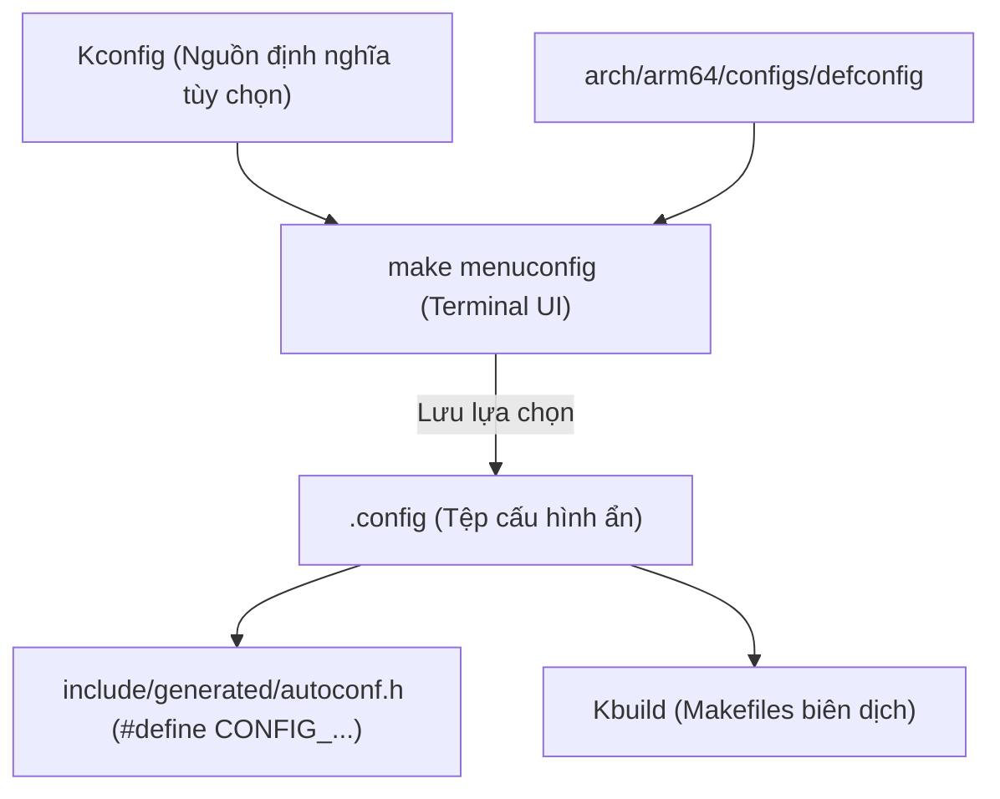
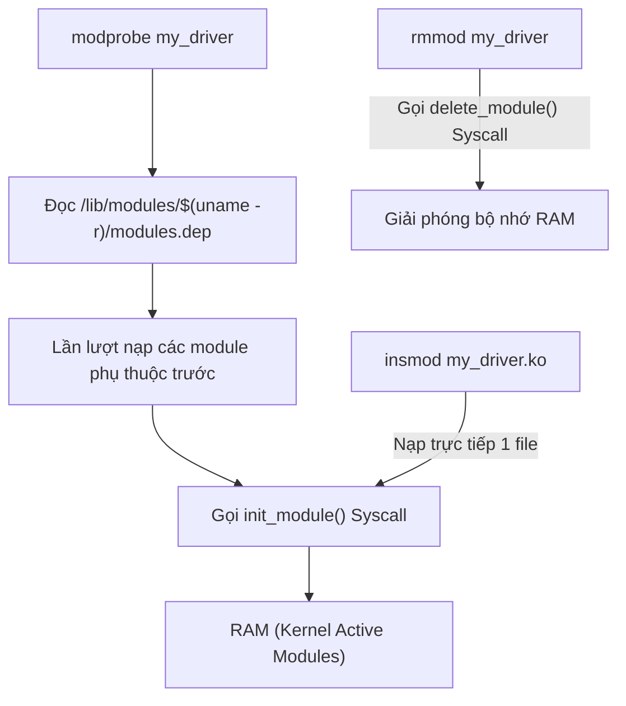
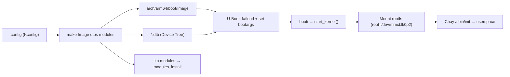

# 🛠️ Chương 3: Linux Kernel Usage - Config, Build, Boot & Modules (Cấu Hình, Biên Dịch Chéo & Khởi Động)

Tài liệu này hệ thống hóa toàn bộ kiến thức từ **Slide 49 đến Slide 91** của khóa học Bootlin Linux Kernel, hướng dẫn chi tiết quy trình cấu hình Kconfig, biên dịch chéo (Cross-compilation), thiết lập Bootloader U-Boot, nạp hệ thống tệp và Practical Lab 3.

---

## ⚙️ 1. Cấu Hình Kernel (Kernel Configuration & Kconfig)

### 1.1 Tệp `.config` và Cơ Chế Kconfig System (Slide 50-56)
Trước khi biên dịch Linux Kernel, bạn phải quyết định những driver và giao thức nào sẽ được đưa vào sản phẩm. Tất cả các thiết lập này được lưu trong tệp tin ẩn **`.config`** tại thư mục gốc của Kernel.



Mỗi tùy chọn `CONFIG_FOO` trong `.config` có 3 trạng thái có thể thiết lập:
* **`CONFIG_FOO=y` (Built-in)**: Mã nguồn driver được **biên dịch trực tiếp** vào tệp nhị phân Kernel Image (`Image` / `zImage`). Driver sẽ tự động khởi chạy lúc boot.
* **`CONFIG_FOO=m` (Module)**: Mã nguồn được biên dịch thành tệp **Loadable Kernel Module (`.ko`)** nằm trên đĩa cứng/SD Card. Chỉ khi User space gọi `modprobe`, module mới được nạp vào RAM.
* **`# CONFIG_FOO is not set` (Disabled)**: Tùy chọn bị tắt hoàn toàn, mã nguồn driver tương ứng bị bỏ qua khi biên dịch.

### 1.2 Các Lệnh Tạo Cấu Hình Thông Dụng (Slide 57-66)
* `make ARCH=arm64 defconfig`: Tạo tệp `.config` dựa trên cấu hình mặc định chuẩn của kiến trúc ARM64.
* `make ARCH=arm multi_v7_defconfig`: Tạo cấu hình chuẩn hỗ trợ nhiều chip ARMv7 (BeagleBone, Raspberry Pi 2, STM32MP1).
* `make ARCH=arm64 menuconfig`: Mở giao diện menu chọn tùy chọn bằng bàn phím (Ncurses UI).
* `make ARCH=arm64 savedefconfig`: Xuất cấu hình hiện tại thành tệp `defconfig` tối giản (chỉ lưu các điểm khác biệt so với mặc định).

---

## 🏗️ 2. Quy Trình Biên Dịch Chéo (Cross-Compilation)

### 2.1 Biên dịch chéo là gì? (Slide 67-69)
Khi phát triển hệ thống nhúng, máy chủ phát triển (Host Machine - x86_64) có tốc độ biên dịch nhanh hơn nhiều so với bo mạch nhúng (Target Machine - ARM/ARM64). Chúng ta sử dụng **Cross-Compiler** chạy trên x86_64 để tạo ra tệp nhị phân thực thi trên ARM/ARM64.

Cần truyền 2 biến môi trường bắt buộc:
* **`ARCH`**: Định nghĩa kiến trúc máy đích (`arm`, `arm64`, `riscv`, `x86`).
* **`CROSS_COMPILE`**: Tiền tố của bộ công cụ biên dịch chéo (ví dụ: `aarch64-linux-gnu-` cho ARM64, `arm-linux-gnabihf-` cho ARM32).

### 2.2 So sánh Các Định Dạng Kernel Image (Slide 70-73)

| File Image | Bản chất | Ứng dụng phổ biến |
| :--- | :--- | :--- |
| **`vmlinux`** | File ELF gốc chưa nén, chứa đầy đủ debug symbols. | Dùng để debug với GDB/Kgdb. Không dùng để boot trực tiếp. |
| **`Image`** | File nhị phân thô (Uncompressed raw binary). | Định dạng chuẩn mặc định của **ARM64**. |
| **`zImage`** | File nén tự giải nén (Self-extracting compressed image). | Định dạng chuẩn mặc định của **ARM32**. |
| **`Image.gz`** | File `Image` nén dạng gzip. | Dùng cho ARM64 khi muốn tiết kiệm bộ nhớ Flash. |
| **`uImage`** | File Image bọc thêm 64-byte Header của U-Boot cũ. | Dùng cho các bản U-Boot đời cũ (Legacy U-Boot). |

### 2.3 Câu lệnh biên dịch chuẩn hoàn chỉnh:
```bash
# 1. Nạp cấu hình mặc định ARM64
make ARCH=arm64 CROSS_COMPILE=aarch64-linux-gnu- defconfig

# 2. Biên dịch Kernel Image, Device Tree (DTBs) và Modules (-j8 dùng 8 nhân CPU)
make ARCH=arm64 CROSS_COMPILE=aarch64-linux-gnu- -j$(nproc) Image dtbs modules
```

---

## 🚀 3. Khởi Động Kernel Với U-Boot & `bootargs`

### 3.1 Cài đặt Modules vào RootFS Target (Slide 74-76)
Sau khi biên dịch thành công, nạp toàn bộ các tệp `.ko` vào thư mục RootFS của bo mạch:

```bash
make ARCH=arm64 CROSS_COMPILE=aarch64-linux-gnu- \
     INSTALL_MOD_PATH=/path/to/target/rootfs modules_install
```
*Kết quả: Các tệp `.ko` được chép vào `/lib/modules/<kernel-version>/`.*

### 3.2 Cấu hình U-Boot và `bootargs` (Slide 77-83)

`bootargs` (Kernel Command Line) là chuỗi tham số U-Boot truyền cho Kernel khi khởi động:

```uboot
# Ví dụ thiết lập biến môi trường trong U-Boot Prompt
setenv bootargs "console=ttyS0,115200 root=/dev/mmcblk0p2 rw rootwait"
saveenv

# Nạp Kernel Image và Device Tree từ SD Card (Phân vùng FAT) vào RAM
fatload mmc 0:1 0x80200000 Image
fatload mmc 0:1 0x88000000 my_board.dtb

# Kích hoạt khởi động Kernel ARM64 (lệnh booti)
booti 0x80200000 - 0x88000000
```

#### Giải thích các cờ `bootargs` quan trọng:
* `console=ttyS0,115200`: Định hướng log khởi động ra cổng Serial UART0 với tốc độ baud 115200.
* `root=/dev/mmcblk0p2`: Chỉ định phân vùng chứa Hệ thống tệp gốc (Root Filesystem).
* `rootwait`: Bắt Kernel tạm dừng chờ đĩa SD Card sẵn sàng trước khi thực hiện mount root.
* `rw`: Mount phân vùng root dưới dạng Read-Write (Cho phép đọc/ghi).

---

## 📦 4. Quản Lý Kernel Modules Trên Target

### 4.1 Bộ Công Cụ Dòng Lệnh Quản Lý Module (Slide 84-91)



| Lệnh | Chức Năng Chi Tiết |
| :--- | :--- |
| **`lsmod`** | Liệt kê danh sách các module đang nạp trong RAM (Đọc dữ liệu từ `/proc/modules`). |
| **`insmod <path/file.ko>`** | Nạp trực tiếp tệp `.ko`. *Không tự động giải quyết phụ thuộc.* |
| **`rmmod <module_name>`** | Tháo bỏ module ra khỏi RAM theo tên. |
| **`modprobe <module_name>`** | **Công cụ khuyến nghị**: Tự động tra cứu tệp `modules.dep` để nạp các module phụ thuộc trước. |
| **`depmod -a`** | Quét lại toàn bộ thư mục `/lib/modules/$(uname -r)/` để cập nhật tệp danh sách phụ thuộc `modules.dep`. |
| **`modinfo <file.ko>`** | Hiển thị thông số phiên bản, tác giả, giấy phép và các tham số `module_param`. |
| **`dmesg`** | Đọc nhật ký Kernel Ring Buffer xem thông báo nạp driver. |

---

## 🛠️ PRACTICAL LAB 3: Biên Dịch Chéo Kernel & Mô Phỏng Khởi Động Trên QEMU ARM64

### Mục tiêu bài lab:
1. Biên dịch chéo Linux Kernel cho kiến trúc ARM64 từ máy chủ Host.
2. Tạo hình ảnh bộ nhớ RAM (Initramfs) hoặc RootFS đơn giản.
3. Chạy mô phỏng hệ thống khởi động Kernel bằng công cụ **QEMU ARM64**.

### Bước 1: Biên dịch Kernel ARM64
Mở Terminal tại thư mục mã nguồn Kernel:

```bash
# 1. Cài đặt bộ công cụ biên dịch chéo ARM64 và QEMU
sudo apt install -y gcc-aarch64-linux-gnu qemu-system-arm

# 2. Tạo cấu hình defconfig cho ARM64
make ARCH=arm64 CROSS_COMPILE=aarch64-linux-gnu- defconfig

# 3. Biên dịch Kernel Image (-j$(nproc) tối ưu số nhân CPU)
make ARCH=arm64 CROSS_COMPILE=aarch64-linux-gnu- -j$(nproc) Image
```

### Bước 2: Chạy mô phỏng khởi động Kernel trên QEMU
Chạy câu lệnh QEMU để khởi động Kernel ARM64 vừa biên dịch mà không cần bo mạch phần cứng thật:

```bash
qemu-system-aarch64 \
    -M virt \
    -cpu cortex-a57 \
    -nographic \
    -kernel arch/arm64/boot/Image \
    -append "console=ttyAMA0 earlycon=pl011,0x9000000 rdinit=/bin/sh"
```

*Kết quả:* Bạn sẽ thấy nhật ký Kernel khởi động xuất ra trên Terminal và dừng lại ở shell nhắc lệnh `/bin/sh`. Bấm `Ctrl+A` rồi nhấn `X` để thoát khỏi QEMU.

---

## 💡 Tình Huống Lỗi Thực Tế & Debug (Real-World Edge Cases)

### Tình huống 1: Lỗi `Exec format error` (ENOEXEC) khi chạy `insmod`
* **Hiện tượng**: Chạy `insmod my_driver.ko` ra lỗi `insmod: ERROR: could not insert module my_driver.ko: Invalid module format`.
* **Nguyên nhân**: File `.ko` được biên dịch cho kiến trúc x86_64 nhưng bạn lại cố nạp nó trên bo mạch ARM (hoặc ngược lại).
* **Cách khắc phục**: Dùng lệnh `file my_driver.ko` để kiểm tra kiến trúc. Đảm bảo đã thêm `ARCH=arm64 CROSS_COMPILE=aarch64-linux-gnu-` khi make.

### Tình huống 2: Kernel Panic lỗi `Kernel panic - not syncing: VFS: Unable to mount root fs`
* **Nguyên nhân**: Cờ `root=/dev/...` trong `bootargs` của U-Boot bị sai tên phân vùng đĩa cứng hoặc driver điều khiển SD Card chưa được bật trong `.config` (`CONFIG_MMC_SDHCI=y`).

---

## 📝 BÀI TẬP THỰC HÀNH HANDS-ON & CÂU HỎI ÔN TẬP

### Bài tập thực hành tự giải:
**Đề bài**: Hãy viết câu lệnh U-Boot thiết lập chuỗi `bootargs` sao cho Kernel xuất log ra cổng Serial UART1 tốc độ 115200, mount phân vùng root tại đĩa NFS qua mạng IP `192.168.1.100`.

<details>
<summary>🔍 <b>Xem đáp án gợi ý</b></summary>

```uboot
setenv bootargs "console=ttyS1,115200 root=/dev/nfs nfsroot=192.168.1.100:/srv/nfs/rootfs,v3 rw ip=dhcp"
saveenv
```
</details>

---

## 🎯 VÍ DỤ MINH HỌA BỔ SUNG

### 💻 Ví dụ 1 (Makefile): Out-of-tree Kbuild Makefile biên dịch chéo ARM64
Đây là mẫu Makefile hoàn chỉnh dùng cho mọi module ngoài cây nguồn:

```makefile
obj-m += hello.o                       # module đầu ra: hello.ko

KDIR ?= ~/kernel_labs/linux            # trỏ tới cây source đã build
ARCH ?= arm64
CROSS_COMPILE ?= aarch64-linux-gnu-

all:
	$(MAKE) -C $(KDIR) M=$(PWD) ARCH=$(ARCH) CROSS_COMPILE=$(CROSS_COMPILE) modules

clean:
	$(MAKE) -C $(KDIR) M=$(PWD) ARCH=$(ARCH) CROSS_COMPILE=$(CROSS_COMPILE) clean
```
```bash
make            # sinh ra hello.ko cho ARM64
file hello.ko   # xác nhận: ELF 64-bit LSB relocatable, ARM aarch64
```

### 🖥️ Ví dụ 2 (Terminal/Debug): So sánh built-in (`=y`) và module (`=m`) trong `.config`

```bash
# Kiểm tra một tùy chọn đang ở trạng thái nào
scripts/config --state CONFIG_I2C_CHARDEV        # in ra: y / m / n

# Bật một driver dưới dạng module mà không cần mở menuconfig
scripts/config --module CONFIG_I2C_CHARDEV
grep CONFIG_I2C_CHARDEV .config

# Trên target: xem module đã nạp và phụ thuộc của nó
lsmod | head
modinfo i2c-dev | grep -E 'filename|license|depends'
dmesg | tail -n 15        # xác nhận thông báo nạp driver
```

### 📊 Ví dụ 3 (Mermaid): Toàn cảnh luồng Build → Boot trên bo mạch ARM64



---
*Tiếp theo: [Chương 4: Developing Kernel Modules](./04_Developing_Kernel_Modules.md)*
