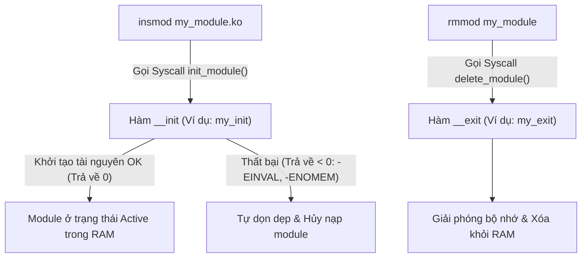
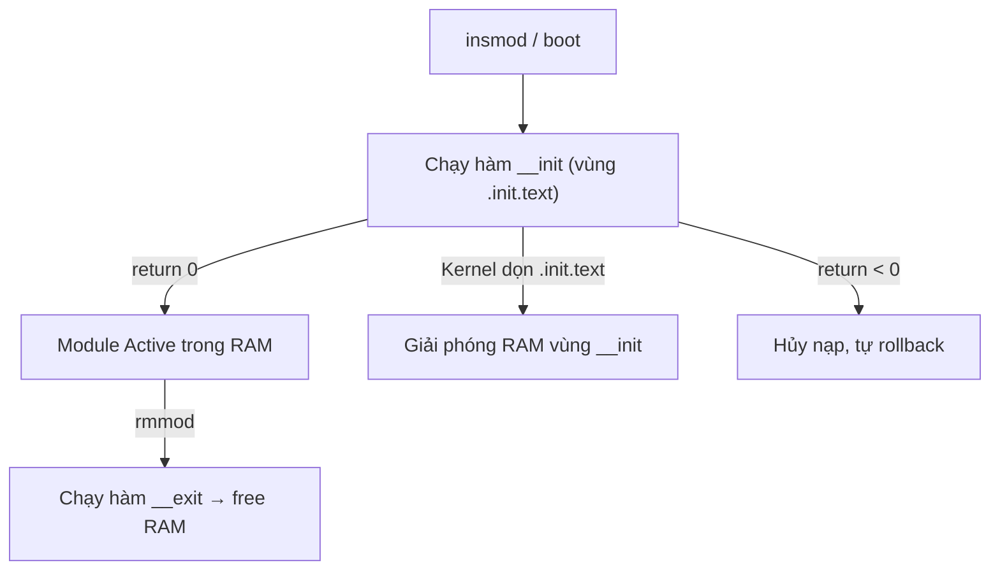

# 📦 Chương 4: Developing Kernel Modules (Phát Triển Mô-Đun Kernel Chuyên Sâu)

Tài liệu này hệ thống hóa toàn bộ kiến thức từ **Slide 92 đến Slide 108** của khóa học Bootlin Linux Kernel, hướng dẫn chi tiết lập trình Loadable Kernel Module (LKM), truyền tham số dòng lệnh, xuất Symbol và Practical Lab 4.

---

## 🧩 1. Kiến Trúc Cấu Trúc Mã Nguồn Kernel Module

### 1.1 Sự khác biệt giữa C User Space và Kernel Module (Slide 92-97)
Một chương trình C thông thường ở User Space bắt đầu bằng hàm `main()` và thực thi tuần tự từ trên xuống dưới. Ngược lại, một Kernel Module thiết kế theo kiến trúc hướng sự kiện (Event-driven):



### 1.2 Tối Ưu Bộ Nhớ Với Macro `__init` và `__exit` (Slide 98)
* **`__init`**: Đánh dấu hàm khởi tạo nằm ở vùng nhớ tạm `.init.text`. Ngay sau khi hàm thực thi xong lúc boot, Kernel sẽ **xóa sạch toàn bộ vùng nhớ này** để trả lại RAM cho hệ thống!
* **`__exit`**: Đánh dấu hàm thuộc vùng `.exit.text`. Nếu module được biên dịch tĩnh trực tiếp vào Kernel (`CONFIG_FOO=y`), hàm hủy này sẽ **tự động bị loại bỏ hoàn toàn** vì Kernel tích hợp không bao giờ bị tháo gỡ.

---

## 🎛️ 2. Truyền Tham Số Cho Module (Module Parameters)

### 2.1 Cú Pháp `module_param()` (Slide 99-102)
Cho phép truyền thông số cấu hình khi nạp module từ dòng lệnh (Ví dụ: `insmod my_driver.ko debug_level=3 dev_name="sensor1"`).

Cú pháp: `module_param(name, type, perm);`

* **`name`**: Tên biến C đã khai báo trong code.
* **`type`**: Kiểu dữ liệu (`int`, `uint`, `bool`, `charp` - con trỏ chuỗi, `byte`, v.v.).
* **`perm`**: Quyền hạn xuất hiện tệp hiển thị tham số trên `sysfs` tại `/sys/module/<module_name>/parameters/<name>`:
  * `0644`: User space có quyền Đọc (`cat`) và Ghi (`echo 5 > ...`) để thay đổi tham số ngay khi module đang chạy!
  * `0444`: Chỉ đọc (Read-only).
  * `0`: Không tạo tệp hiển thị trên sysfs.

---

## 🔗 3. Cơ Chế Xuất Symbol (Exporting Symbols)

### 3.1 Giao Tiếp Giữa Các Module Với `EXPORT_SYMBOL` (Slide 103-105)
Mặc định, các hàm C khai báo trong một module chỉ có phạm vi nội bộ. Nếu Module B muốn gọi một hàm tiện ích từ Module A:
Module A phải xuất hàm đó vào bảng Symbol toàn cục của Kernel (**Kernel Symbol Table** tại `/proc/kallsyms`).

* **`EXPORT_SYMBOL(func_name)`**: Cho phép mọi module (kể cả module mã đóng Proprietary) gọi hàm này.
* **`EXPORT_SYMBOL_GPL(func_name)`**: **Chỉ cho phép** các module khai báo giấy phép GPL (`MODULE_LICENSE("GPL")`) gọi hàm này.

---

## 🏗️ 4. Cấu Trúc Kbuild Makefile Chuẩn (Slide 106-108)

Biên dịch Out-of-tree (mã nguồn module nằm ngoài cây mã nguồn Kernel) phải sử dụng hệ thống Kbuild của Kernel:

```makefile
# 1. Định nghĩa tệp đối tượng đầu ra (.o sẽ được Kbuild biên dịch thành .ko)
obj-m += hello_param_module.o

# 2. Đường dẫn tới thư mục Kernel Source đã được biên dịch/cấu hình
KDIR ?= /lib/modules/$(shell uname -r)/build

# 3. Đường dẫn thư mục làm việc hiện tại
PWD := $(shell pwd)

default:
	$(MAKE) -C $(KDIR) M=$(PWD) modules

clean:
	$(MAKE) -C $(KDIR) M=$(PWD) clean
```

---

## 🛠️ PRACTICAL LAB 4: Viết, Biên Dịch & Nạp Module Nhận Tham Số

### Mục tiêu bài lab:
1. Viết một Out-of-tree Kernel Module nhận tham số dòng lệnh `debug_level` và `device_name`.
2. Viết `Makefile` chuẩn Kbuild để biên dịch module thành tệp `.ko`.
3. Nạp module bằng `insmod`, truyền tham số, kiểm tra nhật ký `dmesg` và thay đổi tham số qua `/sys/module/`.

### Bước 1: Tạo mã nguồn tệp `hello_param_module.c`

```c
#include <linux/init.h>
#include <linux/module.h>
#include <linux/kernel.h>

MODULE_LICENSE("GPL");
MODULE_AUTHOR("Bootlin / Antigravity");
MODULE_DESCRIPTION("Practical Lab 4: Module nhận tham số và sysfs interface");
MODULE_VERSION("1.0");

// 1. Khai báo biến và tham số
static int debug_level = 1;
module_param(debug_level, int, 0644);
MODULE_PARM_DESC(debug_level, "Mức độ log debug (0: Tắt, 1: Mở)");

static char *device_name = "default_sensor";
module_param(device_name, charp, 0444);
MODULE_PARM_DESC(device_name, "Tên thiết bị gán cho module");

// 2. Hàm khởi tạo (__init)
static int __init lab4_init(void)
{
    pr_info("=========================================\n");
    pr_info("[LAB 4] Module đã được nạp thành công!\n");
    pr_info("[LAB 4] Param device_name = %s\n", device_name);
    pr_info("[LAB 4] Param debug_level = %d\n", debug_level);
    pr_info("=========================================\n");
    return 0;
}

// 3. Hàm hủy (__exit)
static void __exit lab4_exit(void)
{
    pr_info("[LAB 4] Đã tháo bỏ module khỏi bộ nhớ RAM!\n");
}

module_init(lab4_init);
module_exit(lab4_exit);
```

### Bước 2: Tạo tệp `Makefile`
```makefile
obj-m += hello_param_module.o

KDIR ?= /lib/modules/$(shell uname -r)/build
PWD := $(shell pwd)

all:
	make -C $(KDIR) M=$(PWD) modules

clean:
	make -C $(KDIR) M=$(PWD) clean
```

### Bước 3: Biên dịch, Nạp và Kiểm Thử Module
Thực hiện các câu lệnh sau trên Terminal:

```bash
# 1. Biên dịch module
make

# 2. Nạp module với tham số tùy biến
sudo insmod hello_param_module.ko debug_level=5 device_name="temp_sensor_v2"

# 3. Kiểm tra nhật ký Kernel
dmesg | tail -n 10

# 4. Kiểm tra giao diện sysfs của tham số
cat /sys/module/hello_param_module/parameters/device_name
cat /sys/module/hello_param_module/parameters/debug_level

# 5. Thay đổi giá trị tham số debug_level ngay khi module đang chạy!
sudo sh -c 'echo 9 > /sys/module/hello_param_module/parameters/debug_level'
cat /sys/module/hello_param_module/parameters/debug_level

# 6. Tháo bỏ module
sudo rmmod hello_param_module
dmesg | tail -n 5
```

---

## 💡 Tình Huống Lỗi Thực Tế & Debug (Real-World Edge Cases)

### Tình huống: Lỗi `Unknown symbol in module` khi nạp module
* **Hiện tượng**: Chạy `insmod module_b.ko` bị báo lỗi: `insmod: ERROR: could not insert module module_b.ko: Unknown symbol in module`.
* **Nguyên nhân**: `module_b` gọi một hàm C được khai báo ở `module_a`, nhưng `module_a` chưa được nạp vào RAM hoặc `module_a` quên khai báo `EXPORT_SYMBOL_GPL(hàm)`.
* **Cách khắc phục**:
  1. Nạp `module_a` trước bằng lệnh `insmod module_a.ko`.
  2. Hoặc sử dụng `modprobe` để tự động nạp theo thứ tự phụ thuộc.

---

## 📝 BÀI TẬP THỰC HÀNH HANDS-ON & CÂU HỎI ÔN TẬP

### Bài tập thực hành tự giải:
**Đề bài**: Hãy chỉnh sửa file `hello_param_module.c` để thêm một tham số mảng số nguyên `arr_values` gồm 4 phần tử bằng macro `module_param_array()`. Nạp module với tham số `arr_values=10,20,30,40` và in ra log `dmesg`.

<details>
<summary>🔍 <b>Xem đáp án gợi ý</b></summary>

```c
static int arr_values[4];
static int arr_argc = 0;
module_param_array(arr_values, int, &arr_argc, 0644);
MODULE_PARM_DESC(arr_values, "Mảng 4 số nguyên");

// Trong lab4_init():
int i;
for (i = 0; i < arr_argc; i++) {
    pr_info("arr_values[%d] = %d\n", i, arr_values[i]);
}
```
</details>

---

## 🎯 VÍ DỤ MINH HỌA BỔ SUNG

### 💻 Ví dụ 1 (Code C): Hai module chia sẻ hàm qua `EXPORT_SYMBOL_GPL`
Minh họa cơ chế Symbol Table: `math_core` cung cấp hàm, `math_user` gọi lại.

```c
/* math_core.c — module cung cấp hàm */
#include <linux/module.h>

int add_numbers(int a, int b)
{
	return a + b;
}
EXPORT_SYMBOL_GPL(add_numbers);   /* xuất ra Kernel Symbol Table */

static int __init core_init(void) { pr_info("math_core: ready\n"); return 0; }
static void __exit core_exit(void) { pr_info("math_core: bye\n"); }
module_init(core_init);
module_exit(core_exit);
MODULE_LICENSE("GPL");
```
```c
/* math_user.c — module tiêu thụ hàm */
#include <linux/module.h>

extern int add_numbers(int a, int b);      /* khai báo hàm từ module khác */

static int __init user_init(void)
{
	pr_info("math_user: 3 + 4 = %d\n", add_numbers(3, 4));
	return 0;
}
module_init(user_init);
MODULE_LICENSE("GPL");
```

### 🖥️ Ví dụ 2 (Terminal/Debug): Nạp đúng thứ tự & kiểm tra symbol

```bash
# Phải nạp module cung cấp symbol TRƯỚC, nếu không sẽ "Unknown symbol"
sudo insmod math_core.ko
sudo insmod math_user.ko          # gọi được add_numbers()
dmesg | tail -n 3

# Xác nhận symbol đã nằm trong bảng toàn cục
sudo grep add_numbers /proc/kallsyms

# Xem thông tin & tham số một module đã build
modinfo hello_param_module.ko
```

### 📊 Ví dụ 3 (Mermaid): Cơ chế `__init` được giải phóng RAM sau boot



---
*Tiếp theo: [Chương 5: Hardware Description & Device Tree](./05_Hardware_Description_Device_Tree.md)*
