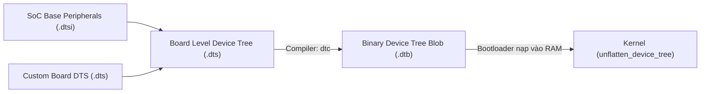
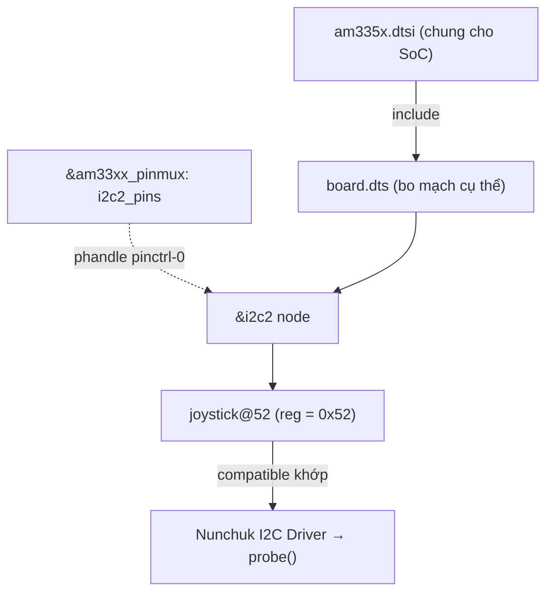

# 🌲 Chương 5: Hardware Description - Device Tree & Pin Muxing (Mô Tả Phần Cứng Chuyên Sâu)

Tài liệu này hệ thống hóa toàn bộ kiến thức từ **Slide 109 đến Slide 175** của khóa học Bootlin Linux Kernel, bao gồm cú pháp Device Tree (DTS/DTB), nguyên lý Pin Control & Pin Muxing (Pinctrl) và bài thực hành Practical Lab 5.

---

## 🔍 1. Phần Cứng Tự Phát Hiện vs Không Tự Phát Hiện

### 1.1 Khái niệm & Sự Ra Đời Của Device Tree (Slide 109-118)
* **Phần cứng tự phát hiện (Discoverable Hardware)**:
  * Ví dụ: USB, PCI/PCIe, ACPI.
  * Các thiết bị trên bus này chứa các thanh ghi lưu sẵn Vendor ID và Device ID. Khi cắm thiết bị vào, Bus Controller chỉ cần đọc thanh ghi là tự động phát hiện và gán Driver tương ứng.
* **Phần cứng không tự phát hiện (Non-Discoverable Hardware)**:
  * Ví dụ: Các ngoại vi SoC nhúng (Memory-Mapped Registers, I2C, SPI, UART, GPIO Controllers).
  * Bộ vi xử lý không thể tự hỏi phần cứng tại địa chỉ `0x44E0B000` là chip gì. Do đó, thông tin địa chỉ, ngắt và tần số clock bắt buộc phải được **mô tả tĩnh (Statically Described)**.

> [!NOTE]
> Từ năm 2011 trở về trước, ARM Linux dùng các tệp C cứng (`arch/arm/mach-xxx/board-yyy.c`) để mô tả phần cứng, khiến mã nguồn Kernel bị phình to với hàng triệu dòng code trùng lặp. **Device Tree (DT)** ra đời nhằm tách rời hoàn toàn thông tin phần cứng ra khỏi mã nguồn biên dịch C của Kernel!

---

## 🌳 2. Cú Pháp & Cấu Trúc Device Tree (DTS, DTSI & DTB)

### 2.1 Luồng Biên Dịch Device Tree (Slide 119-122)



* **`.dtsi`**: Tệp bao hàm chứa cấu hình dùng chung của dòng chip SoC (địa chỉ các ngoại vi cơ bản).
* **`.dts`**: Tệp mô tả chi tiết bo mạch phần cứng cụ thể (Board level), chứa các tệp `.dtsi`.
* **`.dtb`**: Tệp nhị phân nén do công cụ **`dtc` (Device Tree Compiler)** biên dịch từ tệp `.dts` để nạp vào RAM cho Kernel đọc khi boot.

### 2.2 Các Thuộc Tính Chuẩn Trong Device Tree (Slide 123-145)

```dts
// Ví dụ cấu hình Nút bus I2C và cảm biến trên Device Tree
&i2c2 {
    status = "okay";
    pinctrl-names = "default";
    pinctrl-0 = <&i2c2_pins>;
    clock-frequency = <100000>; // 100 kHz I2C speed

    // Nút con đại diện cho Cảm biến Nunchuk nối vào bus I2C2
    nunchuk: joystick@52 {
        compatible = "nintendo,nunchuk";
        reg = <0x52>; // Địa chỉ I2C 7-bit (0x52)
    };
};
```

#### Chi tiết các thuộc tính quan trọng:
1. **`compatible`**: **Chuỗi khóa khớp (Matching Key)** giữa Device Tree và Driver! Kernel sẽ quét danh sách các driver đã nạp để tìm driver nào khai báo chuỗi `compatible` trùng khớp.
2. **`reg`**: Định nghĩa vị trí vùng nhớ hoặc địa chỉ bus `reg = <Địa_chỉ Độ_dài>`.
3. **`#address-cells` & `#size-cells`**: Định nghĩa số ô 32-bit (cells) cần thiết để biểu diễn địa chỉ và độ dài cho các nút con.
4. **`status`**: Khởi chạy driver (`"okay"`) hoặc bỏ qua thiết bị (`"disabled"`).
5. **`phandle` / `&label`**: Con trỏ tham chiếu giữa các nút (tham chiếu clock, interrupt controller hoặc pinctrl).

---

## 🔀 3. Quản Lý Chân Pin Muxing & Pin Control (Pinctrl)

### 3.1 Khái niệm Pin Muxing (Slide 165-175)
Trong các SoC nhúng, một chân vật lý (Physical Pin/Pad) có thể chuyển đổi linh hoạt giữa nhiều chức năng khác nhau để tiết kiệm số lượng chân của chip:
* Ví dụ: Chân P9_19 trên BeagleBone Black có thể chọn làm `GPIO0_13`, `I2C2_SCL`, hoặc `SPI1_CS0`.

Subsystem **Pinctrl** trong Linux Kernel đảm nhận 2 nhiệm vụ:
1. **Pin Multiplexing (Pin Muxing)**: Chuyển mạch đường dẫn tín hiệu nội bộ chip tới chức năng mong muốn.
2. **Pin Configuration**: Cấu hình điện lý (Trở kéo `bias-pull-up` / `bias-pull-down`, Dòng chịu tải `drive-strength`, Tốc độ chuyển mạch `slew-rate`).

```dts
// Định nghĩa cấu hình chân I2C2 trong nút pinctrl
&am33xx_pinmux {
    i2c2_pins: pinmux_i2c2_pins {
        pinctrl-single,pins = <
            AM33XX_PADCONF(AM335X_PIN_UART1_CTSN, PIN_INPUT_PULLUP, MUX_MODE3) // I2C2_SDA
            AM33XX_PADCONF(AM335X_PIN_UART1_RTSN, PIN_INPUT_PULLUP, MUX_MODE3) // I2C2_SCL
        >;
    };
};
```

---

## 🛠️ PRACTICAL LAB 5: Thêm Nút Device Tree & Biên Dịch DTB

### Mục tiêu bài lab:
1. Khám phá cây Device Tree của hệ thống tại `/sys/firmware/devicetree/base` hoặc `/proc/device-tree`.
2. Viết thêm một nút Device Tree mô tả cảm biến I2C Nunchuk (`joystick@52`).
3. Thực hành biên dịch và giải nén tệp `.dtb` với công cụ `dtc`.

### Bước 1: Khám phá Device Tree hiện tại trên hệ thống đang chạy
Mở Terminal và kiểm tra giao diện Device Tree trong `/proc`:

```bash
# Duyệt các nút phần cứng trong /proc/device-tree
ls -l /proc/device-tree/

# Đọc thuộc tính model của bo mạch hiện tại
cat /proc/device-tree/model
echo ""

# Đọc chuỗi compatible của root node
cat /proc/device-tree/compatible
echo ""
```

### Bước 2: Viết và biên dịch một đoạn Device Tree thử nghiệm
Tạo tệp `lab5_custom.dts`:

```dts
/dts-v1/;

/ {
    #address-cells = <1>;
    #size-cells = <1>;
    model = "Custom Embedded Test Board";
    compatible = "custom,test-board";

    // Mô tả bộ nhớ RAM 512MB
    memory@80000000 {
        device_type = "memory";
        reg = <0x80000000 0x20000000>;
    };

    // Mô tả bus I2C ảo
    i2c_bus: i2c@40003000 {
        #address-cells = <1>;
        #size-cells = <0>;
        compatible = "vendor,custom-i2c-controller";
        reg = <0x40003000 0x1000>;
        status = "okay";

        // Cảm biến Nunchuk nối vào bus I2C
        nunchuk: joystick@52 {
            compatible = "nintendo,nunchuk";
            reg = <0x52>;
        };
    };
};
```

Biên dịch từ dạng văn bản `.dts` sang dạng nhị phân `.dtb`:
```bash
# Cài đặt bộ biên dịch dtc nếu chưa có
sudo apt install -y device-tree-compiler

# 1. Biên dịch DTS -> DTB
dtc -I dts -O dtb -o lab5_custom.dtb lab5_custom.dts

# 2. Giải nén ngược từ DTB nhị phân -> DTS để kiểm tra
dtc -I dtb -O dts -o lab5_decompiled.dts lab5_custom.dtb
cat lab5_decompiled.dts
```

---

## 💡 Tình Huống Lỗi Thực Tế & Debug (Real-World Edge Cases)

### Tình huống: Driver không chạy dù đã nạp module thành công
* **Hiện tượng**: Bạn nạp module `i2c_driver.ko` bằng `insmod`, không có lỗi nhưng hàm `probe()` của driver **không bao giờ được gọi**!
* **Nguyên nhân**: Chuỗi `compatible` trong `struct of_device_id` của driver không khớp chính xác từng ký tự với chuỗi `compatible` khai báo trong tệp Device Tree (`.dts`).
* **Cách Debug**: Đọc chuỗi compatible trong Device Tree đang chạy:
  `hexdump -C /proc/device-tree/i2c@40003000/joystick@52/compatible` và so sánh với mã nguồn C của driver.

---

## 📝 BÀI TẬP THỰC HÀNH HANDS-ON & CÂU HỎI ÔN TẬP

### Bài tập thực hành tự giải:
**Đề bài**: Viết một đoạn nút Device Tree đại diện cho một đèn LED kết nối vào chân GPIO 15, thuộc GPIO Controller `&gpio0`. Đèn LED active mức cao (`GPIO_ACTIVE_HIGH`).

<details>
<summary>🔍 <b>Xem đáp án gợi ý</b></summary>

```dts
#include <dt-bindings/gpio/gpio.h>

leds {
    compatible = "gpio-leds";
    status_led: led-0 {
        label = "heartbeat:green";
        gpios = <&gpio0 15 GPIO_ACTIVE_HIGH>;
        default-state = "on";
    };
};
```
</details>

---

## 🎯 VÍ DỤ MINH HỌA BỔ SUNG

### 💻 Ví dụ 1 (Code C): Driver đọc thuộc tính Device Tree bằng OF API
Minh họa việc `probe()` lấy giá trị `reg`, `clock-frequency` và chuỗi tùy chỉnh từ node DT.

```c
#include <linux/of.h>
#include <linux/platform_device.h>

static int demo_probe(struct platform_device *pdev)
{
	struct device_node *np = pdev->dev.of_node;
	u32 freq;
	const char *label;

	/* Đọc property số nguyên */
	if (of_property_read_u32(np, "clock-frequency", &freq) == 0)
		dev_info(&pdev->dev, "clock-frequency = %u Hz\n", freq);

	/* Đọc property chuỗi */
	if (of_property_read_string(np, "label", &label) == 0)
		dev_info(&pdev->dev, "label = %s\n", label);

	return 0;
}
```

### 🖥️ Ví dụ 2 (Terminal/Debug): Kiểm tra & so khớp `compatible` khi driver không probe

```bash
# Liệt kê toàn bộ chuỗi compatible đang có trên hệ thống
find /proc/device-tree -name compatible -exec sh -c 'echo "== $1"; tr "\0" " " < "$1"; echo' _ {} \;

# Đọc chính xác chuỗi compatible của một node (byte-level, phát hiện ký tự thừa)
hexdump -C /proc/device-tree/i2c@40003000/joystick@52/compatible

# Kiểm tra thiết bị đã bind vào driver nào chưa
ls -l /sys/bus/i2c/devices/*/driver 2>/dev/null

# Xem các thiết bị/driver chưa bind (deferred probe)
cat /sys/kernel/debug/devices_deferred 2>/dev/null
```

### 📊 Ví dụ 3 (Mermaid): Cấu trúc phân tầng .dtsi / .dts và quan hệ phandle



---
*Tiếp theo: [Chương 6: Linux Device and Driver Model](./06_Device_Driver_Model.md)*
