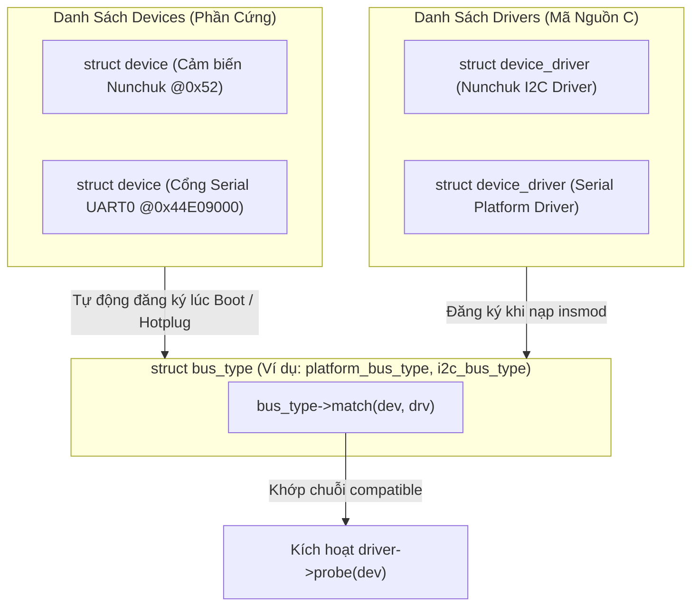
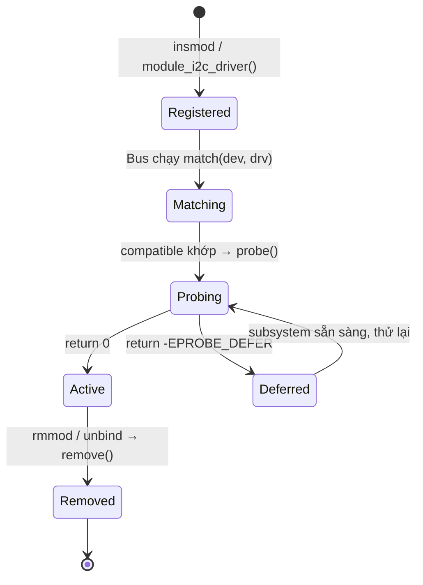

# 🏗️ Chương 6: Linux Device and Driver Model (Mô Hình Thiết Bị & Driver Unified Chuyên Sâu)

Tài liệu này hệ thống hóa toàn bộ kiến thức từ **Slide 176 đến Slide 223** của khóa học Bootlin Linux Kernel, phân tích mô hình Unified Device Model (Bus, Device, Driver), Platform Drivers, Subsystem I2C và bài thực hành Practical Lab 6.

---

## 🏛️ 1. Mô Hình Thiết Bị Thống Nhất (Unified Device Model)

### 1.1 Mục Đích Ra Đời & Ba Thành Phần Cốt Lõi (Slide 176-185)



1. **`struct bus_type`**: Đại diện cho kênh giao tiếp kết nối (ví dụ: `platform_bus_type`, `i2c_bus_type`, `usb_bus_type`). Bus chịu trách nhiệm thực thi hàm `match()` để ghép đôi thiết bị và driver.
2. **`struct device`**: Đại diện cho cá thể phần cứng vật lý gắn trên bus (thường tạo tự động từ nút Device Tree).
3. **`struct device_driver`**: Đại diện cho phần mềm điều khiển chứa các hàm callback xử lý (`probe`, `remove`, `suspend`, `resume`).

---

## 🤝 2. Quy Trình Khớp (Matching Mechanism) & Vòng Đời Driver

### 2.1 Các Ưu Tiên Khớp Giữa Device và Driver (Slide 186-190)
Mỗi khi có một Device mới được thêm vào hoặc một Driver mới được nạp (`insmod`), Bus sẽ duyệt qua danh sách ghép đôi theo thứ tự ưu tiên:

1. **Ưu tiên 1 (Device Tree Matching)**: Khớp chuỗi `compatible` giữa nút Device Tree và bảng `of_match_table` của driver.
2. **Ưu tiên 2 (ACPI Matching)**: Khớp bảng `acpi_match_table` (dành cho máy tính x86).
3. **Ưu tiên 3 (ID Table Matching)**: Khớp danh sách mã định danh `id_table`.
4. **Ưu tiên 4 (Name Matching)**: Khớp chuỗi tên `dev->init_name == drv->name`.

### 2.2 Hàm `probe()` và `remove()` (Slide 191-195)
* **`probe()`**: Được gọi khi Device và Driver khớp nhau.
  * Nhiệm vụ: Đọc tài nguyên phần cứng (Memory, IRQ, Clocks), khởi tạo thiết bị, đăng ký vào Kernel Frameworks.
  * Trả về `0` nếu thành công, hoặc mã lỗi âm (ví dụ: `-ENOMEM`, `-EPROBE_DEFER`).
* **`remove()`**: Được gọi khi thiết bị bị rút ra hoặc module driver bị gỡ bỏ (`rmmod`).
  * Nhiệm vụ: Hủy đăng ký thiết bị, tắt ngắt, giải phóng bộ nhớ đã cấp phát.

---

## 🚉 3. Platform Bus & Platform Drivers

### 3.1 Khái niệm Platform Bus (Slide 196-203)
Platform Bus (`platform_bus_type`) là một bus ảo trong Kernel dùng để quản lý các **thiết bị không tự phát hiện (Non-discoverable devices)** được kết nối trực tiếp vào bus bộ nhớ của SoC (Memory-mapped Peripherals như UART, SPI Controller, Ethernet MAC).

### 3.2 Khai báo Platform Driver mẫu
```c
#include <linux/module.h>
#include <linux/platform_device.h>
#include <linux/of.h>

static int my_pdrv_probe(struct platform_device *pdev)
{
    dev_info(&pdev->dev, "Platform Driver probed thành công!\n");
    return 0;
}

static int my_pdrv_remove(struct platform_device *pdev)
{
    dev_info(&pdev->dev, "Platform Driver removed!\n");
    return 0;
}

static const struct of_device_id my_of_match[] = {
    { .compatible = "vendor,my-platform-device", },
    { }
};
MODULE_DEVICE_TABLE(of, my_of_match);

static struct platform_driver my_pdrv = {
    .probe = my_pdrv_probe,
    .remove = my_pdrv_remove,
    .driver = {
        .name = "my_platform_driver",
        .of_match_table = my_of_match,
    },
};

// Macro tự động khởi tạo module_init và module_exit cho Platform Driver
module_platform_driver(my_pdrv);
MODULE_LICENSE("GPL");
```

---

## 🔌 4. Subsystem I2C (I2C Bus & Client Drivers)

### 4.1 Cấu trúc Driver I2C (Slide 204-223)
Giao tiếp I2C chia thành 2 tầng chính:
1. **I2C Adapter Driver (`i2c_adapter`)**: Driver điều khiển bộ I2C Controller phần cứng của SoC.
2. **I2C Client Driver (`i2c_driver`)**: Driver điều khiển chip ngoại vi nối vào bus I2C (ví dụ: tay cầm Wii Nunchuk địa chỉ `0x52`).

Các hàm **SMBus API** giao tiếp I2C chuẩn:
* `i2c_smbus_read_byte_data(client, reg)`: Đọc 1 byte từ thanh ghi.
* `i2c_smbus_write_byte_data(client, reg, val)`: Ghi 1 byte vào thanh ghi.

---

## 🛠️ PRACTICAL LAB 6: Viết I2C Driver Giao Tiếp Với Tay Cầm Wii Nunchuk

### Mục tiêu bài lab:
1. Viết một `i2c_driver` hoàn chỉnh cho cảm biến Nunchuk nối vào bus I2C địa chỉ `0x52`.
2. Trong hàm `probe()`, khởi tạo Nunchuk bằng cách gửi lệnh giải mã SMBus.
3. Đọc dữ liệu 6 byte dữ liệu thô (nút bấm Z, C và trục Joystick X, Y) và xuất ra log `dmesg`.

### Bước 1: Viết mã nguồn C `nunchuk_driver.c`

```c
#include <linux/module.h>
#include <linux/init.h>
#include <linux/i2c.h>
#include <linux/delay.h>

MODULE_LICENSE("GPL");
MODULE_AUTHOR("Bootlin / Antigravity");
MODULE_DESCRIPTION("Practical Lab 6: I2C Driver cho Wii Nunchuk Sensor");

// Hàm giải mã dữ liệu byte từ Nunchuk
static unsigned char nunchuk_decode_byte(unsigned char b)
{
    return (b ^ 0x17) + 0x17;
}

static int nunchuk_probe(struct i2c_client *client, const struct i2c_device_id *id)
{
    int ret;
    unsigned char buf[6];
    int i;
    int jx, jy, btn_z, btn_c;

    dev_info(&client->dev, "======================================\n");
    dev_info(&client->dev, "Phát hiện Nunchuk tại địa chỉ I2C 0x%02X!\n", client->addr);

    // 1. Khởi tạo Nunchuk (Ghi 0x55 vào thanh ghi 0xF0, 0x00 vào 0xFB)
    i2c_smbus_write_byte_data(client, 0xF0, 0x55);
    mdelay(1);
    i2c_smbus_write_byte_data(client, 0xFB, 0x00);
    mdelay(1);

    // 2. Yêu cầu Nunchuk chuẩn bị gửi 6-byte dữ liệu (Ghi 0x00)
    i2c_smbus_write_byte(client, 0x00);
    mdelay(10);

    // 3. Đọc 6 byte dữ liệu từ Nunchuk
    ret = i2c_master_recv(client, buf, 6);
    if (ret < 0) {
        dev_err(&client->dev, "Lỗi đọc dữ liệu I2C!\n");
        return ret;
    }

    // 4. Giải mã dữ liệu
    for (i = 0; i < 6; i++) {
        buf[i] = nunchuk_decode_byte(buf[i]);
    }

    jx = buf[0]; // Trục Joystick X
    jy = buf[1]; // Trục Joystick Y
    btn_z = !(buf[5] & 0x01); // Nút Z (Bit 0)
    btn_c = !(buf[5] & 0x02); // Nút C (Bit 1)

    dev_info(&client->dev, "[Nunchuk Status] Joystick X: %d, Y: %d | Button Z: %d, C: %d\n",
             jx, jy, btn_z, btn_c);
    dev_info(&client->dev, "======================================\n");

    return 0;
}

static int nunchuk_remove(struct i2c_client *client)
{
    dev_info(&client->dev, "Tháo bỏ Nunchuk I2C Driver!\n");
    return 0;
}

// Bảng Device Tree Matching
static const struct of_device_id nunchuk_dt_ids[] = {
    { .compatible = "nintendo,nunchuk", },
    { }
};
MODULE_DEVICE_TABLE(of, nunchuk_dt_ids);

static struct i2c_driver nunchuk_driver = {
    .driver = {
        .name = "nunchuk_i2c_driver",
        .of_match_table = nunchuk_dt_ids,
    },
    .probe = nunchuk_probe,
    .remove = nunchuk_remove,
};

module_i2c_driver(nunchuk_driver);
```

### Bước 2: Biên dịch và Chạy thử nghiệm
Thực hiện các lệnh trên Terminal:

```bash
# 1. Biên dịch module out-of-tree
make

# 2. Nạp module i2c driver vào Kernel
sudo insmod nunchuk_driver.ko

# 3. Đọc log kết quả probe và dữ liệu cảm biến
dmesg | tail -n 15
```

---

## 💡 Tình Huống Lỗi Thực Tế & Debug (Real-World Edge Cases)

### Tình huống: Lỗi `Deferred probe` (`-EPROBE_DEFER`)
* **Hiện tượng**: Hàm `probe()` trả về mã lỗi `-EPROBE_DEFER` và Kernel liên tục gọi lại hàm probe nhiều lần.
* **Nguyên nhân**: Driver cần sử dụng tài nguyên của một Subsystem khác (ví dụ: I2C Controller hoặc GPIO Controller), nhưng Subsystem đó **chưa khởi tạo xong**.
* **Xử lý**: Đây là **hành vi hoàn toàn bình thường** của Kernel Device Model. Kernel sẽ đưa driver vào danh sách chờ và tự động gọi lại `probe()` khi Subsystem phụ thuộc đã sẵn sàng!

---

## 📝 BÀI TẬP THỰC HÀNH HANDS-ON & CÂU HỎI ÔN TẬP

### Bài tập thực hành tự giải:
**Đề bài**: Trong tệp `nunchuk_driver.c`, hãy bổ sung cấu trúc `struct nunchuk_dev` chứa con trỏ `struct i2c_client*` và lưu con trỏ này vào dữ liệu riêng của thiết bị bằng hàm `i2c_set_clientdata(client, nunchuk_dev)`.

<details>
<summary>🔍 <b>Xem đáp án gợi ý</b></summary>

```c
struct nunchuk_dev {
    struct i2c_client *client;
    int jx, jy;
};

// Trong nunchuk_probe():
struct nunchuk_dev *nunchuk = devm_kzalloc(&client->dev, sizeof(*nunchuk), GFP_KERNEL);
nunchuk->client = client;
i2c_set_clientdata(client, nunchuk);

// Trong nunchuk_remove():
struct nunchuk_dev *nunchuk = i2c_get_clientdata(client);
```
</details>

---

## 🎯 VÍ DỤ MINH HỌA BỔ SUNG

### 💻 Ví dụ 1 (Code C): Lưu dữ liệu riêng thiết bị & xử lý `-EPROBE_DEFER`
Mẫu probe điển hình: cấp phát bằng `devm_*`, lấy tài nguyên, defer nếu chưa sẵn sàng.

```c
struct my_dev {
	struct i2c_client *client;
	int value;
};

static int my_probe(struct i2c_client *client)
{
	struct my_dev *d;
	struct gpio_desc *reset;

	d = devm_kzalloc(&client->dev, sizeof(*d), GFP_KERNEL);
	if (!d)
		return -ENOMEM;
	d->client = client;
	i2c_set_clientdata(client, d);

	/* Nếu GPIO controller chưa init xong → trả -EPROBE_DEFER để thử lại sau */
	reset = devm_gpiod_get_optional(&client->dev, "reset", GPIOD_OUT_HIGH);
	if (IS_ERR(reset))
		return dev_err_probe(&client->dev, PTR_ERR(reset),
				     "chua lay duoc reset GPIO\n");

	dev_info(&client->dev, "probe OK\n");
	return 0;
}
```

### 🖥️ Ví dụ 2 (Terminal/Debug): Quan sát Bus / Device / Driver qua sysfs

```bash
# Ba trụ cột của Device Model đều hiện trong /sys/bus/<bus>
ls /sys/bus/i2c/                 # devices/  drivers/  ...
ls /sys/bus/i2c/drivers/         # danh sách driver đã đăng ký
ls -l /sys/bus/platform/devices/ # thiết bị non-discoverable từ Device Tree

# Bind / unbind driver thủ công (kiểm thử probe/remove)
echo 1-0052 | sudo tee /sys/bus/i2c/drivers/nunchuk_i2c_driver/unbind
echo 1-0052 | sudo tee /sys/bus/i2c/drivers/nunchuk_i2c_driver/bind

# Theo dõi sự kiện probe theo thời gian thực
dmesg -w | grep -i probe
```

### 📊 Ví dụ 3 (Mermaid): Vòng đời một Driver từ đăng ký đến remove



---
*Tiếp theo: [Chương 7: Kernel Frameworks & Char Drivers](./07_Kernel_Frameworks_Char_Drivers.md)*
