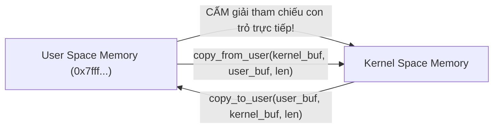
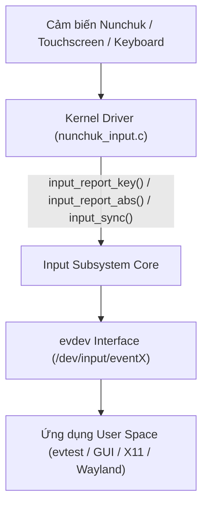
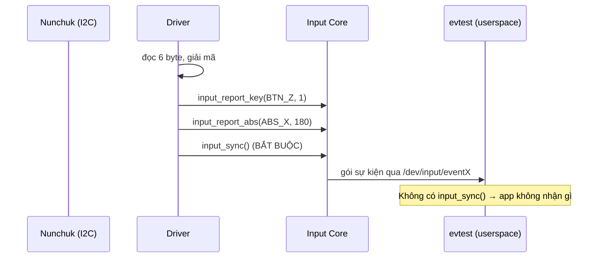

# ⚙️ Chương 7: Kernel Frameworks for Device Drivers (Char Drivers & Input Subsystem)

Tài liệu này hệ thống hóa toàn bộ kiến thức từ **Slide 224 đến Slide 265** của khóa học Bootlin Linux Kernel, hướng dẫn lập trình Character Drivers, chuyển đổi dữ liệu an toàn User/Kernel, hệ thống Input Subsystem, bộ quản lý tài nguyên `devm_*` và bài thực hành Practical Lab 7.

---

## 🔤 1. Character Drivers & Số Định Danh Thiết Bị (Major/Minor)

### 1.1 Vai Trò Của Số Major và Minor (Slide 226-230)
Mọi thiết bị trong hệ thống Linux xuất hiện dưới dạng file nút thiết bị (Device Node) tại `/dev/`. Chúng được định danh bằng một cặp số 32-bit kiểu `dev_t`:

* **Major Number (Số Major)**: Định danh **Driver** chịu trách nhiệm điều khiển thiết bị.
* **Minor Number (Số Minor)**: Định danh **Cá thể thiết bị cụ thể (Device Instance)** mà driver đó đang quản lý.

```bash
# Xem định danh thiết bị trong /dev/ (Số 4 là Major, 0/1/2 là Minor)
ls -l /dev/tty0 /dev/tty1
crw--w---- 1 root tty 4, 0 Jul 31 10:00 /dev/tty0
crw--w---- 1 root tty 4, 1 Jul 31 10:00 /dev/tty1
```

### 1.2 Đăng Ký Vùng Số Character Device & `cdev`
```c
dev_t dev_num;
struct cdev my_cdev;

// 1. Cấp phát động dải số Major/Minor
alloc_chrdev_region(&dev_num, 0, 1, "my_char_device");

// 2. Khởi tạo và thêm cdev vào Kernel VFS
cdev_init(&my_cdev, &my_fops);
cdev_add(&my_cdev, dev_num, 1);
```

---

## 📂 2. Trao Đổi Dữ Liệu An Toàn Với User Space

### 2.1 Quy tắc vàng: `copy_to_user` và `copy_from_user` (Slide 237-243)



> [!WARNING]
> **KHÔNG BAO GIỜ giải tham chiếu trực tiếp con trỏ User Space trong Kernel Code!**
> Con trỏ người dùng truyền vào có thể không hợp lệ, chưa được mapped, hoặc cố tình chứa địa chỉ thuộc Kernel Space để thực hiện cuộc tấn công leo leo quyền hạn (Privilege Escalation).

Bắt buộc sử dụng 2 hàm chuẩn bảo mật:
* **`copy_to_user(to_user_ptr, from_kernel_buf, count)`**: Gửi dữ liệu từ Kernel về User Space.
* **`copy_from_user(to_kernel_buf, from_user_ptr, count)`**: Nhận dữ liệu từ User Space vào Kernel.

---

## 🖼️ 3. Input Subsystem Framework

### 3.1 Khái niệm Input Subsystem (Slide 244-256)
Thay vì tự viết Character Driver riêng cho từng loại bàn phím, chuột hay nút bấm, Kernel cung cấp **Input Subsystem Framework**:



#### Quy trình tích hợp Input Subsystem:
1. **Cấp phát**: `struct input_dev *input = devm_input_allocate_device(&client->dev);`
2. **Khai báo loại sự kiện hỗ trợ**:
   * `set_bit(EV_KEY, input->evbit);` (Hỗ trợ nút bấm)
   * `set_bit(EV_ABS, input->evbit);` (Hỗ trợ trục Joystick tọa độ tuyệt đối)
   * `input_set_abs_params(input, ABS_X, 0, 255, 4, 8);` (Trục X từ 0 đến 255)
3. **Đăng ký**: `input_register_device(input);`
4. **Báo cáo sự kiện**:
   ```c
   input_report_key(input, BTN_Z, z_state);  // Báo trạng thái nút Z
   input_report_abs(input, ABS_X, jx_val);   // Báo tọa độ Joystick X
   input_sync(input);                        // Gửi gói sự kiện đi (Sync Event)
   ```

---

## 🛠️ PRACTICAL LAB 7: Tích Hợp Nunchuk Vào Input Subsystem & Kiểm Thử Với `evtest`

### Mục tiêu bài lab:
1. Nâng cấp driver Nunchuk I2C ở Chương 6 thành một **Input Device** chuẩn của Kernel.
2. Đăng ký các phím `BTN_Z`, `BTN_C` và hai trục Joystick `ABS_X`, `ABS_Y`.
3. Kiểm thử sự kiện nút bấm và di chuyển Joystick trên Terminal User Space bằng công cụ **`evtest`**.

### Bước 1: Viết mã nguồn C `nunchuk_input_driver.c`

```c
#include <linux/module.h>
#include <linux/init.h>
#include <linux/i2c.h>
#include <linux/input.h>
#include <linux/delay.h>

MODULE_LICENSE("GPL");
MODULE_AUTHOR("Bootlin / Antigravity");
MODULE_DESCRIPTION("Practical Lab 7: Tích hợp Nunchuk I2C vào Input Subsystem");

struct nunchuk_dev {
    struct i2c_client *client;
    struct input_dev *input;
};

static unsigned char nunchuk_decode_byte(unsigned char b)
{
    return (b ^ 0x17) + 0x17;
}

static int nunchuk_read_registers(struct i2c_client *client, unsigned char *buf)
{
    int ret, i;
    
    // Gửi lệnh đọc 0x00
    i2c_smbus_write_byte(client, 0x00);
    mdelay(10);

    ret = i2c_master_recv(client, buf, 6);
    if (ret < 0)
        return ret;

    for (i = 0; i < 6; i++) {
        buf[i] = nunchuk_decode_byte(buf[i]);
    }
    return 0;
}

static int nunchuk_probe(struct i2c_client *client, const struct i2c_device_id *id)
{
    struct nunchuk_dev *nunchuk;
    struct input_dev *input;
    int ret;

    // 1. Cấp phát struct quản lý bằng Managed API devm_
    nunchuk = devm_kzalloc(&client->dev, sizeof(*nunchuk), GFP_KERNEL);
    if (!nunchuk)
        return -ENOMEM;

    nunchuk->client = client;

    // 2. Khởi tạo phần cứng Nunchuk
    i2c_smbus_write_byte_data(client, 0xF0, 0x55);
    mdelay(1);
    i2c_smbus_write_byte_data(client, 0xFB, 0x00);
    mdelay(1);

    // 3. Cấp phát và cấu hình Input Device
    input = devm_input_allocate_device(&client->dev);
    if (!input)
        return -ENOMEM;

    nunchuk->input = input;
    input->name = "Wii Nunchuk Joystick & Buttons";
    input->id.bustype = BUS_I2C;

    // Cấu hình các phím bấm Z và C
    set_bit(EV_KEY, input->evbit);
    set_bit(BTN_Z, input->keybit);
    set_bit(BTN_C, input->keybit);

    // Cấu hình trục Joystick X và Y (giá trị 0..255)
    set_bit(EV_ABS, input->evbit);
    input_set_abs_params(input, ABS_X, 0, 255, 4, 8);
    input_set_abs_params(input, ABS_Y, 0, 255, 4, 8);

    // 4. Đăng ký Input Device với Kernel
    ret = input_register_device(input);
    if (ret)
        return ret;

    i2c_set_clientdata(client, nunchuk);
    dev_info(&client->dev, "Đã đăng ký Nunchuk thành công dưới dạng Input Device!\n");

    return 0;
}

static int nunchuk_remove(struct i2c_client *client)
{
    dev_info(&client->dev, "Đã tháo bỏ Nunchuk Input Driver!\n");
    return 0;
}

static const struct of_device_id nunchuk_dt_ids[] = {
    { .compatible = "nintendo,nunchuk", },
    { }
};
MODULE_DEVICE_TABLE(of, nunchuk_dt_ids);

static struct i2c_driver nunchuk_driver = {
    .driver = {
        .name = "nunchuk_input_driver",
        .of_match_table = nunchuk_dt_ids,
    },
    .probe = nunchuk_probe,
    .remove = nunchuk_remove,
};

module_i2c_driver(nunchuk_driver);
```

### Bước 2: Biên dịch và Kiểm thử sự kiện với `evtest` trên User Space
Thực hiện các câu lệnh sau trên Terminal:

```bash
# 1. Biên dịch module out-of-tree
make

# 2. Nạp module vào Kernel
sudo insmod nunchuk_input_driver.ko

# 3. Cài đặt tiện ích evtest kiểm thử thiết bị nhập liệu
sudo apt install -y evtest

# 4. Chạy evtest để lắng nghe sự kiện nút bấm & Joystick thực tế!
sudo evtest
```

**Kết quả màn hình `evtest`:**
```text
Available devices:
/dev/input/event0:  Wii Nunchuk Joystick & Buttons
Select the device event number [0-0]: 0
Input device name: "Wii Nunchuk Joystick & Buttons"
Event: time 1722420000.123456, type 1 (EV_KEY), code 0x1a0 (BTN_Z), value 1
Event: time 1722420000.123456, -------------- SYN_REPORT ------------
Event: time 1722420000.456789, type 3 (EV_ABS), code 0 (ABS_X), value 180
Event: time 1722420000.456789, -------------- SYN_REPORT ------------
```

---

## 💡 Tình Huống Lỗi Thực Tế & Debug (Real-World Edge Cases)

### Tình huống: Quên gọi `input_sync()` sau khi báo cáo sự kiện
* **Hiện tượng**: Bạn gọi `input_report_key(input, BTN_Z, 1)` nhưng ứng dụng User Space (như `evtest` hay Game Engine) không nhận được bất kỳ tín hiệu nút bấm nào.
* **Nguyên nhân**: Input Subsystem chỉ thực sự đóng gói và chuyển toàn bộ các sự kiện thay đổi trạng thái về User Space khi nhận được lệnh đồng bộ **`input_sync(input);`**!

---

## 📝 BÀI TẬP THỰC HÀNH HANDS-ON & CÂU HỎI ÔN TẬP

### Bài tập thực hành tự giải:
**Đề bài**: Tại sao chúng ta nên sử dụng các API có tiền tố `devm_` (như `devm_input_allocate_device`) thay vì hàm cấp phát thông thường `input_allocate_device` trong hàm `probe()`?

<details>
<summary>🔍 <b>Xem đáp án gợi ý</b></summary>

Vì các API `devm_` (Device Managed) tự động gắn vòng đời của bộ nhớ với thiết bị `struct device`. Nếu hàm `probe()` gặp lỗi ở giữa chừng hoặc khi driver bị gỡ bỏ (`remove()`), Kernel sẽ **tự động giải phóng bộ nhớ** mà lập trình viên không cần viết lệnh free thủ công, triệt tiêu 100% rủi ro rò rỉ bộ nhớ (Memory Leak).
</details>

---

## 🎯 VÍ DỤ MINH HỌA BỔ SUNG

### 💻 Ví dụ 1 (Code C): Char driver tối giản với `file_operations` đầy đủ read/write
Bộ đệm trong Kernel, trao đổi an toàn với User Space qua `copy_*_user`.

```c
#include <linux/fs.h>
#include <linux/uaccess.h>
#include <linux/miscdevice.h>

static char kbuf[128];
static size_t kbuf_len;

static ssize_t dev_read(struct file *f, char __user *ubuf, size_t n, loff_t *off)
{
	return simple_read_from_buffer(ubuf, n, off, kbuf, kbuf_len);
}

static ssize_t dev_write(struct file *f, const char __user *ubuf, size_t n, loff_t *off)
{
	if (n > sizeof(kbuf))
		n = sizeof(kbuf);
	if (copy_from_user(kbuf, ubuf, n))   /* KHÔNG deref con trỏ user trực tiếp */
		return -EFAULT;
	kbuf_len = n;
	return n;
}

static const struct file_operations fops = {
	.owner = THIS_MODULE,
	.read  = dev_read,
	.write = dev_write,
};
```

### 🖥️ Ví dụ 2 (Terminal/Debug): Kiểm tra major/minor và test char device

```bash
# Xem driver đã cấp phát major nào (từ /proc/devices)
cat /proc/devices | grep -i my_char

# Ghi rồi đọc lại dữ liệu qua device node
echo "xin chao kernel" > /dev/my_char_device
cat /dev/my_char_device

# Với input device: liệt kê và xem khả năng của thiết bị
cat /proc/bus/input/devices
sudo evtest /dev/input/event0     # theo dõi sự kiện realtime
```

### 📊 Ví dụ 3 (Mermaid): Đường đi của sự kiện qua Input Subsystem



---
*Tiếp theo: [Chương 8: Memory Management & I/O Memory](./08_Memory_Management_IO_Memory.md)*
