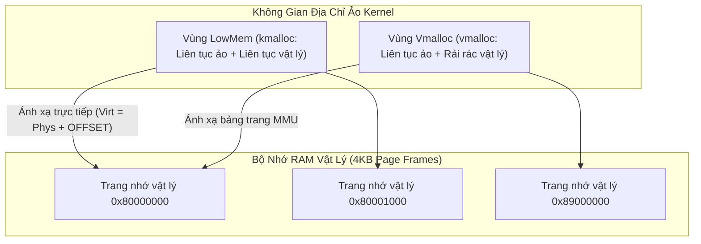
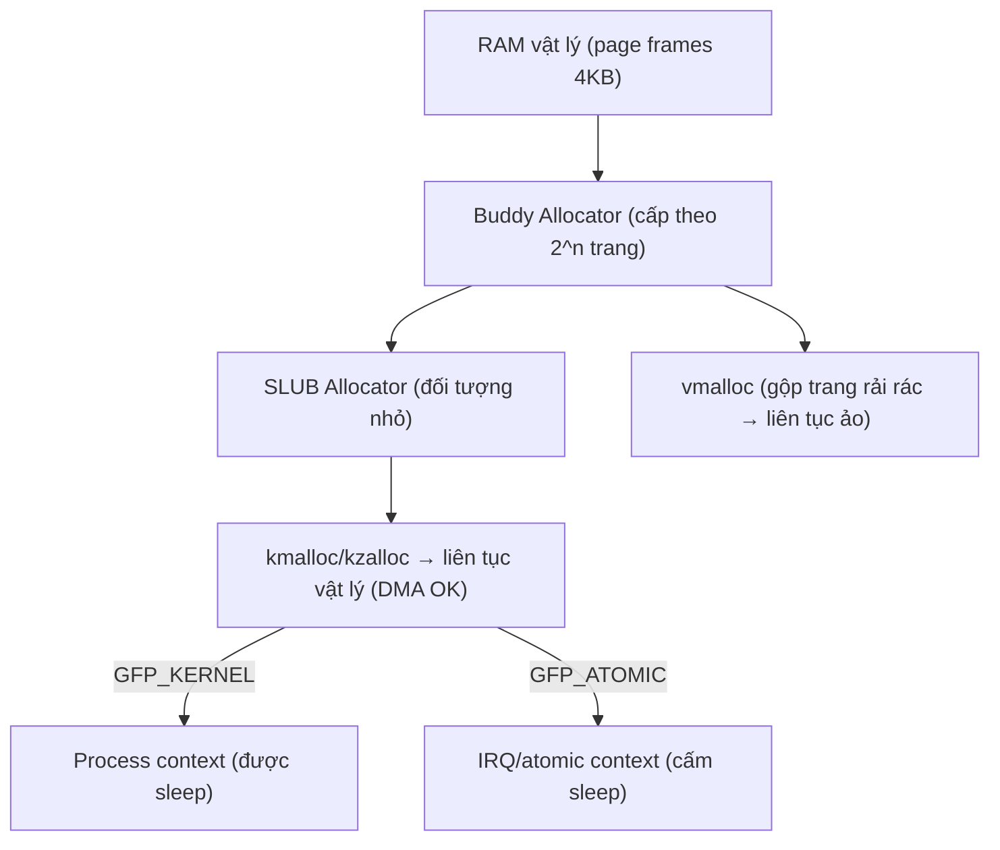

# 🧠 Chương 8: Memory Management & I/O Memory (Quản Lý Bộ Nhớ & MMIO Chuyên Sâu)

Tài liệu này hệ thống hóa toàn bộ kiến thức từ **Slide 266 đến Slide 299** của khóa học Bootlin Linux Kernel, phân tích cơ chế quản lý bộ nhớ ảo (Virtual Memory), phân biệt `kmalloc` vs `vmalloc`, truy xuất thanh ghi MMIO (`ioremap`) và bài thực hành Practical Lab 8.

---

## 🗺️ 1. Không Gian Bộ Nhớ Ảo & Các Bộ Cấp Phát (Memory Allocators)

### 1.1 Bộ Nhớ Vật Lý vs Bộ Nhớ Ảo (Slide 266-270)
Trong Linux Kernel, mọi địa chỉ bộ nhớ được xử lý trong code C đều là **Địa chỉ Ảo (Virtual Address)**. Bộ quản lý bộ nhớ MMU của CPU chuyển đổi địa chỉ ảo sang **Địa chỉ Vật lý (Physical Address)** theo từng trang nhớ (Page Frame - kích thước 4KB).



### 1.2 Buddy Allocator và SLUB Allocator (Slide 271-275)
1. **Buddy Allocator (Page Allocator)**: Bộ cấp phát gốc quản lý RAM theo từng trang $2^0, 2^1, 2^2, ...$ trang.
2. **SLUB Allocator (Object Allocator)**: Xây dựng trên nền Buddy Allocator để cấp phát các vùng nhớ kích thước nhỏ từ vài byte đến vài KB một cách cực kỳ nhanh chóng, hạn chế tối đa phân mảnh bộ nhớ.

---

## 💉 2. So Sánh Chi Tiết `kmalloc` vs `vmalloc`

### 2.1 Bảng So Sánh Hai Hàm Cấp Phát Bộ Nhớ Chính (Slide 276-287)

| Tiêu chí                  | `kmalloc()` / `kzalloc()`                 | `vmalloc()`                                                  |
| :------------------------ | :---------------------------------------- | :----------------------------------------------------------- |
| **Tính liên tục vật lý**  | **CÓ**. Liên tục cả địa chỉ Ảo VÀ Vật lý. | KHÔNG. Chỉ liên tục địa chỉ Ảo, địa chỉ Vật lý bị phân mảnh. |
| **Hỗ trợ DMA phần cứng?** | **CÓ**. Bắt buộc dùng cho bộ đệm DMA.     | **KHÔNG**. Không dùng trực tiếp cho DMA thô.                 |
| **Tốc độ thực thi**       | Cực nhanh (Dùng SLUB Cache có sẵn).       | Chậm hơn (Phải tạo bảng trang MMU mới).                      |
| **Kích thước tối đa**     | Giới hạn (Tối đa vài MB).                 | Rất lớn (Tùy thuộc vào RAM trống còn lại).                   |
| **Hàm giải phóng**        | `kfree(ptr);`                             | `vfree(ptr);`                                                |

### 2.2 Ý Nghĩa Các Cờ Cấp Phát (`gfp_t` Flags)
* **`GFP_KERNEL`**: Cờ tiêu chuẩn. Cho phép Kernel **đi ngủ (Sleep/Block)** để thu hồi bộ nhớ nếu RAM đang bận. *Chỉ được dùng trong Process Context.*
* **`GFP_ATOMIC`**: **TUYỆT ĐỐI KHÔNG SLEEP**. Nếu hết RAM, hàm trả về `NULL` ngay lập tức. *Bắt buộc dùng trong Interrupt Context (ISR), Spinlock critical section!*
* **`GFP_DMA`**: Cấp phát bộ nhớ từ vùng RAM dành riêng cho thiết bị DMA 24-bit/32-bit.

---

## 🔌 3. Truy Xuất Bộ Nhớ I/O (Memory-Mapped I/O - MMIO)

### 3.1 Khái niệm MMIO & `ioremap` (Slide 288-293)
Các thanh ghi phần cứng của SoC được ánh xạ vào địa chỉ bộ nhớ vật lý. Để đọc/ghi các thanh ghi này trong Driver, Kernel bắt buộc phải ánh xạ địa chỉ vật lý đó sang địa chỉ ảo bằng hàm **`ioremap()`**:

```c
// Ánh xạ 4KB thanh ghi phần cứng từ địa chỉ vật lý 0x44E07000 (GPIO1 Controller)
void __iomem *base = ioremap(0x44E07000, 0x1000);
```

### 3.2 Quy Tắc Đọc/Ghi Thanh Ghi An Toàn (Slide 294-297)

> [!CAUTION]
> **KHÔNG BAO GIỜ giải tham chiếu trực tiếp con trỏ `base` như con trỏ C thông thường (`*base = 0x01`)!**
> Việc này sẽ bỏ qua Memory Barriers hoặc bị Compiler tối ưu hóa làm sai lệch thứ tự ghi thanh ghi phần cứng.

Bắt buộc sử dụng các hàm đọc/ghi chuẩn của Kernel:

```c
#include <linux/io.h>

// Đọc thanh ghi (Read 32-bit)
u32 val = readl(base + 0x138); // Đọc thanh ghi GPIO_DATAIN

// Ghi thanh ghi (Write 32-bit)
writel(1 << 21, base + 0x194); // Ghi thanh ghi GPIO_SETDATAOUT để bật LED
```

---

## 🛠️ PRACTICAL LAB 8: Đọc/Ghi Thanh Ghi I/O Remap Để Điều Khiển Đèn LED GPIO

### Mục tiêu bài lab:
1. Xác định địa chỉ vật lý thanh ghi GPIO Controller từ tệp Device Tree.
2. Ánh xạ vùng nhớ phần cứng MMIO bằng hàm `devm_platform_ioremap_resource()`.
3. Sử dụng các hàm `readl()` và `writel()` để cấu hình hướng chân GPIO (`GPIO_OE`) và chớp/tắt đèn LED.

### Bước 1: Viết mã nguồn C `gpio_mmio_driver.c`

```c
#include <linux/module.h>
#include <linux/init.h>
#include <linux/platform_device.h>
#include <linux/io.h>
#include <linux/of.h>

MODULE_LICENSE("GPL");
MODULE_AUTHOR("Bootlin / Antigravity");
MODULE_DESCRIPTION("Practical Lab 8: Đọc/Ghi thanh ghi MMIO GPIO bằng readl/writel");

// Offset các thanh ghi của bộ điều khiển GPIO AM335x (BeagleBone Black)
#define GPIO_OE          0x134 // Output Enable Register (0: Output, 1: Input)
#define GPIO_CLEARDATAOUT 0x190 // Clear Data Register (Ghi 1 để Tắt LED)
#define GPIO_SETDATAOUT   0x194 // Set Data Register (Ghi 1 để Bật LED)
#define LED_PIN_BIT      (1 << 21) // Chân GPIO1_21 (USR0 LED)

struct gpio_led_dev {
    void __iomem *reg_base;
};

static int gpio_led_probe(struct platform_device *pdev)
{
    struct gpio_led_dev *dev;
    u32 val;

    dev_info(&pdev->dev, "======================================\n");
    dev_info(&pdev->dev, "Đang khởi tạo Driver MMIO GPIO LED...\n");

    dev = devm_kzalloc(&pdev->dev, sizeof(*dev), GFP_KERNEL);
    if (!dev)
        return -ENOMEM;

    // 1. Ánh xạ địa chỉ vật lý MMIO từ nút Device Tree
    dev->reg_base = devm_platform_ioremap_resource(pdev, 0);
    if (IS_ERR(dev->reg_base))
        return PTR_ERR(dev->reg_base);

    dev_info(&pdev->dev, "Đã ioremap vùng nhớ vật lý sang Virtual Addr: %p\n", dev->reg_base);

    // 2. Đọc thanh ghi GPIO_OE hiện tại
    val = readl(dev->reg_base + GPIO_OE);
    
    // 3. Cấu hình chân LED làm Output (Xóa bit LED_PIN_BIT về 0)
    val &= ~LED_PIN_BIT;
    writel(val, dev->reg_base + GPIO_OE);

    // 4. Bật đèn LED (Ghi bit vào thanh ghi SETDATAOUT)
    writel(LED_PIN_BIT, dev->reg_base + GPIO_SETDATAOUT);
    dev_info(&pdev->dev, "Đã BẬT đèn LED GPIO thành công!\n");
    dev_info(&pdev->dev, "======================================\n");

    platform_set_drvdata(pdev, dev);
    return 0;
}

static int gpio_led_remove(struct platform_device *pdev)
{
    struct gpio_led_dev *dev = platform_get_drvdata(pdev);

    if (dev->reg_base) {
        // Tắt đèn LED trước khi tháo module (Ghi bit vào CLEARDATAOUT)
        writel(LED_PIN_BIT, dev->reg_base + GPIO_CLEARDATAOUT);
        dev_info(&pdev->dev, "Đã TẮT đèn LED GPIO và tháo driver!\n");
    }
    return 0;
}

static const struct of_device_id gpio_led_dt_ids[] = {
    { .compatible = "vendor,custom-gpio-led", },
    { }
};
MODULE_DEVICE_TABLE(of, gpio_led_dt_ids);

static struct platform_driver gpio_led_driver = {
    .probe = gpio_led_probe,
    .remove = gpio_led_remove,
    .driver = {
        .name = "custom_gpio_led_driver",
        .of_match_table = gpio_led_dt_ids,
    },
};

module_platform_driver(gpio_led_driver);
```

### Bước 2: Biên dịch và Kiểm thử
Thực hiện các lệnh trên Terminal:

```bash
# 1. Biên dịch module out-of-tree
make

# 2. Nạp module vào Kernel để kích hoạt hàm probe bật LED
sudo insmod gpio_mmio_driver.ko

# 3. Kiểm tra nhật ký Kernel
dmesg | tail -n 10

# 4. Tháo module để tắt LED
sudo rmmod gpio_mmio_driver
dmesg | tail -n 5
```

---

## 💡 Tình Huống Lỗi Thực Tế & Debug (Real-World Edge Cases)

### Tình huống: Gọi `kmalloc(GFP_KERNEL)` trong hàm ngắt ISR
* **Hiện tượng**: Khi ngắt phần cứng xảy ra, hệ thống bị crash lập tức kèm thông báo: `BUG: scheduling while atomic` hoặc `Call Trace: kmalloc -> sleep_on`.
* **Nguyên nhân**: Hàm ngắt ISR chạy trong **Interrupt Context (Atomic Context)**. Gọi `kmalloc` với cờ `GFP_KERNEL` có thể làm tiến trình đi ngủ, điều này bị cấm tuyệt đối trong ISR!
* **Khắc phục**: Thay cờ `GFP_KERNEL` bằng cờ **`GFP_ATOMIC`**.

---

## 📝 BÀI TẬP THỰC HÀNH HANDS-ON & CÂU HỎI ÔN TẬP

### Bài tập thực hành tự giải:
**Đề bài**: Khi nào bạn nên sử dụng `kmalloc()` và khi nào bạn nên sử dụng `vmalloc()`?

<details>
<summary>🔍 <b>Xem đáp án gợi ý</b></summary>

- **Nên dùng `kmalloc()`**: Cho các vùng nhớ có kích thước nhỏ đến trung bình (dưới 128KB) và **bắt buộc dùng cho bộ đệm DMA** phần cứng vì `kmalloc` đảm bảo tính liên tục về bộ nhớ vật lý.
- **Nên dùng `vmalloc()`**: Cho các vùng nhớ lớn (hàng triệu byte như bộ đệm hệ thống tệp hay chứa module nạp động) nơi tính liên tục về địa chỉ ảo là đủ và không cần truyền DMA thô.
</details>

---

## 🎯 VÍ DỤ MINH HỌA BỔ SUNG

### 💻 Ví dụ 1 (Code C): Chọn đúng allocator & cờ GFP theo ngữ cảnh
Minh họa `kmalloc` cho buffer nhỏ/DMA vs `vmalloc` cho buffer lớn, và `GFP_ATOMIC` trong ISR.

```c
#include <linux/slab.h>
#include <linux/vmalloc.h>

/* Trong process context: buffer nhỏ, có thể sleep */
char *small = kmalloc(256, GFP_KERNEL);
if (!small) return -ENOMEM;

/* Buffer rất lớn (vd 4MB), chỉ cần liên tục ảo */
void *big = vmalloc(4 * 1024 * 1024);

/* Trong interrupt handler: TUYỆT ĐỐI không sleep */
irqreturn_t my_isr(int irq, void *dev)
{
	char *tmp = kmalloc(64, GFP_ATOMIC);   /* không dùng GFP_KERNEL ở đây! */
	if (tmp) {
		/* ... xử lý nhanh ... */
		kfree(tmp);
	}
	return IRQ_HANDLED;
}

kfree(small);
vfree(big);
```

### 🖥️ Ví dụ 2 (Terminal/Debug): Quan sát bộ nhớ Kernel & vùng MMIO

```bash
# Thống kê slab (SLUB) — xem cache nào tốn RAM nhất
sudo slabtop -o | head

# Tổng quan bộ nhớ kernel: Slab, VmallocUsed...
grep -E 'Slab|VmallocUsed|KernelStack' /proc/meminfo

# Bản đồ vùng địa chỉ MMIO đã ánh xạ của các thiết bị
sudo cat /proc/iomem | grep -i gpio

# Kiểm tra rò rỉ bộ nhớ kernel (nếu bật CONFIG_DEBUG_KMEMLEAK)
echo scan | sudo tee /sys/kernel/debug/kmemleak
sudo cat /sys/kernel/debug/kmemleak
```

### 📊 Ví dụ 3 (Mermaid): Cây cấp phát bộ nhớ trong Kernel



---
*Tiếp theo: [Chương 9: Clock, Power Management & Misc Subsystem](./09_Clock_Power_Misc_Subsystem.md)*
