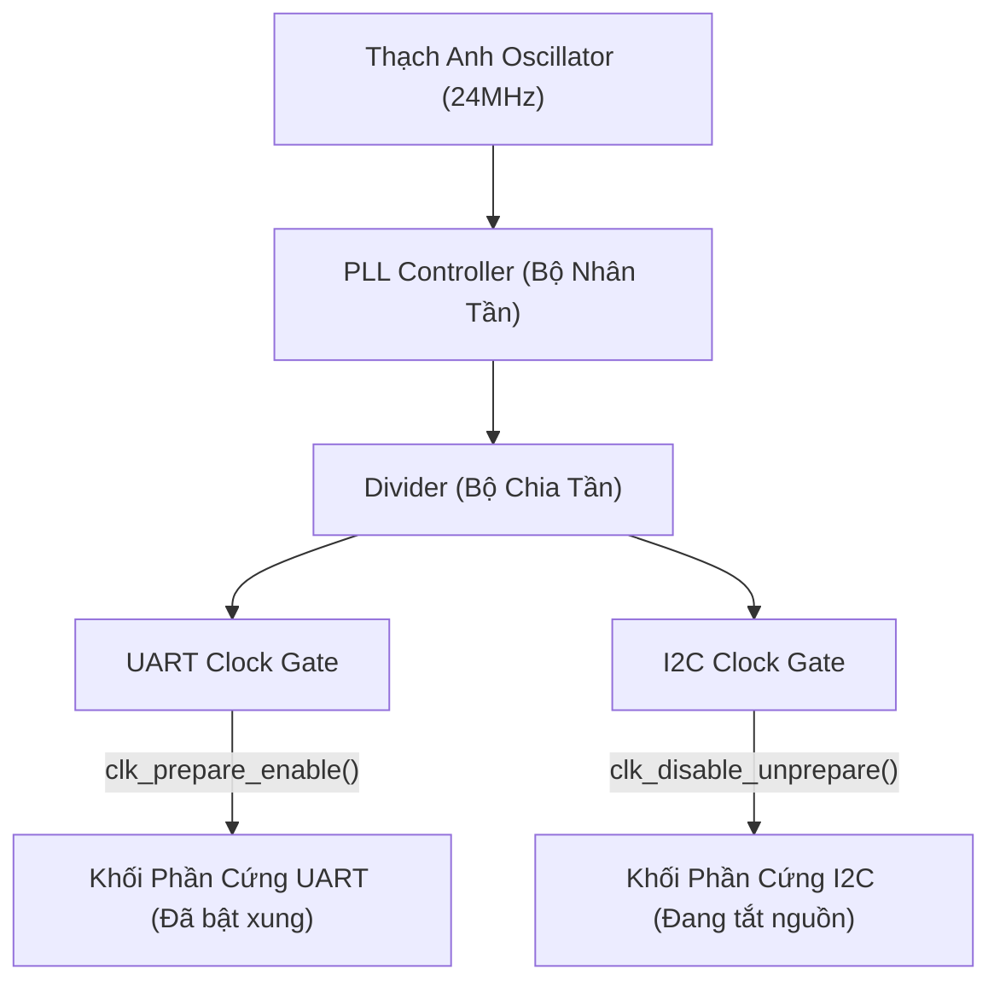
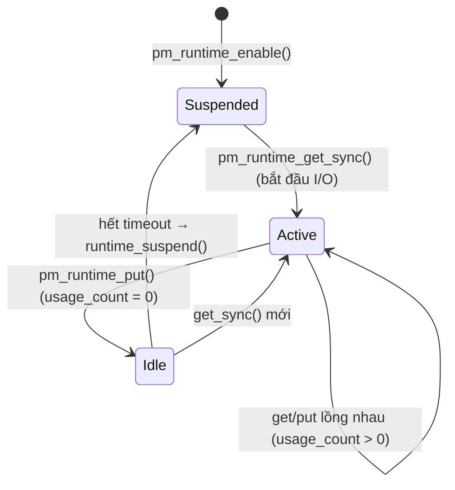

# ⏰ Chương 9: Clock, Power Management & Misc Subsystem (Quản Lý Xung Nhịp & Nguồn Điện)

Tài liệu này hệ thống hóa toàn bộ kiến thức từ **Slide 300 đến Slide 315** của khóa học Bootlin Linux Kernel, bao gồm hệ thống quản lý xung nhịp (Common Clock Framework), quản lý điện năng (Power Management), Subsystem `miscdevice` và bài thực hành Practical Lab 9.

---

## ⏱️ 1. Common Clock Framework (CCF)

### 1.1 Khái niệm & Cấu Trúc Cây Clock (Slide 300-302)
Các SoC nhúng chứa hệ thống cây Clock (Clock Tree) phức tạp bao gồm các bộ dao động thạch anh (Oscillators), bộ nhân tần PLLs, bộ chia tần (Dividers), và các cổng đóng/mở xung (Clock Gates).

Tắt các đường xung clock của các thiết bị phần cứng chưa dùng đến là phương pháp **tiết kiệm điện năng hiệu quả nhất** trên hệ thống nhúng.



### 1.2 Các Hàm API Làm Việc Với Clock (Slide 303-304)

```c
#include <linux/clk.h>

// 1. Lấy con trỏ Clock từ Device Tree trong hàm probe()
struct clk *my_clk = devm_clk_get(&pdev->dev, NULL);
if (IS_ERR(my_clk))
    return PTR_ERR(my_clk);

// 2. Bật Clock (Chuẩn bị trong sleep context và bật trong atomic context)
int ret = clk_prepare_enable(my_clk);
if (ret)
    return ret;

// 3. Đọc tần số clock hiện tại (Hz)
unsigned long rate = clk_get_rate(my_clk);
dev_info(&pdev->dev, "Tần số xung clock: %lu Hz\n", rate);

// 4. Tắt Clock khi tháo bỏ driver hoặc vào chế độ ngủ (Suspend)
clk_disable_unprepare(my_clk);
```

---

## 🔋 2. Quản Lý Nguồn Điện (Power Management - PM)

### 2.1 System Suspend & Resume (Slide 306-307)
Khi toàn bộ hệ thống vào chế độ ngủ sâu (Suspend to RAM / Deep Sleep):
Kernel sẽ gọi lần lượt hàm callbacks trong `struct dev_pm_ops` của từng driver:

* **`.suspend()`**: Dừng các giao tiếp I/O, lưu lại các thanh ghi trạng thái phần cứng vào RAM, tắt clock và ngắt nguồn thiết bị.
* **`.resume()`**: Bật lại nguồn điện, khôi phục clock, nạp lại giá trị các thanh ghi và tiếp tục hoạt động.

### 2.2 Runtime Power Management (Runtime PM) (Slide 308)
Khác với System Suspend (ngủ toàn hệ thống), **Runtime PM** cho phép **tắt nguồn từng linh kiện phần cứng riêng lẻ** ngay lập tức khi linh kiện đó rảnh (Idle), dù hệ thống chính vẫn đang hoạt động:

```c
#include <linux/pm_runtime.h>

pm_runtime_enable(&pdev->dev);

// Khi bắt đầu thao tác I/O với thiết bị -> Bật nguồn
pm_runtime_get_sync(&pdev->dev);

// ... Đọc / Ghi dữ liệu với phần cứng ...

// Khi thao tác xong -> Báo cáo rảnh để kernel tự tắt nguồn sau khoảng timeout
pm_runtime_put_sync(&pdev->dev);
```

---

## 🎸 3. Subsystem `miscdevice` (Misc Subsystem)

### 3.1 Đơn Giản Hóa Tạo Character Driver (Slide 309-315)
Thông thường, để tạo một Character Driver, bạn phải thực hiện nhiều bước phức tạp (`alloc_chrdev_region`, `cdev_init`, `cdev_add`, `class_create`, `device_create`).

**`miscdevice`** là một Subsystem đơn giản hóa toàn bộ quy trình trên! Tất cả các thiết bị misc đều chia sẻ chung **Major Number 10**, và Kernel tự động cấp phát số Minor và tạo nút `/dev/<tên>` giúp bạn chỉ trong 1 dòng lệnh duy nhất:

```c
#include <linux/miscdevice.h>

static const struct file_operations my_fops = {
    .owner = THIS_MODULE,
    .write = serial_write_func,
};

static struct miscdevice my_misc_device = {
    .minor = MISC_DYNAMIC_MINOR, // Yêu cầu tự động cấp số Minor rảnh
    .name = "my_serial_dev",     // Tạo file /dev/my_serial_dev
    .fops = &my_fops,
};

// Đăng ký: misc_register(&my_misc_device);
// Hủy đăng ký: misc_deregister(&my_misc_device);
```

---

## 🛠️ PRACTICAL LAB 9: Viết Driver Serial UART Xuất Dữ Liệu Dùng `miscdevice` & Clock API

### Mục tiêu bài lab:
1. Viết một Driver điều khiển cổng Serial UART xuất ký tự ra phần cứng.
2. Quản lý xung clock cho ngoại vi UART bằng bộ API `clk_prepare_enable()`.
3. Đăng ký giao diện file `/dev/feserial` thông qua Subsystem `miscdevice`.

### Bước 1: Viết mã nguồn C `fe_serial_driver.c`

```c
#include <linux/module.h>
#include <linux/init.h>
#include <linux/platform_device.h>
#include <linux/miscdevice.h>
#include <linux/clk.h>
#include <linux/io.h>
#include <linux/uaccess.h>

MODULE_LICENSE("GPL");
MODULE_AUTHOR("Bootlin / Antigravity");
MODULE_DESCRIPTION("Practical Lab 9: Driver Serial UART dùng miscdevice và CCF Clock API");

#define UART_TX 0x00 // Transmit Holding Register
#define UART_LSR 0x14 // Line Status Register
#define UART_LSR_THRE 0x20 // Transmit Holding Register Empty Bit

struct fe_serial_dev {
    void __iomem *regs;
    struct clk *clk;
    struct miscdevice miscdev;
};

static void serial_write_char(struct fe_serial_dev *dev, char c)
{
    // Chờ cho đến khi bộ đệm truyền TX rảnh (Busy loop với readl)
    while (!(readl(dev->regs + UART_LSR) & UART_LSR_THRE))
        cpu_relax();

    // Ghi ký tự vào thanh ghi TX
    writel(c, dev->regs + UART_TX);
}

static ssize_t fe_serial_write(struct file *file, const char __user *buf, size_t count, loff_t *ppos)
{
    struct fe_serial_dev *dev = container_of(file->private_data, struct fe_serial_dev, miscdev);
    char kbuf[128];
    size_t i, len;

    len = min(count, sizeof(kbuf));
    if (copy_from_user(kbuf, buf, len))
        return -EFAULT;

    for (i = 0; i < len; i++) {
        serial_write_char(dev, kbuf[i]);
    }

    return len;
}

static const struct file_operations fe_serial_fops = {
    .owner = THIS_MODULE,
    .write = fe_serial_write,
};

static int fe_serial_probe(struct platform_device *pdev)
{
    struct fe_serial_dev *dev;
    int ret;

    dev_info(&pdev->dev, "======================================\n");
    dev_info(&pdev->dev, "Đang khởi tạo Serial UART Driver...\n");

    dev = devm_kzalloc(&pdev->dev, sizeof(*dev), GFP_KERNEL);
    if (!dev)
        return -ENOMEM;

    // 1. Ánh xạ vùng nhớ MMIO thanh ghi UART
    dev->regs = devm_platform_ioremap_resource(pdev, 0);
    if (IS_ERR(dev->regs))
        return PTR_ERR(dev->regs);

    // 2. Lấy và BẬT xung Clock cho UART
    dev->clk = devm_clk_get(&pdev->dev, NULL);
    if (!IS_ERR(dev->clk)) {
        ret = clk_prepare_enable(dev->clk);
        if (ret)
            return ret;
        dev_info(&pdev->dev, "Đã bật Clock UART thành công! Freq: %lu Hz\n", clk_get_rate(dev->clk));
    }

    // 3. Đăng ký miscdevice
    dev->miscdev.minor = MISC_DYNAMIC_MINOR;
    dev->miscdev.name = "feserial";
    dev->miscdev.fops = &fe_serial_fops;
    dev->miscdev.parent = &pdev->dev;

    ret = misc_register(&dev->miscdev);
    if (ret) {
        if (!IS_ERR(dev->clk))
            clk_disable_unprepare(dev->clk);
        return ret;
    }

    platform_set_drvdata(pdev, dev);
    dev_info(&pdev->dev, "Đã tạo thiết bị /dev/feserial thành công!\n");
    dev_info(&pdev->dev, "======================================\n");
    return 0;
}

static int fe_serial_remove(struct platform_device *pdev)
{
    struct fe_serial_dev *dev = platform_get_drvdata(pdev);

    misc_deregister(&dev->miscdev);
    if (!IS_ERR(dev->clk)) {
        clk_disable_unprepare(dev->clk);
    }
    return 0;
}

static const struct of_device_id fe_serial_dt_ids[] = {
    { .compatible = "bootlin,feserial", },
    { }
};
MODULE_DEVICE_TABLE(of, fe_serial_dt_ids);

static struct platform_driver fe_serial_driver = {
    .probe = fe_serial_probe,
    .remove = fe_serial_remove,
    .driver = {
        .name = "feserial_driver",
        .of_match_table = fe_serial_dt_ids,
    },
};

module_platform_driver(fe_serial_driver);
```

### Bước 2: Biên dịch và Gửi ký tự ra /dev/feserial
Thực hiện các lệnh trên Terminal:

```bash
# 1. Biên dịch module
make

# 2. Nạp module vào Kernel
sudo insmod fe_serial_driver.ko

# 3. Gửi chuỗi ký tự từ User Space ra cổng Serial!
echo "Hello from Linux Kernel Misc Serial Driver!" > /dev/feserial

# 4. Kiểm tra nhật ký dmesg
dmesg | tail -n 10
```

---

## 💡 Tình Huống Lỗi Thực Tế & Debug (Real-World Edge Cases)

### Tình huống: Quên bật Clock (`clk_prepare_enable`) trước khi truy xuất thanh ghi
* **Hiện tượng**: Ngay dòng lệnh `readl()` hoặc `writel()` đầu tiên trong `probe()`, hệ thống bị treo cứng (Bus Error / Synchronous External Abort).
* **Nguyên nhân**: Ngoại vi SoC bị cắt xung clock hoàn toàn. Truy cập thanh ghi phần cứng khi chưa cấp xung clock sẽ khiến bus bộ nhớ bị khóa vĩnh viễn!
* **Khắc phục**: Luôn gọi `clk_prepare_enable()` thành công **TRƯỚC KHI** thực hiện bất kỳ thao tác đọc/ghi thanh ghi nào.

---

## 📝 BÀI TẬP THỰC HÀNH HANDS-ON & CÂU HỎI ÔN TẬP

### Bài tập thực hành tự giải:
**Đề bài**: Sự khác nhau giữa `clk_prepare()` và `clk_enable()` là gì? Tại sao lại có hàm gộp `clk_prepare_enable()`?

<details>
<summary>🔍 <b>Xem đáp án gợi ý</b></summary>

- **`clk_prepare()`**: Thực hiện các thao tác khởi tạo có thể đi ngủ (Sleep context) như bật nguồn bộ dao động PLL.
- **`clk_enable()`**: Thực hiện các thao tác bật cổng xung gate trong ngữ cảnh nguyên tử (Atomic context) không đi ngủ.
- **`clk_prepare_enable()`**: Là hàm tiện ích gộp cả 2 thao tác trên, thường được gọi trong hàm `probe()` của driver.
</details>

---

## 🎯 VÍ DỤ MINH HỌA BỔ SUNG

### 💻 Ví dụ 1 (Code C): Driver hỗ trợ System Suspend/Resume với `dev_pm_ops`
Lưu/khôi phục clock khi hệ thống ngủ — mẫu chuẩn dùng `SIMPLE_DEV_PM_OPS`.

```c
#include <linux/pm.h>

static int my_suspend(struct device *dev)
{
	struct my_drv *d = dev_get_drvdata(dev);
	clk_disable_unprepare(d->clk);        /* tắt clock để tiết kiệm điện */
	dev_info(dev, "suspended\n");
	return 0;
}

static int my_resume(struct device *dev)
{
	struct my_drv *d = dev_get_drvdata(dev);
	clk_prepare_enable(d->clk);           /* bật lại clock khi thức dậy */
	dev_info(dev, "resumed\n");
	return 0;
}

static SIMPLE_DEV_PM_OPS(my_pm_ops, my_suspend, my_resume);

/* Gắn vào driver: .driver.pm = &my_pm_ops */
```

### 🖥️ Ví dụ 2 (Terminal/Debug): Quan sát Clock & Power Management

```bash
# Xem toàn bộ cây clock: tần số, số thiết bị đang dùng (enable_cnt)
sudo cat /sys/kernel/debug/clk/clk_summary | head -30

# Trạng thái Runtime PM của một thiết bị
cat /sys/devices/platform/*/power/runtime_status   # active / suspended

# Các mức sleep hệ thống mà kernel hỗ trợ
cat /sys/power/state                                # freeze standby mem disk

# Thử suspend-to-idle rồi xem log resume
echo freeze | sudo tee /sys/power/state
dmesg | tail -n 20

# Xác nhận thiết bị misc vừa tạo (đều dùng major 10)
ls -l /dev/feserial && cat /proc/misc | grep feserial
```

### 📊 Ví dụ 3 (Mermaid): Tham chiếu Runtime PM (get/put) tự tắt nguồn khi idle



---
*Tiếp theo: [Chương 10: Processes, Scheduling, Interrupts & Locking](./10_Processes_Scheduling_Interrupts_Concurrency.md)*
