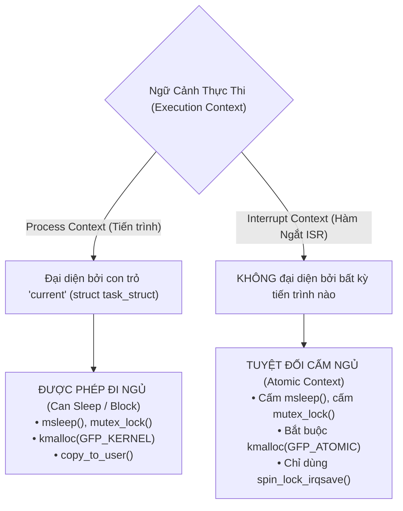
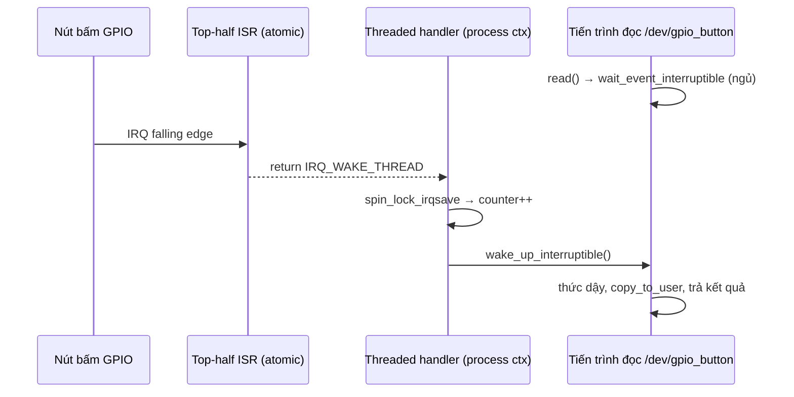

# 🔄 Chương 10: Processes, Scheduling, Interrupts & Concurrency (Ngắt & Đồng Bộ Hóa Chuyên Sâu)

Tài liệu này hệ thống hóa toàn bộ kiến thức từ **Slide 316 đến Slide 374** của khóa học Bootlin Linux Kernel, phân tích chuyên sâu về ngữ cảnh thực thi, xử lý ngắt phần cứng (Threaded IRQ/Workqueues), các bộ khóa đồng bộ (Spinlock vs Mutex) và bài thực hành Practical Lab 10.

---

## 🧵 1. Ngữ Cảnh Thực Thi: Process Context vs Interrupt Context

### 1.1 Sự Khác Biệt Cốt Lõi (Slide 316-320)
Mã nguồn C của bạn chạy trong Linux Kernel luôn thuộc một trong hai ngữ cảnh (Execution Contexts):



---

## ⚡ 2. Xử Lý Ngắt: Top-Half vs Bottom-Half

### 2.1 Tại Sao Phải Chia Đôi Hàm Ngắt? (Slide 336-340)
* **Top-Half (Primary ISR)**: Chạy ngay lập tức khi phần cứng phát tín hiệu IRQ. Phải thực thi cực nhanh (vài microsecond), xóa cờ ngắt phần cứng và hoãn các thao tác tính toán nặng cho Bottom-half. **Bị cấm ngủ!**
* **Bottom-Half**: Đảm nhận xử lý khối lượng lớn dữ liệu sau đó.

### 2.2 Các Cơ Chế Bottom-Half Hiện Đại (Slide 341-351)

1. **Threaded IRQs (`request_threaded_irq`)**: **Chuẩn khuyến nghị hiện đại!**
   * Kernel tự động tạo một Kernel Thread riêng biệt để chạy hàm bottom-half.
   * Chạy trong **Process Context** $\rightarrow$ Được phép đi ngủ, cấp phát bộ nhớ `GFP_KERNEL` và dùng Mutex!

2. **Workqueues (`struct work_struct`)**:
   * Đưa công việc vào hàng chờ để Kernel Thread `kworker` xử lý sau trong **Process Context**.

---

## 🔒 3. Khóa Đồng Bộ Dữ Liệu (Concurrency & Locking)

### 3.1 Nguồn Gốc Đua Tranh Dữ Liệu (Race Conditions) (Slide 352-356)
Tranh chấp dữ liệu xảy ra khi có từ 2 luồng thực thi đồng thời đọc/ghi vào một vùng nhớ dùng chung (Shared Memory):
1. **Symmetrical Multi-Processing (SMP)**: Các nhân CPU chạy song song.
2. **Kernel Preemption**: Tiến trình ưu tiên cao hơn cướp quyền CPU của tiến trình hiện tại.
3. **Hardware Interrupts**: Ngắt phần cứng có thể xen vào bất kỳ lúc nào.

### 3.2 Bảng So Sánh Spinlock vs Mutex (Slide 357-374)

| Tiêu chí                | Spinlock (`spinlock_t`)                                | Mutex (`struct mutex`)                          |
| :---------------------- | :----------------------------------------------------- | :---------------------------------------------- |
| **Hành vi khi bị khóa** | **Busy-waiting (Xoay lặp CPU)** chờ khóa mở.           | **Go to Sleep & Context Switch** nhường CPU.    |
| **Ngữ cảnh sử dụng**    | Dùng được trong **CẢ** Process Context lẫn ISR!        | **CHỈ** dùng trong Process Context.             |
| **Được phép ngủ?**      | **TUYỆT ĐỐI KHÔNG**. Giữ Spinlock mà ngủ gây Deadlock! | **CÓ**.                                         |
| **Thời gian giữ khóa**  | Cực ngắn (vài nanosecond / microsecond).               | Dài (Có các thao tác I/O hoặc cấp phát bộ nhớ). |

---

## 🛠️ PRACTICAL LAB 10: Lập Trình Ngắt Nút Bấm GPIO & Bảo Vệ Vùng Tranh Chấp Với Spinlock

### Mục tiêu bài lab:
1. Đăng ký ngắt nút bấm GPIO bằng hàm `devm_request_threaded_irq()`.
2. Sử dụng `spin_lockhalf và Process Context._irqsave()` để bảo vệ biến đếm số lần bấm phím dùng chung giữa Top-
3. Thức tỉnh tiến trình đang chờ bằng Wait Queue (`wait_event_interruptible`).

### Bước 1: Viết mã nguồn C `gpio_irq_spinlock_driver.c`

```c
#include <linux/module.h>
#include <linux/init.h>
#include <linux/platform_device.h>
#include <linux/interrupt.h>
#include <linux/gpio/consumer.h>
#include <linux/spinlock.h>
#include <linux/wait.h>
#include <linux/fs.h>
#include <linux/miscdevice.h>
#include <linux/uaccess.h>

MODULE_LICENSE("GPL");
MODULE_AUTHOR("Bootlin / Antigravity");
MODULE_DESCRIPTION("Practical Lab 10: Ngắt GPIO Threaded IRQ kết hợp Spinlock và Wait Queue");

struct gpio_irq_dev {
    struct gpio_desc *btn_desc;
    int irq_num;
    spinlock_t lock;
    int event_counter;
    wait_queue_head_t wq;
    int data_ready;
    struct miscdevice miscdev;
};

// 1. Top-half ISR (Chạy trong Interrupt Context)
static irqreturn_t btn_top_half(int irq, void *dev_id)
{
    struct gpio_irq_dev *dev = dev_id;

    // Trả về IRQ_WAKE_THREAD để kích hoạt Bottom-half thread
    return IRQ_WAKE_THREAD;
}

// 2. Bottom-half Threaded Handler (Chạy trong Process Context)
static irqreturn_t btn_bottom_half_thread(int irq, void *dev_id)
{
    struct gpio_irq_dev *dev = dev_id;
    unsigned long flags;

    // Bảo vệ biến đếm dùng chung bằng Spinlock safe với Interrupts
    spin_lock_irqsave(&dev->lock, flags);
    dev->event_counter++;
    dev->data_ready = 1;
    pr_info("[GPIO IRQ] Nút bấm được kích hoạt! Tong so lan bấm: %d\n", dev->event_counter);
    spin_unlock_irqrestore(&dev->lock, flags);

    // Thức tỉnh tiến trình đang chờ trên Wait Queue
    wake_up_interruptible(&dev->wq);

    return IRQ_HANDLED;
}

// 3. Hàm read() từ User Space
static ssize_t irq_read(struct file *file, char __user *buf, size_t count, loff_t *ppos)
{
    struct gpio_irq_dev *dev = container_of(file->private_data, struct gpio_irq_dev, miscdev);
    char kbuf[64];
    int len, current_count;
    unsigned long flags;

    // Đưa tiến trình đi ngủ chờ cho đến khi data_ready == 1
    if (wait_event_interruptible(dev->wq, dev->data_ready != 0))
        return -ERESTARTSYS; // Ngắt bởi Signal Ctrl+C

    // Đọc an toàn biến đếm bằng Spinlock
    spin_lock_irqsave(&dev->lock, flags);
    current_count = dev->event_counter;
    dev->data_ready = 0; // Reset cờ
    spin_unlock_irqrestore(&dev->lock, flags);

    len = snprintf(kbuf, sizeof(kbuf), "Button Pressed Count: %d\n", current_count);
    if (copy_to_user(buf, kbuf, len))
        return -EFAULT;

    return len;
}

static const struct file_operations irq_fops = {
    .owner = THIS_MODULE,
    .read = irq_read,
};

static int gpio_irq_probe(struct platform_device *pdev)
{
    struct gpio_irq_dev *dev;
    int ret;

    dev_info(&pdev->dev, "======================================\n");
    dev_info(&pdev->dev, "Đang khởi tạo GPIO Threaded IRQ Driver...\n");

    dev = devm_kzalloc(&pdev->dev, sizeof(*dev), GFP_KERNEL);
    if (!dev)
        return -ENOMEM;

    // Khởi tạo Spinlock và Wait Queue
    spin_lock_init(&dev->lock);
    init_waitqueue_head(&dev->wq);

    // Lấy GPIO Descriptor từ Device Tree
    dev->btn_desc = devm_gpiod_get(&pdev->dev, "button", GPIOD_IN);
    if (IS_ERR(dev->btn_desc))
        return PTR_ERR(dev->btn_desc);

    // Lấy số ngắt IRQ tương ứng với chân GPIO
    dev->irq_num = gpiod_to_irq(dev->btn_desc);
    if (dev->irq_num < 0)
        return dev->irq_num;

    // Đăng ký Threaded IRQ với Kernel
    ret = devm_request_threaded_irq(&pdev->dev, dev->irq_num,
                                    btn_top_half,
                                    btn_bottom_half_thread,
                                    IRQF_TRIGGER_FALLING | IRQF_ONESHOT,
                                    "gpio_button_irq", dev);
    if (ret)
        return ret;

    // Đăng ký miscdevice
    dev->miscdev.minor = MISC_DYNAMIC_MINOR;
    dev->miscdev.name = "gpio_button";
    dev->miscdev.fops = &irq_fops;
    dev->miscdev.parent = &pdev->dev;

    ret = misc_register(&dev->miscdev);
    if (ret)
        return ret;

    platform_set_drvdata(pdev, dev);
    dev_info(&pdev->dev, "Đã đăng ký Ngắt IRQ %d cho /dev/gpio_button!\n", dev->irq_num);
    dev_info(&pdev->dev, "======================================\n");
    return 0;
}

static int gpio_irq_remove(struct platform_device *pdev)
{
    struct gpio_irq_dev *dev = platform_get_drvdata(pdev);
    misc_deregister(&dev->miscdev);
    return 0;
}

static const struct of_device_id gpio_irq_dt_ids[] = {
    { .compatible = "vendor,custom-gpio-button", },
    { }
};
MODULE_DEVICE_TABLE(of, gpio_irq_dt_ids);

static struct platform_driver gpio_irq_driver = {
    .probe = gpio_irq_probe,
    .remove = gpio_irq_remove,
    .driver = {
        .name = "gpio_button_irq_driver",
        .of_match_table = gpio_irq_dt_ids,
    },
};

module_platform_driver(gpio_irq_driver);
```

### Bước 2: Biên dịch và Thử nghiệm Đọc Sự Kiện Ngắt
Thực hiện các lệnh trên Terminal:

```bash
# 1. Biên dịch module
make

# 2. Nạp module vào Kernel
sudo insmod gpio_irq_spinlock_driver.ko

# 3. Chạy lệnh cat trên /dev/gpio_button (Tiến trình sẽ TỰ ĐỘNG ĐI NGỦ chờ nút bấm!)
cat /dev/gpio_button

# 4. Khi nhấn nút phần cứng -> Hàm ngắt kích hoạt -> Tiến trình thức tỉnh và in số lần bấm!
```

---

## 💡 Tình Huống Lỗi Thực Tế & Debug (Real-World Edge Cases)

### Tình huống: Thao tác gây Deadlock hệ thống với Spinlock
* **Hiện tượng**: Hệ thống bị đứng cứng ngắc (Hang/Lockup), không phản ứng với bất kỳ phím bấm nào.
* **Nguyên nhân**: Bạn gọi `spin_lock()` trong Process context mà KHÔNG dùng `spin_lock_irqsave()`. Khi CPU đang nắm giữ Spinlock, một ngắt phần cứng ISR xảy ra trên cùng CPU đó và hàm ISR lại gọi `spin_lock()` để lấy đúng ổ khóa đó $\rightarrow$ **Self Deadlock vĩnh viễn!**
* **Khắc phục**: Luôn luôn sử dụng **`spin_lock_irqsave(&lock, flags)`** khi chia sẻ dữ liệu với hàm ngắt ISR!

---

## 📝 BÀI TẬP THỰC HÀNH HANDS-ON & CÂU HỎI ÔN TẬP

### Bài tập thực hành tự giải:
**Đề bài**: Tại sao chúng ta không nên dùng `mutex_lock()` để bảo vệ vùng nhớ dùng chung trong hàm Top-half ISR?

<details>
<summary>🔍 <b>Xem đáp án gợi ý</b></summary>

Vì hàm `mutex_lock()` có thể đưa tiến trình đi ngủ (Sleep/Context Switch) nếu khóa đang bận. Trong khi đó, Top-half ISR chạy trong **Interrupt Context (Atomic Context)** - nơi không đại diện bởi bất kỳ tiến trình nào. Nếu đưa Interrupt Context đi ngủ, Kernel sẽ bị **Kernel Panic / Bug Crash** ngay lập tức!
</details>

---

## 🎯 VÍ DỤ MINH HỌA BỔ SUNG

### 💻 Ví dụ 1 (Code C): Mutex trong process context vs Spinlock chia sẻ với ISR
Hai tình huống khóa điển hình — chọn sai loại là lỗi kinh điển.

```c
/* (A) Chỉ có process context truy cập → dùng mutex (được sleep) */
struct mutex cfg_lock;
mutex_lock(&cfg_lock);
/* ... đọc/ghi có thể copy_from_user, kmalloc(GFP_KERNEL) ... */
mutex_unlock(&cfg_lock);

/* (B) Dữ liệu dùng chung giữa ISR và process → spinlock tắt IRQ */
spinlock_t data_lock;
unsigned long flags;
spin_lock_irqsave(&data_lock, flags);   /* tắt IRQ trên CPU này */
shared_counter++;
spin_unlock_irqrestore(&data_lock, flags);
```

### 🖥️ Ví dụ 2 (Terminal/Debug): Quan sát IRQ, scheduler và phát hiện deadlock

```bash
# Đếm số lần mỗi IRQ được kích hoạt trên từng CPU
cat /proc/interrupts | grep -E 'gpio|CPU'

# Xem thread bottom-half do threaded IRQ sinh ra
ps -eLo pid,comm | grep irq/

# Thông tin scheduler & độ trễ của một tiến trình
cat /proc/$(pgrep -n cat)/sched 2>/dev/null | head

# Bật lockdep để kernel tự tố cáo deadlock tiềm ẩn (cần CONFIG_PROVE_LOCKING)
dmesg | grep -i -A5 'possible circular locking'
```

### 📊 Ví dụ 3 (Mermaid): Luồng Top-half → Threaded IRQ → đánh thức tiến trình



---
*Tiếp theo: [Chương 11: Direct Memory Access (DMA)](./11_Direct_Memory_Access_DMA.md)*
