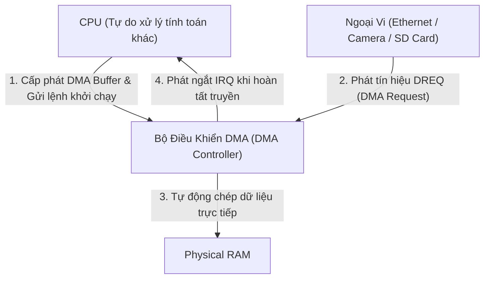
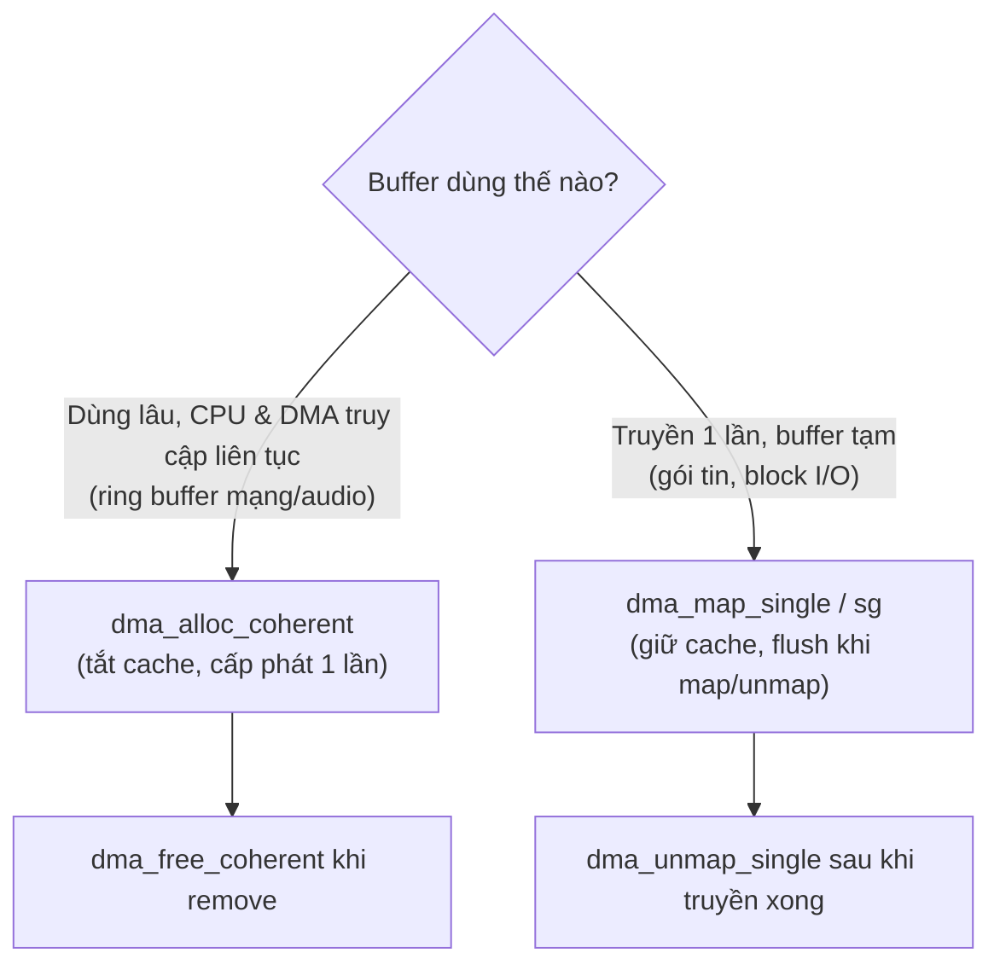

# 🚀 Chương 11: Direct Memory Access (DMA) (Truy Xuất Bộ Nhớ Trực Tiếp Chuyên Sâu)

Tài liệu này hệ thống hóa toàn bộ kiến thức từ **Slide 375 đến Slide 400** của khóa học Bootlin Linux Kernel, phân tích nguyên lý DMA, sự bất đồng bộ bộ nhớ đệm (Cache Coherency), các kỹ thuật ánh xạ Coherent vs Streaming và bài thực hành Practical Lab 11.

---

## ⚡ 1. Nguyên Lý Động Lực Học Của DMA

### 1.1 Tại Sao Phải Dùng DMA? (Slide 375-377)
Truy xuất bộ nhớ trực tiếp (DMA - Direct Memory Access) cho phép các thiết bị ngoại vi (Card mạng 10Gbps, Ổ cứng NVMe, Camera HD) tự động đọc/ghi dữ liệu trực tiếp vào RAM vật lý mà **KHÔNG CẦN sự can thiệp của CPU**.



### 1.2 Bài Toán Bất Đồng Bộ Cache (Cache Coherency Problem) (Slide 378-383)

> [!CAUTION]
> CPU không làm việc trực tiếp trên RAM mà thao tác qua bộ nhớ đệm tốc độ cao **CPU Cache (L1/L2/L3)**. Điều này dẫn đến nguy cơ xung đột dữ liệu:

1. **Thao tác Ghi (Device $\rightarrow$ RAM)**: Bộ điều khiển DMA ghi dữ liệu mới vào RAM. Nhưng CPU Cache vẫn giữ dữ liệu cũ $\rightarrow$ CPU đọc phải dữ liệu sai!
2. **Thao tác Đọc (RAM $\rightarrow$ Device)**: CPU ghi dữ liệu mới vào Cache nhưng chưa kịp xả (Flush) xuống RAM. Thiết bị DMA đọc RAM sẽ nhận phải dữ liệu cũ!

Để giải quyết, Linux Kernel cung cấp 2 phương pháp ánh xạ DMA:

| Phương pháp DMA Mapping | Cơ chế xử lý CPU Cache | Ứng dụng phù hợp |
| :--- | :--- | :--- |
| **Coherent Mapping** (Consistent) | **Tắt CPU Cache (Uncached)**. CPU và DMA luôn ghi trực tiếp vào RAM. | Bộ đệm dùng lâu dài (Ring buffers của card mạng/audio). |
| **Streaming Mapping** | **Vẫn bật Cache**. Kernel tự động Xả (Flush/Invalidate) Cache khi Map/Unmap. | Bộ đệm tạm thời truyền 1 lần (Packet buffers, I/O blocks). |

---

## 🔄 2. Các API Ánh Xạ DMA (`dma-mapping`)

### 2.1 Cấu hình cờ DMA Mask (Slide 384-385)
Khai báo khả năng đánh địa chỉ của thiết bị DMA phần cứng với Kernel:

```c
#include <linux/dma-mapping.h>

// Thiết lập cờ hỗ trợ DMA 32-bit
int ret = dma_set_mask_and_coherent(&pdev->dev, DMA_BIT_MASK(32));
if (ret)
    return ret;
```

### 2.2 Coherent DMA Mapping (Slide 386-388)
```c
dma_addr_t dma_handle;
void *cpu_vaddr;

// 1. Cấp phát Coherent Memory (Trả về địa chỉ ảo CPU và địa chỉ bus DMA)
cpu_vaddr = dma_alloc_coherent(&pdev->dev, 8192, &dma_handle, GFP_KERNEL);
if (!cpu_vaddr)
    return -ENOMEM;

// cpu_vaddr: Dùng cho CPU đọc/ghi trong code C
// dma_handle: Nạp địa chỉ vật lý bus này vào thanh ghi DMA của phần cứng!

// 2. Giải phóng bộ nhớ khi remove driver
dma_free_coherent(&pdev->dev, 8192, cpu_vaddr, dma_handle);
```

### 2.3 Streaming DMA Mapping (Slide 389-392)
```c
void *kmalloc_buf = kmalloc(2048, GFP_KERNEL);
dma_addr_t dma_handle;

// 1. Ánh xạ bộ đệm kmalloc và tự động Flush/Invalidate CPU Cache
dma_handle = dma_map_single(&pdev->dev, kmalloc_buf, 2048, DMA_TO_DEVICE);
if (dma_mapping_error(&pdev->dev, dma_handle)) {
    kfree(kmalloc_buf);
    return -EIO;
}

// 2. Trao dma_handle cho phần cứng DMA kích hoạt truyền...

// 3. Hủy ánh xạ sau khi truyền xong (trong hàm ISR)
dma_unmap_single(&pdev->dev, dma_handle, 2048, DMA_TO_DEVICE);
```

---

## 🛠️ PRACTICAL LAB 11: Lập Trình Cấp Phát Coherent DMA Memory & Đo Độ Trễ Truyền

### Mục tiêu bài lab:
1. Thiết lập DMA Mask 32-bit cho Platform Driver.
2. Cấp phát vùng nhớ **Coherent DMA** bằng hàm `dma_alloc_coherent()`.
3. Ghi dữ liệu mẫu từ CPU vào buffer và kiểm tra địa chỉ vật lý `dma_addr_t` được xuất ra.

### Bước 1: Viết mã nguồn C `dma_demo_driver.c`

```c
#include <linux/module.h>
#include <linux/init.h>
#include <linux/platform_device.h>
#include <linux/dma-mapping.h>
#include <linux/of.h>

MODULE_LICENSE("GPL");
MODULE_AUTHOR("Bootlin / Antigravity");
MODULE_DESCRIPTION("Practical Lab 11: Lập trình Coherent DMA Memory Allocation");

#define DMA_BUF_SIZE (16 * 1024) // 16 KB DMA Buffer

struct dma_demo_dev {
    void *cpu_addr;
    dma_addr_t dma_handle;
    size_t size;
};

static int dma_demo_probe(struct platform_device *pdev)
{
    struct dma_demo_dev *dev;
    int i;
    unsigned char *ptr;

    dev_info(&pdev->dev, "======================================\n");
    dev_info(&pdev->dev, "Đang khởi tạo DMA Demo Driver...\n");

    dev = devm_kzalloc(&pdev->dev, sizeof(*dev), GFP_KERNEL);
    if (!dev)
        return -ENOMEM;

    dev->size = DMA_BUF_SIZE;

    // 1. Cấu hình DMA Mask 32-bit
    if (dma_set_mask_and_coherent(&pdev->dev, DMA_BIT_MASK(32))) {
        dev_err(&pdev->dev, "Lỗi: Phần cứng không hỗ trợ DMA 32-bit!\n");
        return -EIO;
    }

    // 2. Cấp phát bộ nhớ Coherent DMA (Uncached Memory)
    dev->cpu_addr = dma_alloc_coherent(&pdev->dev, dev->size, &dev->dma_handle, GFP_KERNEL);
    if (!dev->cpu_addr) {
        dev_err(&pdev->dev, "Lỗi cấp phát dma_alloc_coherent!\n");
        return -ENOMEM;
    }

    dev_info(&pdev->dev, "Cấp phát Coherent DMA thành công!\n");
    dev_info(&pdev->dev, " • CPU Virtual Address : %p\n", dev->cpu_addr);
    dev_info(&pdev->dev, " • DMA Bus Physical Addr: %pad\n", &dev->dma_handle);

    // 3. Ghi dữ liệu mẫu từ CPU vào DMA Buffer
    ptr = (unsigned char *)dev->cpu_addr;
    for (i = 0; i < 256; i++) {
        ptr[i] = (unsigned char)i;
    }

    dev_info(&pdev->dev, "Đã ghi 256 byte dữ liệu mẫu vào DMA Buffer.\n");
    dev_info(&pdev->dev, "======================================\n");

    platform_set_drvdata(pdev, dev);
    return 0;
}

static int dma_demo_remove(struct platform_device *pdev)
{
    struct dma_demo_dev *dev = platform_get_drvdata(pdev);

    if (dev->cpu_addr) {
        // Giải phóng bộ nhớ Coherent DMA
        dma_free_coherent(&pdev->dev, dev->size, dev->cpu_addr, dev->dma_handle);
        dev_info(&pdev->dev, "Đã giải phóng Coherent DMA Memory thành công!\n");
    }
    return 0;
}

static const struct of_device_id dma_demo_dt_ids[] = {
    { .compatible = "vendor,custom-dma-engine", },
    { }
};
MODULE_DEVICE_TABLE(of, dma_demo_dt_ids);

static struct platform_driver dma_demo_driver = {
    .probe = dma_demo_probe,
    .remove = dma_demo_remove,
    .driver = {
        .name = "custom_dma_demo_driver",
        .of_match_table = dma_demo_dt_ids,
    },
};

module_platform_driver(dma_demo_driver);
```

### Bước 2: Biên dịch và Nạp Kiểm Thử
Thực hiện các lệnh trên Terminal:

```bash
# 1. Biên dịch module out-of-tree
make

# 2. Nạp module để kích hoạt hàm probe DMA
sudo insmod dma_demo_driver.ko

# 3. Đọc nhật ký dmesg xem địa chỉ Ảo và địa chỉ Vật lý DMA
dmesg | tail -n 15

# 4. Tháo bỏ module
sudo rmmod dma_demo_driver
```

---

## 💡 Tình Huống Lỗi Thực Tế & Debug (Real-World Edge Cases)

### Tình huống: Lỗi `DMA buffer not cacheline-aligned`
* **Hiện tượng**: Khi dùng Streaming DMA Mapping, dữ liệu ở các byte đầu/cuối của bộ đệm bị ghi đè ngẫu nhiên.
* **Nguyên nhân**: Bộ đệm `kmalloc` không được căn chỉnh theo độ dài dòng Cache (Cache line size - thường là 64 byte). Khi Kernel thực hiện Flush/Invalidate Cache line, nó vô tình làm mất dữ liệu của các biến nằm chung dòng Cache line với buffer!
* **Khắc phục**: Luôn đảm bảo bộ đệm Streaming DMA được căn chỉnh bằng cờ `____cacheline_aligned`.

---

## 📝 BÀI TẬP THỰC HÀNH HANDS-ON & CÂU HỎI ÔN TẬP

### Bài tập thực hành tự giải:
**Đề bài**: Tại sao địa chỉ con trỏ ảo `cpu_addr` do `dma_alloc_coherent` trả về không thể truyền trực tiếp vào các thanh ghi phần cứng của bộ điều khiển DMA?

<details>
<summary>🔍 <b>Xem đáp án gợi ý</b></summary>

Vì con trỏ `cpu_addr` là **Địa chỉ Ảo trong Kernel Space** (Virtual Address) do MMU quản lý. Bộ điều khiển DMA phần cứng nằm ngoài CPU nên không đi qua MMU, nó bắt buộc phải làm việc với **Địa chỉ Vật lý Bus (Physical DMA Address)** được lưu trong biến `dma_handle`!
</details>

---

## 🎯 VÍ DỤ MINH HỌA BỔ SUNG

### 💻 Ví dụ 1 (Code C): Streaming DMA đúng chiều với `dma_map_single`
Minh họa vòng đời map → phần cứng truyền → unmap, chú ý hướng truyền.

```c
#include <linux/dma-mapping.h>

char *buf = kmalloc(2048, GFP_KERNEL);          /* kmalloc: liên tục vật lý */
dma_addr_t handle;

/* Gửi RAM → thiết bị: kernel flush cache trước khi map */
handle = dma_map_single(dev, buf, 2048, DMA_TO_DEVICE);
if (dma_mapping_error(dev, handle)) {
	kfree(buf);
	return -EIO;
}

/* Nạp 'handle' (địa chỉ bus) vào thanh ghi DMA, khởi động truyền... */

/* Sau khi phần cứng báo xong (trong ISR) mới được unmap */
dma_unmap_single(dev, handle, 2048, DMA_TO_DEVICE);
kfree(buf);
```

### 🖥️ Ví dụ 2 (Terminal/Debug): Kiểm tra khả năng & hoạt động DMA

```bash
# Xem các kênh DMA engine đang có trên hệ thống
ls /sys/class/dma/

# Thống kê vùng RAM dành cho DMA (DMA zone) và CMA
grep -iE 'DMA|Cma' /proc/meminfo
cat /proc/zoneinfo | grep -iA3 'zone   DMA'

# Theo dõi lỗi ánh xạ DMA (nếu bật CONFIG_DMA_API_DEBUG)
dmesg | grep -i 'DMA-API'

# Xem IRQ hoàn tất truyền của DMA controller
cat /proc/interrupts | grep -i dma
```

### 📊 Ví dụ 3 (Mermaid): Chọn Coherent vs Streaming mapping



---
*Tiếp theo: [Chương 12: Kernel Debugging & Advanced APIs](./12_Kernel_Debugging_Useful_APIs.md)*
