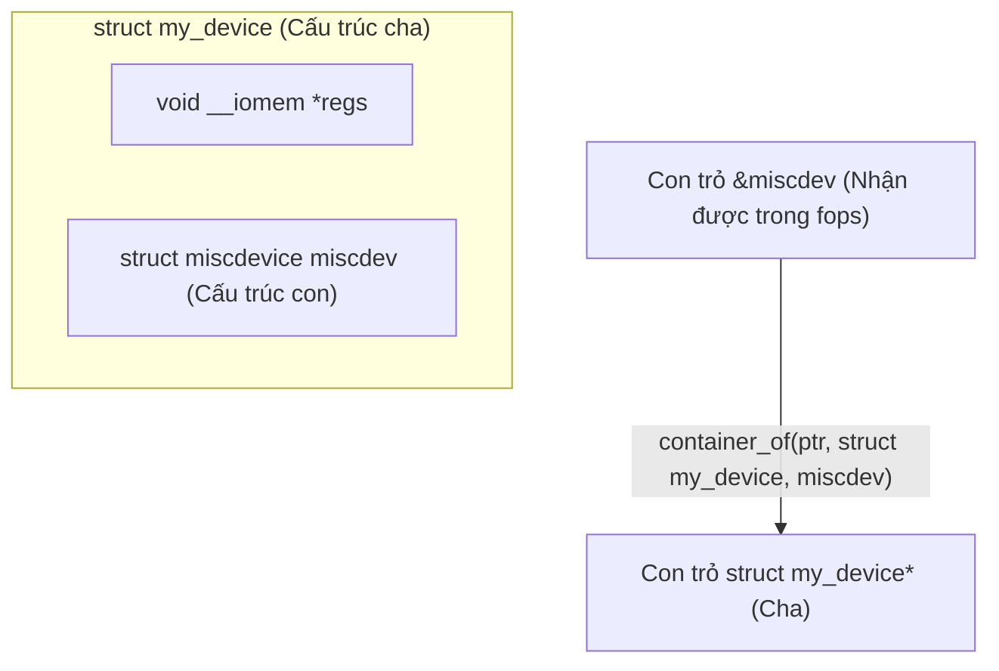
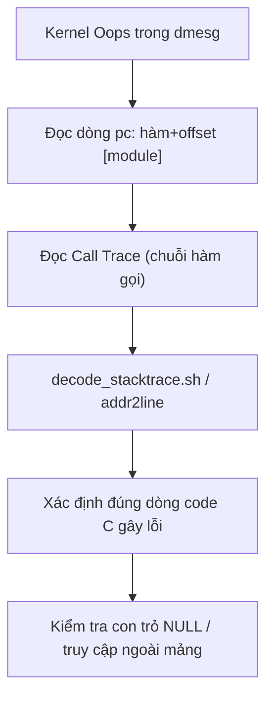

# 🛠️ Chương 12: Kernel Debugging & Advanced APIs (Debugging & Kỹ Thuật Nâng Cao)

Tài liệu này hệ thống hóa toàn bộ kiến thức từ **Slide 401 đến Slide 446** của khóa học Bootlin Linux Kernel, hướng dẫn các công cụ Debug Kernel (printk, Dynamic Debug, Debugfs, Stack Trace Oops), Macro `container_of`, Linked Lists, `mmap` và Practical Lab 12.

---

## 🐞 1. Kỹ Thuật Debug Linux Kernel (Kernel Debugging)

### 1.1 Nhật Ký Log `printk` & Dynamic Debug (Slide 401-408)
Kernel cung cấp các hàm xuất log gắn liền với mức độ ưu tiên (Log levels):

```c
dev_info(&pdev->dev, "Thông tin khởi động bình thường\n");
dev_err(&pdev->dev, "Lỗi nghiêm trọng phần cứng!\n");
dev_dbg(&pdev->dev, "Log debug giá trị thanh ghi: 0x%08X\n", reg);
```

#### Dynamic Debug (Bật/Tắt Log Động Không Cần Biên Dịch Lại):
Mặc định các câu lệnh `dev_dbg()` sẽ bị ẩn. Bạn có thể bật/tắt hiển thị log của từng file C hoặc từng dòng lệnh **ngay khi hệ thống đang chạy**:

```bash
# Bật tất cả log dev_dbg trong file fe_serial_driver.c
echo "file fe_serial_driver.c +p" > /sys/kernel/debug/dynamic_debug/control

# Tắt log trong file fe_serial_driver.c
echo "file fe_serial_driver.c -p" > /sys/kernel/debug/dynamic_debug/control
```

### 1.2 Debugfs (Hệ Thống Tệp Giao Tiếp Debug) (Slide 409-412)
`debugfs` (thường gắn tại `/sys/kernel/debug/`) cho phép lập trình viên tạo các tệp ảo để đọc/ghi thông số nội bộ của driver mà không bị ràng buộc bởi tiêu chuẩn của `sysfs`:

```c
#include <linux/debugfs.h>

static struct dentry *debug_dir;
static u32 status_reg = 0x1234;

// 1. Tạo thư mục và file trong debugfs (trong probe)
debug_dir = debugfs_create_dir("my_driver_debug", NULL);
debugfs_create_u32("status", 0644, debug_dir, &status_reg);

// 2. Xóa thư mục debugfs (trong remove)
debugfs_remove_recursive(debug_dir);
```

### 1.3 Phân Tích Kernel Oops & Stack Trace (Slide 413-420)
Khi Kernel truy cập con trỏ NULL, một thông điệp **Kernel Oops** sẽ xuất hiện trong `dmesg`:

```text
[   12.345678] Unable to handle kernel NULL pointer dereference at virtual address 0000000000000000
[   12.346000] pc : my_driver_read+0x18/0x40 [my_driver]
[   12.346100] Call Trace:
[   12.346200]  vfs_read+0xa4/0x1b0
[   12.346300]  ksys_read+0x64/0xf0
```

* **`pc` (Program Counter)**: Tên hàm và offset xảy ra crash (`my_driver_read+0x18`).
* **Giải mã dòng code lỗi**: Sử dụng công cụ `gdb` hoặc script của Kernel:
  ```bash
  ./scripts/decode_stacktraces.sh vmlinux < oops_log.txt
  ```

---

## 🔗 2. Các Struct & Macro Nâng Cao (`container_of` & `list_head`)

### 2.1 Macro Thần Kỳ `container_of` (Slide 421-424)

> [!IMPORTANT]
> **`container_of(ptr, type, member)`** cho phép từ con trỏ của một cấu trúc con (`ptr`), tính toán ngược lại địa chỉ bộ nhớ của cấu trúc cha chứa nó (`type`)!



### 2.2 Danh Sách Liên Kết Đôi Circular (`struct list_head`) (Slide 425-431)
```c
#include <linux/list.h>

struct data_node {
    int id;
    struct list_head list; // Nhúng struct list_head
};

static LIST_HEAD(my_global_list); // Khai báo Head

// 1. Thêm nút mới vào danh sách
struct data_node *node = kmalloc(sizeof(*node), GFP_KERNEL);
node->id = 100;
INIT_LIST_HEAD(&node->list);
list_add_tail(&node->list, &my_global_list);

// 2. Duyệt danh sách an toàn
struct data_node *pos;
list_for_each_entry(pos, &my_global_list, list) {
    pr_info("Node ID: %d\n", pos->id);
}
```

---

## 🛠️ PRACTICAL LAB 12: Tạo Giao Diện Debugfs & Giải Mã Lỗi Kernel Oops

### Mục tiêu bài lab:
1. Tạo thư mục và các tệp tinh chỉnh biến trong `debugfs`.
2. Tạo thử nghiệm một lỗi Null Pointer Dereference để phân tích nhật ký Kernel Oops trong `dmesg`.

### Bước 1: Viết mã nguồn C `debugfs_demo_driver.c`

```c
#include <linux/module.h>
#include <linux/init.h>
#include <linux/platform_device.h>
#include <linux/debugfs.h>
#include <linux/fs.h>
#include <linux/uaccess.h>

MODULE_LICENSE("GPL");
MODULE_AUTHOR("Bootlin / Antigravity");
MODULE_DESCRIPTION("Practical Lab 12: Debugfs Interface & Trigger Test Fault");

struct debug_demo_dev {
    struct dentry *dbg_dir;
    u32 read_count;
    u32 trigger_fault;
};

static int debug_demo_probe(struct platform_device *pdev)
{
    struct debug_demo_dev *dev;

    dev_info(&pdev->dev, "======================================\n");
    dev_info(&pdev->dev, "Đang khởi tạo Debugfs Demo Driver...\n");

    dev = devm_kzalloc(&pdev->dev, sizeof(*dev), GFP_KERNEL);
    if (!dev)
        return -ENOMEM;

    dev->read_count = 42;
    dev->trigger_fault = 0;

    // 1. Tạo thư mục trong /sys/kernel/debug/
    dev->dbg_dir = debugfs_create_dir("lab12_debug", NULL);

    // 2. Tạo tệp biến u32 đọc/ghi số lần read_count
    debugfs_create_u32("read_count", 0644, dev->dbg_dir, &dev->read_count);

    // 3. Tạo tệp cờ trigger_fault (ghi 1 để cố tình gây ngắt Null Pointer phục vụ học tập)
    debugfs_create_u32("trigger_fault", 0200, dev->dbg_dir, &dev->trigger_fault);

    platform_set_drvdata(pdev, dev);
    dev_info(&pdev->dev, "Đã tạo thư mục /sys/kernel/debug/lab12_debug/ thành công!\n");
    dev_info(&pdev->dev, "======================================\n");
    return 0;
}

static int debug_demo_remove(struct platform_device *pdev)
{
    struct debug_demo_dev *dev = platform_get_drvdata(pdev);

    // Xóa thư mục debugfs
    debugfs_remove_recursive(dev->dbg_dir);
    return 0;
}

static const struct of_device_id debug_demo_dt_ids[] = {
    { .compatible = "vendor,custom-debug-demo", },
    { }
};
MODULE_DEVICE_TABLE(of, debug_demo_dt_ids);

static struct platform_driver debug_demo_driver = {
    .probe = debug_demo_probe,
    .remove = debug_demo_remove,
    .driver = {
        .name = "custom_debug_demo_driver",
        .of_match_table = debug_demo_dt_ids,
    },
};

module_platform_driver(debug_demo_driver);
```

### Bước 2: Biên dịch và Thao Tác Trực Tiếp Trên Debugfs
Thực hiện các lệnh trên Terminal:

```bash
# 1. Biên dịch module
make

# 2. Nạp module vào Kernel
sudo insmod debugfs_demo_driver.ko

# 3. Đọc biến read_count từ debugfs!
cat /sys/kernel/debug/lab12_debug/read_count

# 4. Ghi thay đổi biến read_count ngay khi driver đang chạy
sudo sh -c 'echo 999 > /sys/kernel/debug/lab12_debug/read_count'
cat /sys/kernel/debug/lab12_debug/read_count

# 5. Tháo bỏ module
sudo rmmod debugfs_demo_driver
```

---

## 💡 Tình Huống Lỗi Thực Tế & Debug (Real-World Edge Cases)

### Tình huống: Macro `container_of` tính toán sai địa chỉ
* **Hiện tượng**: Bạn gọi `container_of(ptr, type, member)` nhưng giá trị con trỏ cha trả về bị lệch địa chỉ, gây crash ngay lập tức khi đọc struct cha.
* **Nguyên nhân**: Truyền sai tên trường `member` hoặc kiểu dữ liệu con trỏ `ptr` không phải là địa chỉ thực sự của trường `member` nằm trong struct cha.

---

## 📝 BÀI TẬP THỰC HÀNH HANDS-ON & CÂU HỎI ÔN TẬP

### Bài tập thực hành tự giải:
**Đề bài**: Hãy viết cú pháp macro `container_of` để lấy con trỏ `struct my_device*` biết rằng bạn đang có con trỏ `&dev->miscdev` thuộc trường `.miscdev`.

<details>
<summary>🔍 <b>Xem đáp án gợi ý</b></summary>

```c
struct my_device {
    int id;
    struct miscdevice miscdev;
};

// Cú pháp container_of:
struct my_device *my_dev = container_of(miscdev_ptr, struct my_device, miscdev);
```
</details>

---

## 🎯 VÍ DỤ MINH HỌA BỔ SUNG

### 💻 Ví dụ 1 (Code C): `container_of` + duyệt danh sách liên kết an toàn khi xóa
Mẫu thực dụng: lấy struct cha từ member, và giải phóng cả list bằng biến `_safe`.

```c
#include <linux/list.h>

struct item {
	int id;
	struct list_head node;
};
static LIST_HEAD(items);

/* Lấy con trỏ cha từ con trỏ member (vd trong callback fops) */
static void demo(struct list_head *p)
{
	struct item *it = container_of(p, struct item, node);
	pr_info("id = %d\n", it->id);
}

/* Xóa toàn bộ list: PHẢI dùng _safe vì đang free trong lúc duyệt */
static void free_all(void)
{
	struct item *it, *tmp;

	list_for_each_entry_safe(it, tmp, &items, node) {
		list_del(&it->node);
		kfree(it);
	}
}
```

### 🖥️ Ví dụ 2 (Terminal/Debug): Bộ công cụ debug thường dùng nhất

```bash
# Lọc log kernel realtime theo mức ưu tiên (chỉ warning trở lên)
dmesg -w --level=warn,err,crit

# Bật dev_dbg động cho đúng 1 hàm mà không build lại kernel
echo 'func my_probe +p' | sudo tee /sys/kernel/debug/dynamic_debug/control

# Giải mã địa chỉ trong Oops thành số dòng code
addr2line -e my_driver.ko 0x18            # dùng offset từ 'pc'
./scripts/decode_stacktrace.sh vmlinux < oops.txt

# Xem symbol module đang chạy để đối chiếu Call Trace
sudo cat /proc/kallsyms | grep my_driver
```

### 📊 Ví dụ 3 (Mermaid): Quy trình phân tích một Kernel Oops



---
*Chúc mừng bạn đã hoàn thành trọn bộ 12 Chương Bài Học & Practical Labs Linux Kernel Architecture & Driver Development!*
